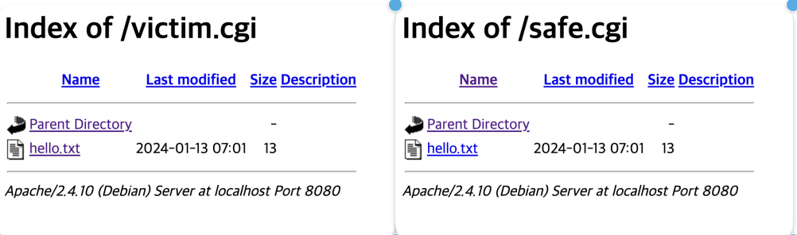
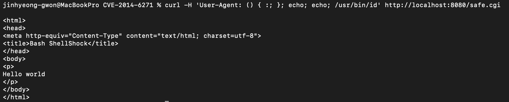

# CVE-2014-6271

#### Contributor

진규정 (@gyutrange)

### 요약

취약점: bash의 환경변수를 설정할 때 발생함.

foo라는 환경 변수 설정시,  함수 형태로 선언하면 설정 내부에서 함수로 인식함.
이때, 함수 뒤에 있는 스크립트까지 함께 실행되면서 취약점과 위협이 발생하게 됨.

```
export foo='() { echo hello; }; pwd; ls;'
```

bash가 실행되면 `pwd; ls;` 뒷 부분의 스크립트가 실행됨. 

Bash CGI는 request시의 User-Agent값을 환경변수에 저장하므로 CGI를 이용하는 서버에 취약점을 발생시킴.
(따로 쉘을 실행시키지 않아도 공격이 가능함.)

<br>

### 환경 구성 및 실행

```bash
docker compose build
docker compose up -d
```

http://your-ip/ 에 접속하면 두 개의 파일이 보임.



1. safe.cgi : 최신버전의 bash로 생성.
2. victim.cgi : 취약한 4.3버전 bash로 생성.

<br>

### 결과


`() { foo; }; echo Content-Type: text/plain; echo; /usr/bin/id` 스크립트를 User-Agent header값에 넣으면 `/usr/bin/id` 가 실행되며 결과가 나타남.



safe.cgi로 공격을 할 경우 페이로드가 통하지 않는다.

<br>

### 결

- CVE-2014-6271는shellshock로 매우 위험한 취약점임.
- 웹의 request만으로 쉘 명령어를 사용할 수 있음.
