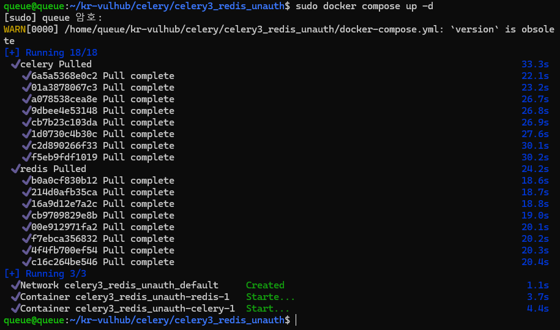
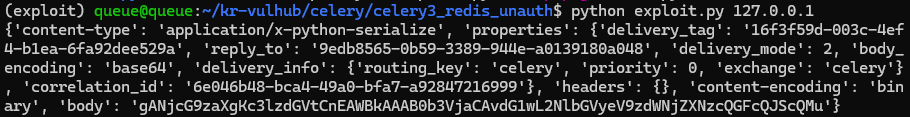
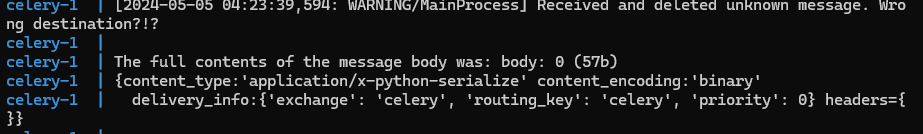
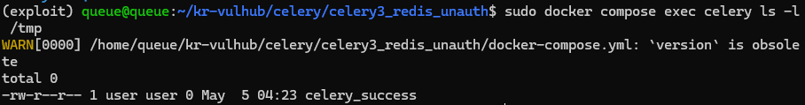
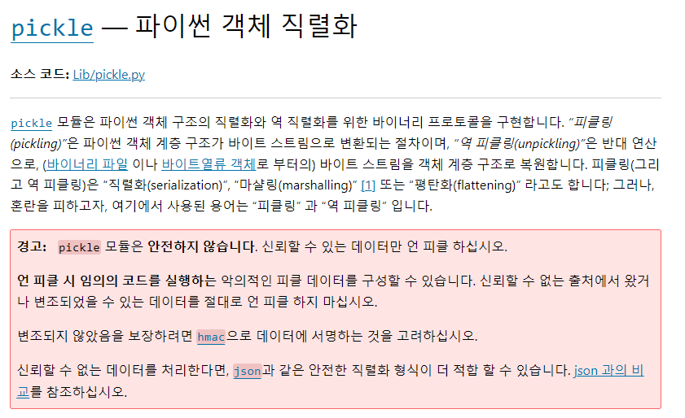
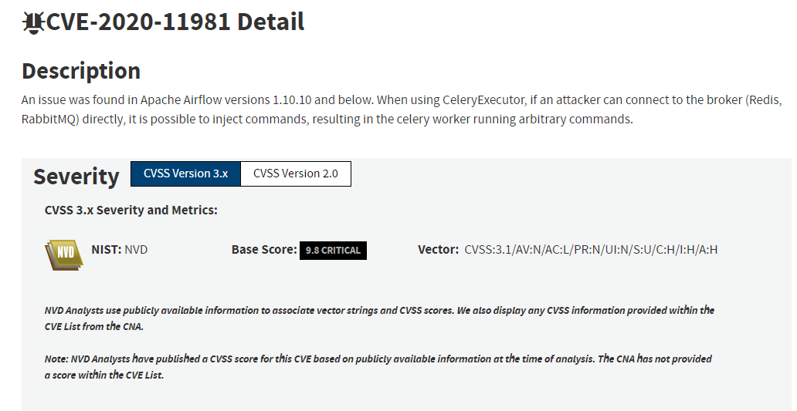

# Celery <4.0 Redis unauthorized access + Pickle deserialization exploit

> [정민규 (@tomorrow9913)](https://github.com/tomorrow9913)

## 요약

- Celery는 단순하고 유연하며 신뢰할 수있는 분산 시스템으로 많은 메시지를 처리하면서 이러한 시스템을 작동하고 유지 관리하는 데 필요한 도구를 제공하며 실시간 처리에 중점을 둔 작업 대기열이며 작업 예약도 지원.
- Celery <4.0 버전(docker에 설치된 환경은 3.1.23)에서 기본적으로 직렬화 된 작업 메시지에 Pickle이 사용. 
- 역직렬화 시 임의의 코드를 실행하는 악의적인 피클 데이터를 구성할 수 있음.

## 환경 구성 및 실행

Celery 3.1.23 + Redis를 실행하기 위해 아래 명령어 입력:

```bash
docker compose up -d
```


## Exploit

The exploit script `exploit.py` only supports use under python3

`exploit.py`의`command` 변수의 값을 원하는 명령어로 변경하면 해당 코드가 서버에서 실행된다.(기본값 : `touch /tmp/celery_success`)

```bash
pip install redis
python exploit.py [Host IP]
```


## 결과

```
docker compose logs celery
```
위와 같은 명령어를 통해 아래와 같은 작업 메시지 오류를 볼 수 있음



```bash
docker compose exec celery ls -l /tmp
```

exploit.py의 command에 적힌 명령어가 실행되어 `celery_success` 파일이 성공적으로 생성되었음을 알 수 있음.



## 정리
- 대기열 서비스(예 : Redis/Rabbitmq/Rocketmq)에 무단 접근이 가능한 경우, Pickle 역직렬화 취약점을 이용해 임의의 코드를 실행하는 데 사용될 수 있습니다.
- pickle의 문서와 같이 신뢰하지 않는 소스의 데이터를 절대로 언피클해서는 안됩니다.


- 필요한 경우 직렬화에 JSON을 기본으로 사용하는 4.0 이상의 Celery를 활용하거나 다음과 같은 옵션을 추가 할 수 있습니다
    - accept_content 설정에서 허용되는 콘텐츠 유형의 화이트리스트를 지정하여 신뢰할 수 없는 콘텐츠를 비활성화할 수 있습니다. 

    ``` python
    c = celery.Celery()
    c.conf.update(CELERY_ACCEPT_CONTENT = ['json'])
    ```

    *이 설정은 버전 3.0.18에서 처음 지원되었습니다. 이전 버전을 실행 중인 경우에는 무시됩니다.*


이러한 방법은 [Apache Airflow Celery Broker Remote Command Execution (CVE-2020-11981)](https://nvd.nist.gov/vuln/detail/CVE-2020-11981)에도 사용되었음 *[vulhub](https://github.com/vulhub/vulhub/tree/master/airflow/CVE-2020-11981)*



## Reference

https://docs.celeryproject.org/en/stable/userguide/configuration.html

https://www.bookstack.cn/read/celery-3.1.7-zh/8d5b10e3439dbe1f.md#dhfmrk

https://docs.celeryproject.org/en/stable/userguide/calling.html#serializers

https://www.jianshu.com/p/52552c075bc0

https://www.runoob.com/w3cnote/python-redis-intro.html

https://blog.csdn.net/SKI_12/article/details/85015803

https://docs.celeryq.dev/en/latest/userguide/security.html#serializers

https://starlox.medium.com/insecure-deserialization-attack-with-python-pickle-2fd23ac5ff8f