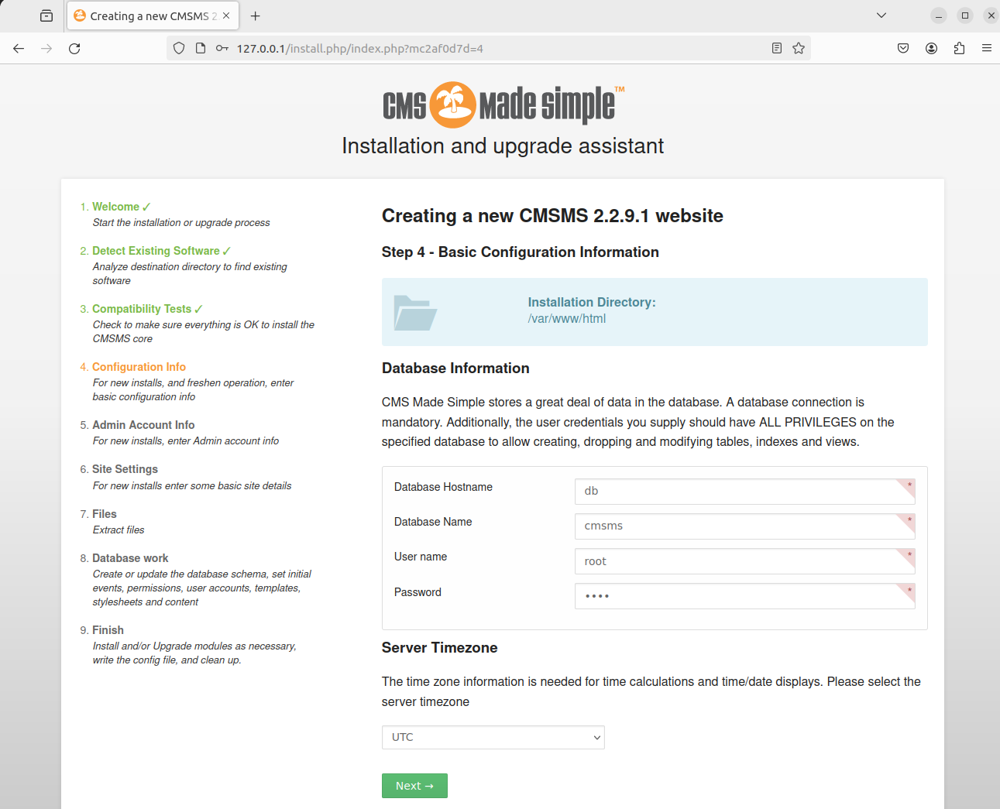
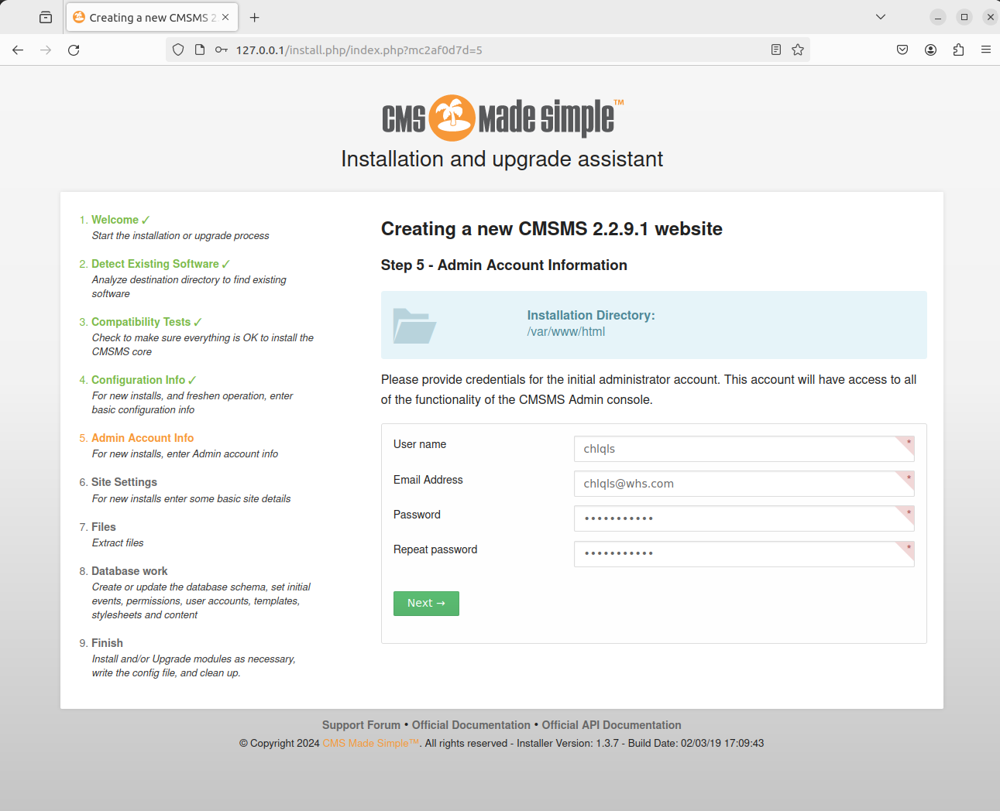
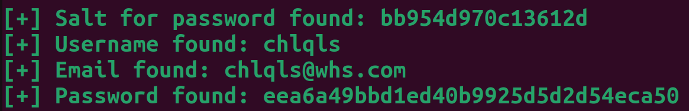

# CMS Made Simple (CMSMS) < 2.2.10 Unauthenticated SQL Injection (CVE-2019-9053)

> [최빈 (@chlqls)](https://github.com/chlqls)

 

### 요약

- **CMS Made Simple (CMSMS)** 는 개발자, 프로그래머 및 사이트 소유자에게 웹 기반 개발 및 관리 영역을 제공하기 위한 무료 오픈 소스 콘텐츠 관리 시스템임
- 2.2.9.1 이전 버전에서 CMS Made Simple은 인증되지 않은 **SQL Injection 취약점**이 있음
  - 공격자는 관리자의 암호 또는 암호 재설정 토큰을 획득 가능함
- 더불어 SSTI 이슈([CVE-2021-26120](https://github.com/vulhub/vulhub/tree/master/cmsms/CVE-2021-26120))와 결합되면 공격자가 대상 서버에서 임의의 코드를 실행할 위험 발생

 

### 환경 구성 및 실행

1. `docker compose up -d`를 실행하여 테스트 환경(CMS Made Simple 2.2.9.1)을 실행

2. 서버가 시작된 후 `http://your-ip/install.php/`에 접속하여 CMS를 설치

   - 해당 페이지에서 설치 지침에 따라 CMSMS를 설치
   - [Step 4] MySQL database address는 `db`, database name은 `cmsms`, username과 password는 둘 다 `root` 입력

     

   - [Step 5] Admin 계정 정보는 자유롭게 입력

     

3. `python2 poc.py -u http://127.0.0.1`를 실행하여 위에서 입력한 **Admin 계정이 출력**되는 것을 확인
   - SQL Injection 취약점을 이용하기 위해 [https://www.exploit-db.com/exploits/46635](https://www.exploit-db.com/exploits/46635)의 스크립트 활용

 

### 결과

 

### 정리

- 이 취약점은 공격자가 데이터베이스에서 Admin 계정의 정보를 얻을 수 있어, 정보 유출 및 비정상적인 동작 유발의 위험이 있다.
- 안전한 데이터 관리를 위해서는 입력값을 정규화하고 필터링하여 입력값을 안전하게 처리해야 한다.
