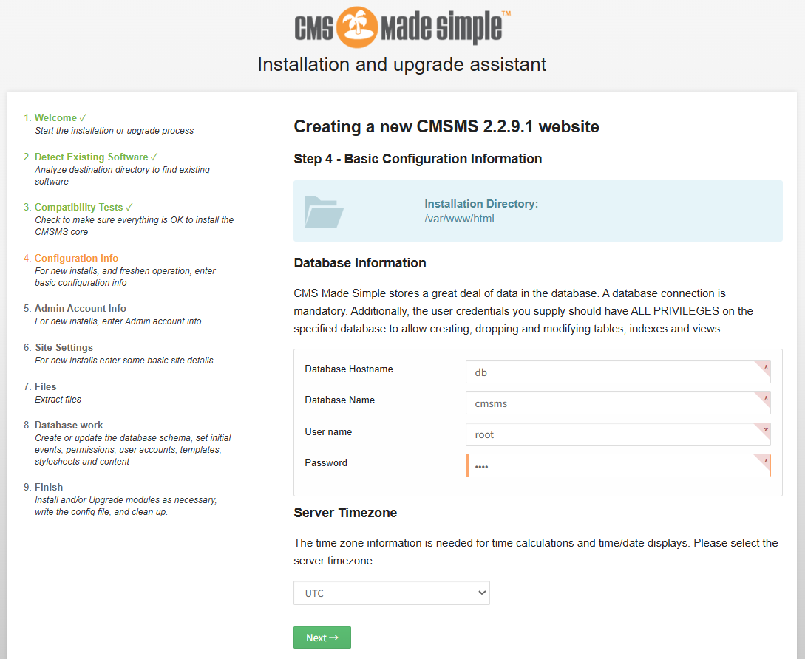
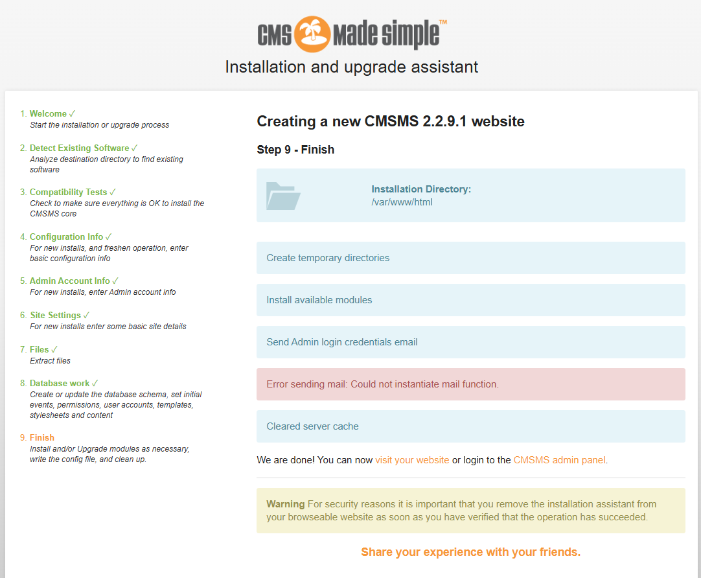
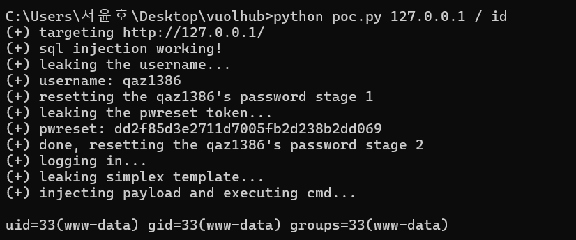

# **CVE-2021-26120 | Unauthenticated Remote Code**

> 화이트햇 스쿨 3기 (23반) - 서윤호

git 주소: https://github.com/qaz1386/kr-vulhub/tree/main/cmsms/CVE-2021-26120

**요약**

CMS Made Simple (CMSMS)는 개발자, 프로그래머, 사이트 소유자들에게 웹 기반 개발 및 관리 환경을 제공하는 무료 오픈 소스 콘텐츠 관리 시스템(CMS)이다.

Smarty 3.1.39 이전 버전에서는 `{function name=substring}` 구문 이후 예기치 않은 함수 이름을 통해 코드 인젝션이 가능하며, 이에 대해 CVE-2021-26120이 할당되었다.

CMS Made Simple 버전 2.2.15 이하에서는, 디자이너 권한을 가진 인증된 사용자가 서버 측 템플릿 인젝션(Server Side Template Injection, SSTI)을 유발할 수 있으며, 이는 앞서 언급한 CVE-2021-26120과 관련이 있다.

따라서, CMSMS 버전이 2.2.9.1보다 낮을 경우, 인증되지 않은 공격자가 CVE-2019-9053과 CVE-2021-26120을 연계하여 서버에서 임의 코드를 실행할 수 있다.

**환경 구성 및 실행**

다음 명령어를 실행하여 CMS Made Simple 2.2.9.1 환경을 시작한다:

```
docker compose up -d
```

서버가 시작되면 브라우저를 통해 아래 주소로 접속하여 CMS를 설치해야 한다: 
```
http://your-ip/install.php
ex: http://localhost/install.php
```
설치 과정에서 다음 정보를 입력한다:

MySQL 데이터베이스 주소: db

데이터베이스 이름: cmsms

사용자 이름: root

비밀번호: root


그 다음은 임의로 설정해 주면 된다. 설정이 완료된 경우 다음과 같다


설치를 완료하면 CMS Made Simple 환경 구성이 완료되었다.

**결과**

[POC](https://github.com/qaz1386/kr-vulhub/blob/main/cmsms/CVE-2021-26120/poc.py) 사용하여
관리자 비밀번호를 초기화하거나 임의 명령어를 실행할 수 있다.
commands:
```
python poc.py 127.0.0.1 / id
```


**정리**

CMS Made Simple 2.2.9.1 이하 버전에서는 인증 없이 코드 실행이 가능하다.
이 공격은 CVE-2019-9053(SQL 인젝션)과 CVE-2021-26120(SSTI)을 조합하여 이루어진 것이다.
docker-compose를 이용해 손쉽게 환경을 구성하고 취약점을 재현할 수 있다.
설치 후 보안을 위해 반드시 install.php 파일을 삭제하거나 이름을 변경해야 한다.
실제 운영 환경에서는 반드시 최신 버전으로 업데이트하여 이 취약점을 방지해야 한다.