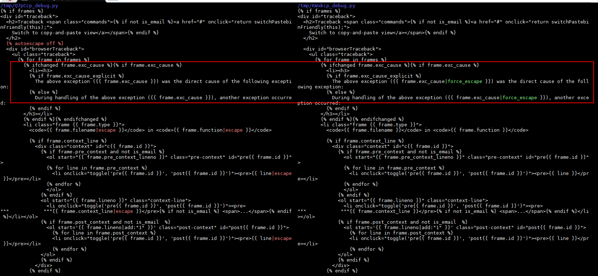
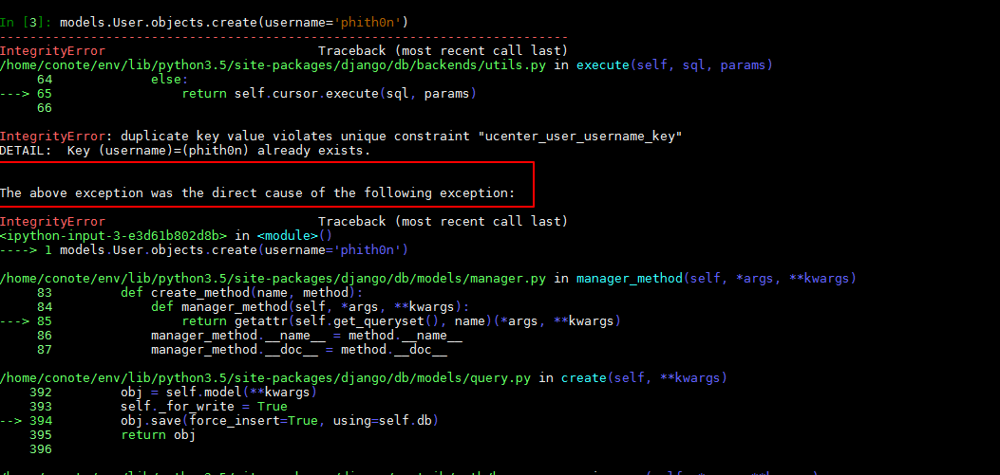

# Django debug page XSS 취약성 (CVE-2017-12794) 분석

짱고가 새 버전 1.11을 출시했습니다.5. 500페이지에 존재할 수 있는 XSS 취약점을 수정했습니다. 이 기사는 취약점의 원리와 재현, 그리고 저의 짧은 리뷰를 설명합니다.

## 0x01 패치 분석

공식 설명은 500페이지에 나오는 BUG이기 때문에, 우리가 중점적으로 주목하는 것은 `django/views/debug.py`。

Github에 Django의 창고가 있으니 다운로드 받아 1.11.4와 1.11.5 비교:

```bash
git clone https://github.com/django/django.git
cd django
git diff 1.11.4 1.11.5 django/views/debug.py
```



외부에서 전역 이스케이프를 닫은 다음 두 곳에 강제 이스케이프가 추가되었음을 알 수 있습니다.그렇다면 이 위치에서 취약점이 촉발된 것이 틀림없습니다.

## 0x02 기능점 탐색

이 두 출력점을 작동시키려면 이 if문으로 들어가야 합니다:``。

일단 정상적인 상황에서 이 자리는 어떤 용도로 쓰이는지, 즉 기능점이 무엇인지 한번 생각해보도록 하겠습니다.

노인 Django가 개발했는데, 그림틀에 있는 이 핵심 문장인 `The above exception was the direct cause of the following exception:`을 보면, 보통 데이터베이스에 이상이 있을 때 이런 잘못된 문구를 던집니다.

간단한 테스트를 할 수 있습니다. Django 명령줄에서 username이 phith0n인 사용자를 만들고 username이 phith0n인 사용자를 다시 만들면 `IntegrityError` 예외가 발생합니다.



데이터베이스의 Unique 이상을 유발했기 때문에 위의 그림을 참조하십시오.

Django는 왜 이러한 비정상적인 메커니즘을 도입했습니까?Django의 모델은 결국 데이터베이스를 조작하는 것이기 때문에 개발자가 SQL 오류 디버깅을 쉽게 하기 위함이며, 데이터베이스에서 구체적으로 어떤 오류가 발생하는지는 Django가 100% 예측할 수 없기 때문입니다.그렇다면 개발자가 데이터베이스 이상을 유발한 작업을 신속하게 찾기 위해서는 두 가지 이상 역추적 스택을 하나로 연결해야 합니다.

우리는 코드를 볼 수 있습니다,`django/db/utils.py`의 `__exit_` 함수:

```python
def __exit__(self, exc_type, exc_value, traceback):
if exc_type is None:
return
for dj_exc_type in (
DataError,
OperationalError,
IntegrityError,
InternalError,
ProgrammingError,
NotSupportedError,
DatabaseError,
InterfaceError,
Error,
):
db_exc_type = getattr(self.wrapper.Database, dj_exc_type.__name__)
if issubclass(exc_type, db_exc_type):
dj_exc_value = dj_exc_type(*exc_value.args)
dj_exc_value.__cause__ = exc_value
if not hasattr(exc_value, '__traceback__'):
exc_value.__traceback__ = traceback
# # Only set the 'errors_occurred' flag for errors that may make
# # the connection unusable.
if dj_exc_type not in (DataError, IntegrityError):
self.wrapper.errors_occurred = True
six.reraise(dj_exc_type, dj_exc_value, traceback)
```

이 중 'exc_type`은 비정상이며, 만약 그 유형이 'DataError, OperationalError, IntegrityError, InternalEror, ProgrammingEng_, NotSupportedEngor, DataBaseEngor, InterfaceEng' 중 하나라면 동일한 유형의 새로운 예외를 던지고 그 __cause_와 __traceback___을 설정할 때 이 컨텍스트가 됩니다.

`exc_value`는 이전 이상에 대한 설명이고, `traceeback`은 이전 이상에 대한 역추적 스택입니다.이 함수는 사실 이전 이상과 현재 새로운 이상을 연관시킵니다.

마지막으로 500페이지에서 `_cause_`가 출력됩니다.

## 0x03 취약성 재현

테스트 결과 Postgres 데이터베이스를 사용하고 이상이 트리거될 때 psycopg2가 필드 이름과 필드 값을 모두 던지는 것을 발견했습니다.그러면 필드 값에 제어 가능한 문자열이 포함되어 있고 0x02에서 언급했기 때문에 이 문자열은 실제로 '__cause_'로 설정되어 마지막으로 페이지에 표시됩니다.

그래서 우리는 다음과 같은 장면이 있다고 가정합니다.

1. 사용자 등록 페이지, 사용자 이름을 확인하지 못했습니다.
2. `<script>alert(1)</script>`라는 사용자 이름을 가진 사용자 등록하기
3. `<script>alert(1)</script>`라는 사용자 이름을 가진 사용자를 다시 등록합니다.
4. duplicate key 예외를 발생시켜 XSS 취약성을 초래합니다

나는 위의 과정을 vulhub의 한 환경으로 정리합니다:https://github.com/phith0n/vulhub/tree/master/django/CVE-2017-12794

컴파일 및 부팅 환경:

```
docker compose up -d
```

`http://your-ip:8000/create_user/?username=<script> alert(1) </script>` 에 접속하여 성공적으로 사용자를 생성했습니다. `http:///your-ip:8000 /create_user /?username=<script> alert(1) < /script>` 에 접속하여 예외를 발생시킵니다:
