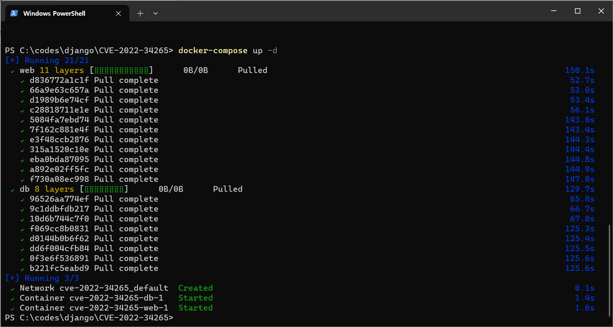
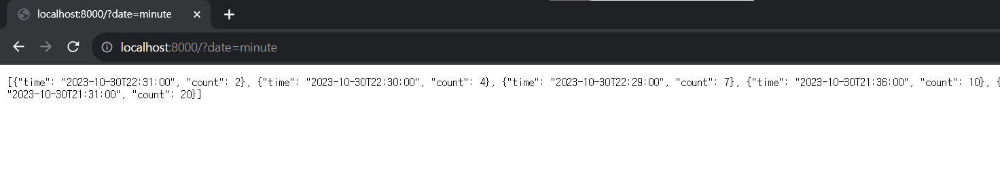
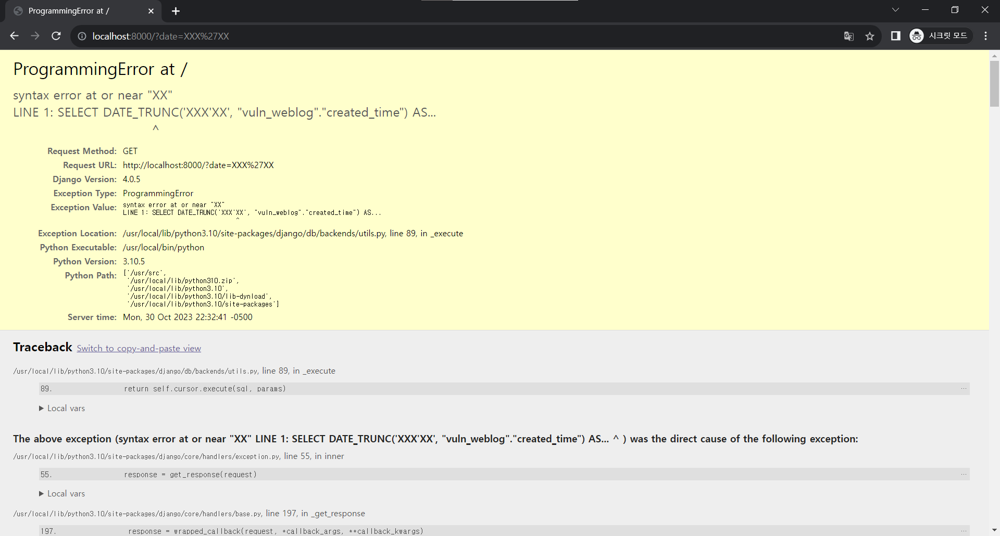

CVE-2022-34265
-------------------------
Contributors
- [[2반]김동하_4624(@DHki)](https://github.com/DHki)

##### 요약
- Django의 Trunc()와 Extract() 함수가 Django 4.0.5 version에서 SQL Injection 공격에 취약함
- 두 함수는 날짜/시간의 값을 특정 단위로 잘라내기 위해 사용함
- Trunc(): 날짜/시간 column의 값을 특정 단위(연도, 월, 일, 시간 ..)로 잘라내는데 사용
- 4.0.6 version으로 update하면서 해당 취약점 패치  

[CVE-2022-34265: Potential SQL injection via Trunc(kind) and Extract(lookup_name) arguments](https://www.djangoproject.com/weblog/2022/jul/04/security-releases/)  
  
##### 취약 환경 구성, 실행
취약 환경은 패치되기 전 version인 4.0.5를 이용해서 만듭니다
<pre>
docker compose up -d
</pre>
docker를 이용해 취약 환경을 띄우고, [localhost:8000](http://localhost:8000)으로 접속합니다.

  
- 웹페이지는 Trunc 함수를 이용해 페이지 클릭 수를 보여줍니다.
- 아래 페이지는 분 단위로 클릭 횟수 JSON으로 리턴해줍니다.  
```http://localhost:8000/?date=minute```


##### SQL Injection 취약점 확인
date parameter에 SQL Injection 공격을 시도해보면, 아래와 같이 오류가 발생하고 SQL query 탈출이 가능한 것으로 보입니다.


##### 정리
- Django 4.0.5 version에서 Trunc, Extract 함수 사용 시 내부적으로 만들어내는 query문 탈출이 가능함 : SQL Injection으로 이어질 수 있음
- 4.0.6 version에서 해당 취약점 패치