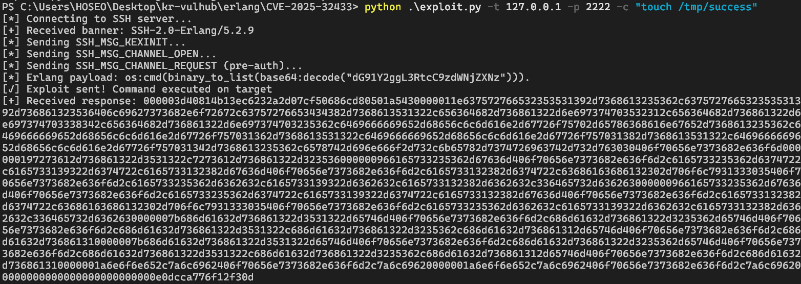

# Erlang/OTP SSH 원격 코드 실행(CVE-2025-32433)

**Erlang/OTP SSH**는 Erlang/OTP 플랫폼에 기본 탑재된 SSH 서버 컴포넌트입니다.

공격자가 특수하게 조작된 ****SSH 프로토콜 메시지를 보내면, 별도의 인증 없이 원격 코드 실행(RCE)이 가능합니다.

영향을 받는 버전:

- OTP-27.3.2 및 이전 버전
- OTP-26.2.5.10 및 이전 버전
- OTP-25.3.2.19 및 이전 버전

관련 자료:

- [https://github.com/erlang/otp/security/advisories/GHSA-37cp-fgq5-7wc2](https://github.com/erlang/otp/security/advisories/GHSA-37cp-fgq5-7wc2)
- [https://github.com/erlang/otp/commit/6eef04130afc8b0ccb63c9a0d8650209cf54892f#diff-ceeb1aeeb602e1424c13d9da9383e0782f65869d6e64e015c194145b1a64edcd](https://github.com/erlang/otp/commit/6eef04130afc8b0ccb63c9a0d8650209cf54892f#diff-ceeb1aeeb602e1424c13d9da9383e0782f65869d6e64e015c194145b1a64edcd)
- [https://github.com/ProDefense/CVE-2025-32433](https://github.com/ProDefense/CVE-2025-32433)
- [https://datatracker.ietf.org/doc/html/rfc4254](https://datatracker.ietf.org/doc/html/rfc4254)

## 환경 구성

다음 명령어를 실행하여 Erlang/OTP 27.3.2 버전 기반 SSH 서버를 구동합니다.

```docker
docker compose up -d
```

컨테이너가 실행되면 SSH 서비스가 컨테이너 내부 포트 2222에서 구동되고, 호스트의 2222번 포트로 매핑됩니다.

SSH 클라이언트나 제공된 익스플로잇 스크립트를 이용해 접속할 수 있습니다.

## 익스플로잇

제공된 **exploit.py** 스크립트를 사용하여 취약점을 쉽게 재현할 수 있습니다.

예를 들어, 다음 명령어를 실행하면 대상 컨테이너 안에 파일을 생성할 수 있습니다.

```powershell
python exploit.py -t 127.0.0.1 -p 2222 -c "touch /tmp/success"
```



이 스크립트는 특수하게 조작된 `SSH_MSG_CHANNEL_REQUEST` (메시지 번호 94) 패킷을 보내 서버의 메시지 처리 취약점을 이용해, 인증되지 않은 상태에서도 임의 명령어를 실행할 수 있도록 합니다.

📖 RFC 4254에 따르면, 해당 메시지의 기본 구조는 다음과 같습니다.

```
byte      SSH_MSG_CHANNEL_REQUEST
uint32    recipient channel
string    "exec"
boolean   want reply
string    command
```

## 결과

익스플로잇이 성공하면, 컨테이너에 접속해 `/tmp/success` 파일이 생성된 것을 확인할 수 있습니다.

