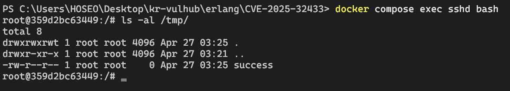

## Erlang/OTP SSH 미인증 원격 코드 실행 취약점 (CVE-2025-32433) 분석

### 취약점 개요

**Erlang/OTP SSH**는 Erlang/OTP 플랫폼에 내장된 SSH 서버 컴포넌트입니다.
**CVE-2025-32433**는 인증 없이 임의 명령어를 실행할 수 있는 심각한 취약점으로, 공격자가 특수 제작된 SSH 프로토콜 메시지를 전송하면 서버 측에서 임의 코드가 실행됩니다.

---

### 영향받는 버전

- OTP-27.3.2 및 이전 버전
- OTP-26.2.5.10 및 이전 버전
- OTP-25.3.2.19 및 이전 버전

---

### 참고 자료

- [공식 보안 권고 (GitHub Advisory)](https://github.com/erlang/otp/security/advisories/GHSA-37cp-fgq5-7wc2)
- [패치 커밋 상세 (6eef041)](https://github.com/erlang/otp/commit/6eef04130afc8b0ccb63c9a0d8650209cf54892f#diff-ceeb1aeeb602e1424c13d9da9383e0782f65869d6e64e015c194145b1a64edcd)
- [PoC 코드 저장소](https://github.com/ProDefense/CVE-2025-32433)
- [RFC 4254 - SSH 연결 프로토콜](https://datatracker.ietf.org/doc/html/rfc4254)

---

## 환경 구성

### 1. 취약 서버 실행

Erlang/OTP 27.3.2 기반 SSH 서버를 Docker로 실행:

```bash
docker compose up -d
```

- 서비스 포트: 컨테이너 내부 2222 → 호스트 2222 포트 매핑


---

## 취약점 재현 절차

### 1. 악성 스크립트 실행

제공된 [exploit.py](exploit.py)를 사용하여 공격 수행:

```bash
python exploit.py -t 127.0.0.1 -p 2222 -c "touch /tmp/success"
```


### 2. 공격 메커니즘

- **SSH_MSG_CHANNEL_REQUEST(94)** 메시지 악용
- RFC 4254 §6.5에 정의된 메시지 구조:

```
byte      SSH_MSG_CHANNEL_REQUEST
uint32    수신 채널
string    "exec" (실행 유형)
boolean   응답 요청 여부
string    명령어
```

- 인증 단계 없이 `exec` 요청 처리 과정에서 명령어 실행


### 3. 실행 결과 확인

컨테이너 내부에서 `/tmp/success` 파일 생성 확인:


---

## 기술적 분석

### 취약점 핵심

1. **인증 우회**: SSH 핸드셰이크 초기 단계에서 명령어 실행 가능
2. **프로토콜 처리 오류**: 서버가 비정상 채널 요청을 올바르게 검증하지 못함
3. **임의 코드 실행**: 사용자 입력값(command)을 시스템 명령어로 직접 전달

---

## 대응 방안

1. **Erlang/OTP 업데이트**
    - OTP-27.3.3 이상
    - OTP-26.2.5.11 이상
    - OTP-25.3.2.20 이상
2. **네트워크 차단 정책**: SSH 포트(기본 22/tcp)에 대한 불필요한 외부 접근 차단
3. **PoC 검증**: [공식 패치](https://github.com/erlang/otp/commit/6eef041) 적용 여부 확인

---

### 요약

이 취약점은 **SSH 프로토콜 구현 결함**으로 인해 발생하며, 공격 복잡도가 낮고 영향력이 크므로 **즉시 패치 적용**이 필수적입니다. CTF 환경에서의 실습 시 반드시 격리된 네트워크에서 테스트할 것을 권장합니다.


