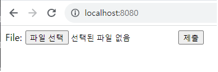

 GhostScript 샌드박스 우회(명령 실행) 취약성 (CVE-2018-16509)

## 개요

GhostScript는  pdf 및 postscript 처리 도구이다. Pdf 편집 및 변환, postscript 해석 및 디버깅 등이 가능하여 ImageMagick, Python PIL 등과 같은 많은 사진 처리 라이브러리에서 사용된다. 8월 21일 Tabis Ormandy에 의해 Artifex Ghostscript 9.24 이전 버전에서 /invalidaccess 예외 처리 과정에서 권한 복원 확인 절차가 잘못되어 공격자가 특수 제작된 PostScript 코드를 통해 pipe 명령을 사용하여 코드를 실행할 수 있는 취약점이 발견되었다. 이를 통해 공격자는 악의적인 PostScript 코드를 사용자에게 제공하거나 시스템에 업로드할 수 있고, 해당 코드가 실행되면 시스템의 제어 및 데이터 탈취가 가능하다는 것이 밝혀졌다.

 - http://seclists.org/oss-sec/2018/q3/142
 - https://bugs.chromium.org/p/project-zero/issues/detail?id=1640


## 취약점 환경

다음 명령을 실행하여 취약성 환경을 시작할 수 있다. (GhostScript 9.23, ImageMagick 7.0.8):

```
docker compose up -d
```

환경이 시작되면 'http://your-ip:8080'에 액세스하여 업로드 구성 요소를 볼 수 있습니다.

## 공격 실시

업로드[poc.png](poc.png), 명령어 'id > /tmp/success & & cat/tmp/success'를 실행합니다. 이때 컨테이너 `docker compose exec web bash`에 들어가면 /tmp/success가 생성되었음을 알 수 있습니다.



명령줄을 사용하여 이 취약성을 테스트할 수도 있습니다.

```
docker run -it --rm --name im -v `pwd`/poc.png:/poc.png vulhub/imagemagick:7.0.8-10 convert /poc.png /poc.gif
```


id 명령이 성공적으로 실행되었음을 알 수 있습니다.
