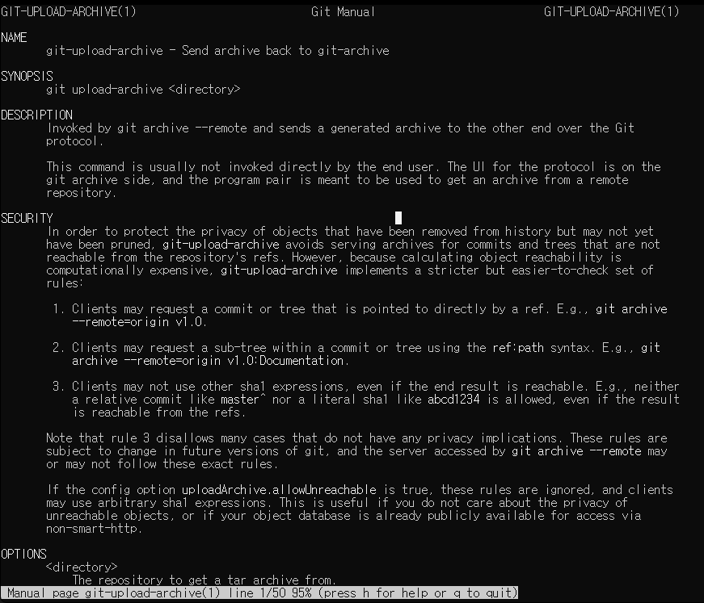
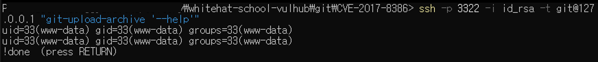
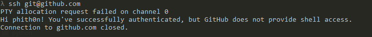
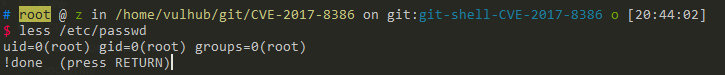

# GIT-SHELL 샌드박스 우회 (CVE-2017-8386)

GIT-SHELL 샌드박스 우회 (CVE-2017-8386)는 임의 파일 읽기 및 잠재적으로 임의의 명령어 실행에 대해 취약점을 유발합니다.

참조 링크:

- https://insinuator.net/2017/05/git-shell-bypass-by-abusing-less-cve-2017-8386/
- https://www.leavesongs.com/PENETRATION/git-shell-cve-2017-8386.html

## 테스트 환경

컴파일 및 테스트 환경 실행:

```
docker compose up -d
```

Docker 호스트의 SSH 포트와 충돌을 피하기 위해 컨테이너의 SSH 포트를 3322로 설정했습니다. 현재 디렉토리에는 `id_rsa`라는 SSH 개인 키를 생성했는데, 연결할 때 이 키를 지정하십시오.

연결하기 전에 개인 키의 권한을 0600으로 설정해야 합니다: `chmod 0600 id_rsa`
그렇지 않으면 연결이 실패할 수 있습니다.

SSH 서비스에 정상적으로 연결하려면 다음 명령을 사용하십시오: `ssh -p 3322 -i id_rsa git@127.0.0.1`.
이 명령을 실행하면 git-shell에서 인식되지 않는 명령으로 오류가 반환되고 연결이 종료됩니다.

--help 트릭을 사용하여 대상에 연결하고 도움말 페이지로 이동합니다:

```
ssh -p 3322 -i id_rsa -t git@127.0.0.1 "git-upload-archive '--help'"
```

`shift`+e를 누르면 임의 파일을 읽을 수 있습니다:



도움말 페이지로 돌아가서 `!id`를 입력하여 명령을 실행합니다:



(왜 www-data 사용자인가요? git 사용자와 www-data 사용자의 UID가 모두 33이므로 사실상 동일한 사용자입니다.)

## 작동 원리

### SSH 프로토콜 기반의 git 풀링 프로세스

git-shell은 git 서비스의 중요한 구성 요소로 알려져 있으며, git 서비스는 SSH, git, HTTPS 세 가지 프로토콜을 사용하여 프로젝트를 전달할 수 있습니다. 이 중 SSH가 가장 안전하고 편리한 방법입니다.

우리는 GitHub에서 무작위 프로젝트를 열어 "Clone with SSH"에 나열된 주소를 찾을 수 있습니다. 예를 들어, `git@github.com:phith0n/vulhub.git`라는 URL은 git에게 SSH 사용자가 git이며 주소는 github.com(기본 포트는 22)이며 이 프로젝트는 `phith0n/vulhub.git` 디렉토리에 위치함을 알려줍니다. 그런 다음 git은 SSH 프로토콜을 사용하여 github.com에 연결하고 해당 디렉토리의 프로젝트를 가져옵니다.

따라서 SSH 프로토콜을 기반으로 한 git 클론 작업은 본질적으로 SSH 프로토콜을 통해 git 서버에 연결하고 지정된 디렉토리를 가져오는 과정입니다.

그렇다면, 이 프로세스는 SSH 상호 작용 과정이므로 직접적으로 `ssh git@github.com`을 실행하면 GitHub 서버에 로그인할 수 있을까요?

아마도 그렇지 않습니다. 다음과 같이 시도해 볼 수 있습니다.



그냥 "안된다"라고 말하는 것은 정확하지 않습니다. 실제로, 저는 SSH 서비스에 연결하고 인증을 통과했지만 GitHub은 Shell 액세스를 제공하지 않는다는 안내 메시지를 표시하고 연결을 종료했습니다.

따라서 정상적인 상황에서 SSH 기반의 git 풀링 프로세스는 git 서버에 대해 안전합니다.

Git 서버를 어떻게 설정하는지에 대한 자세한 내용은 [이 문서](http://www.liaoxuefeng.com/wiki/0013739516305929606dd18361248578c67b8067c8c017b000/00137583770360579bc4b458f044ce7afed3df579123eca000)를 참조하십시오.

### Git 사용자가 시스템 Shell을 실행하지 못하게 하는 방법

그렇다면 GitHub과 같은 git 서비스 제공업체는 위에서 설명한 "안전한" 통신 프로세스를 어떻게 구현할까요?

사용자가 SSH를 통해 본인을 인증하고 Shell을 부여하지 않고도 작업을 수행할 수 있는 방법은 다음 두 가지입니다:

1. 사용자를 생성할 때 Shell을 git-shell로 설정
2. authorized_keys 파일의 각 SSH 키 앞에 명령을 설정하여 원래 명령을 무시하거나 빼앗습니다.

첫 번째 방법은 상대적으로 직관적이며 사용자를 생성할 때 bash 또는 sh와 같은 정상 Shell을 부여하지 않고 git-shell을 부여하는 것입니다. git-shell은 샌드박스 환경으로 git-shell 내에서만 허용되는 명령을 실행할 수 있습니다.

두 번째 방법은 git 서버에서만 사용하는 것뿐만 아니라 많은 Linux 배포판에서도 사용됩니다. 예를 들어, AWS는 기본적으로 루트 로그인을 허용하지 않지만 /root/.ssh/authorized_keys 파일에서 `command="echo 'Please login as the user \"ec2-user\" rather than the user \"root\".';echo;sleep 10"`을 설정합니다. 이 문구는 원래 명령을 무시하고 특정 메시지를 출력합니다.

물론 두 번째 방법 내에서도 git-shell을 사용할 수 있습니다. 예를 들어, git 사용자를 추가할 때 /bin/bash를 설정하고 authorized_keys에서 `command="git-shell -c \"$SSH_ORIGINAL_COMMAND\""`을 설정하면 실제로는 git-shell을 사용합니다.

### Git-Shell 샌드박스 우회 취약점 (CVE-2017-8386)

git-shell은 사용자가 명령을 실행할 수 있게 하는 Shell이지만, git 사용자의 홈 디렉토리에 "git-shell-commands"라는 새 디렉토리를 만들고 사용자가 실행할 수 있는 명령을 이 디렉토리에 넣으면 샌드박스가 생성됩니다. git-shell에서는 "git-shell-commands" 디렉토리에 있는 명령만 실행할 수 있습니다.

시스템에 "git-shell-commands" 디렉토리가 없는 경우 git-shell은 기본적으로 다음 세 가지 명령만 허용합니다:

- `git-receive-pack <argument>`
- `git-upload-pack <argument>`
- `git-upload-archive <argument>`

그러나 CVE-2017-8386의 저자는 `git-upload-archive --help` (또는 `git-receive-pack --help`)를 실행하면 대화식 man 페이지로 이동하고 man은 less 명령을 호출하며 마지막으로 페이지를 위아래로 스크롤할 수 있는 도움말 문서를 엽니다.

아무 문제가 없을 것 같지만, less 명령에는 상호 작용 기능이 있습니다. 예를 들어 less 페이지에서 `shift`+e를 누르면 Examine 기능을 열고 이를 통해 임의 파일을 읽을 수 있으며, `!id`를 입력하여 id 명령을 실행할 수 있습니다.

이 기능을 이용하여 쉘로 이동할 수 있으므로 git-shell 샌드박스를 우회하여 임의의 파일을 읽거나 임의 명령을 실행할 수 있습니다.

Linux 컴퓨터에서 `less /etc/passwd`를 실행하고 less 페이지에 들어간 다음 영어 입력 모드에서 `!id`를 입력하면 id 명령을 실행할 수 있습니다:



따라서 이러한 특성을 활용하여 git-shell 샌드박스를 우회하여 임의 파일을 읽거나 임의 명령을 실행할 수 있습니다.

테스트 환경에서 직접 시도할 수 있으며 Linux에서 `git-receive-pack --help`를 실행하고 `!id`를 입력하여 결과를 확인할 수 있습니다.

[evi1cg님의 블로그](https://evi1cg.me/archives/CVE-2017-8386.html)에 동적 그림이 포함되어 있어 더 직관적으로 볼 수 있습니다.

### SSH를 통한 취약점 활용

그렇다면 이 취약점을 원격으로 활용하려면 어떻게 해야 할까요?

우리는 앞에서 시도해 보았듯이 직접 `ssh git@gitserver`를 실행하면 git-shell만 얻거나 메시지만 반환합니다. 따라서 이전 섹션에서 설명한 샌드박스 우회 취약점을 활용하여 명령을 실행할 수 있습니다.

```
ssh -p 3322 -i id_rsa -t git@127.0.0.1 "git-upload-archive '--help'"
```

도움말 페이지에 진입한 후 `shift`+e 또는 `!id`를 입력하여 명령을 실행할 수 있습니다.

### 일부 제한 사항

앞서 언급했듯이, 일반적으로 Git 사용자를 구성할 때 SSH가 Shell에 액세스할 수 없도록 하는 두 가지 방법이 있습니다. 첫 번째 방법은 사용자를 생성할 때 Shell을 /usr/bin/git-shell로 설정하는 것이고, 두 번째 방법은 authorized_keys 파일에서 command를 덮어쓰는 것입니다.

만약 대상 서버가 첫 번째 방법을 사용하여 설정되었을 경우, 'git-upload-archive '--help''를 성공적으로 실행하여 도움말 페이지로 이동하더라도 명령을 실행할 수 없습니다. 왜냐하면 '!id'는 여전히 Git-Shell에서 실행되며, Git-Shell에는 'id' 명령이 없기 때문입니다.

그러나 파일을 읽는 작업은 명령이 아니라 파일을 읽는 것이기 때문에 Git-Shell의 샌드박스 규칙에 영향을 받지 않으므로 파일을 읽는 것은 항상 가능합니다.

만약 대상 서버가 두 번째 방법을 사용하여 Git-Shell 설정이 되었을 경우, 예를 들어 /etc/passwd 파일에서 Git 사용자의 Shell을 'bash'로 설정하고 'authorized_keys' 파일에서 'command'를 덮어쓴 경우, 'git-shell'을 실행합니다. 이 경우, 'help' 페이지에 접근한 후 '!id'와 같은 명령을 입력하면 명령이 Git-Shell 대신 일반 Shell (일반적으로 'bash')에서 실행되므로 'id' 명령이 성공적으로 실행됩니다. 따라서 이 상황에서는 샌드박스 제한이 없습니다.

요약하면, 이 취약점은 적어도 임의의 파일 읽기를 가능하게 하며, 필요한 경우 임의의 명령 실행이 가능할 수 있습니다.
