# GitLab Arbitrary File Disclosure (CVE-2016-9086)
CVE-2016-9086 취약점은 2016년 10월 27일에 HackerOne의 Jobert Abma가 공개한 취약점이다.

GitLab의 "import/export project" 기능에서 발생하는 임의 파일 읽기 취약점이다.

GitLab 8.9 버전부터 8.13.2 버전까지의 모든 버전에서 취약점이 발생한다.

GitLab은 웹 기반의 DevOps 라이프사이클 도구로서,
위키, 이슈 추적 및 지속적인 통합 및 배포 파이프라인 기능을 제공하는 Git 저장소 관리자이다.

GitLab의 import/export project 기능은 사용자 제공 아카이브 내 심볼릭 링크를 제대로 확인하지 않았기 때문에, 인증된 사용자가 GitLab 서비스 계정으로 접근 가능한 모든 파일의 내용을 검색할 수 있었다.

이 취약점을 통해 공격자가 악성 파일을 업로드하여 GitLab 서비스 계정이 액세스할 수 있는 모든 파일의 내용(GitLab의 구성 파일, 사용자 인증 토큰, 민감한 데이터 등)을 읽을 수 있게 한다.

## CVE-2016-9086 실습
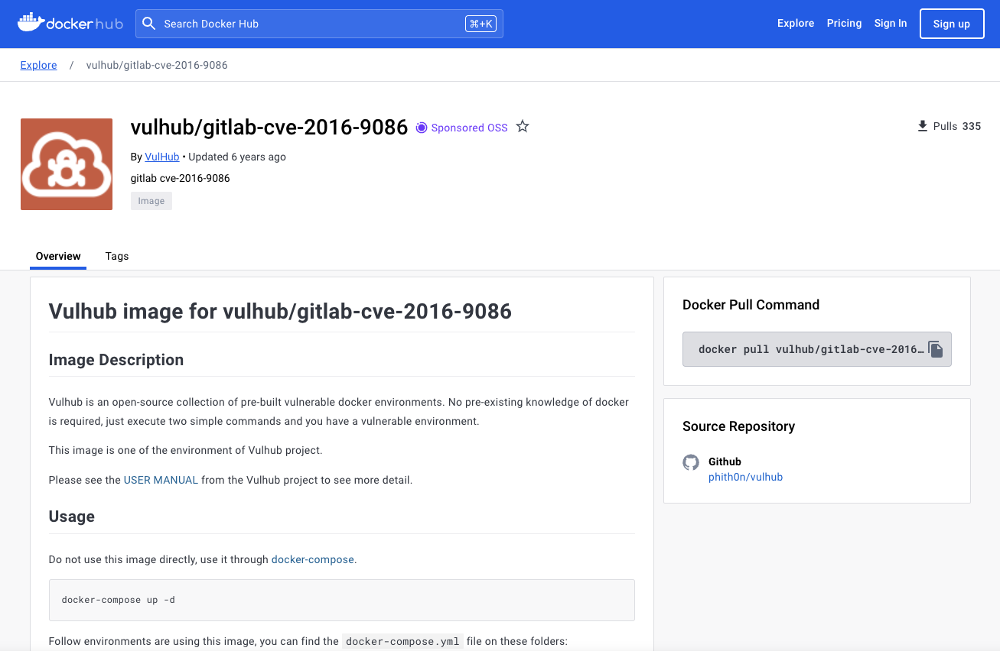  

```bash
docker pull vulhub/gitlab-cve-2016-9086
```

gitlab-cve-2016-9086 실습을 위해 GitLab이 설치된 도커 이미지를 불러온다.

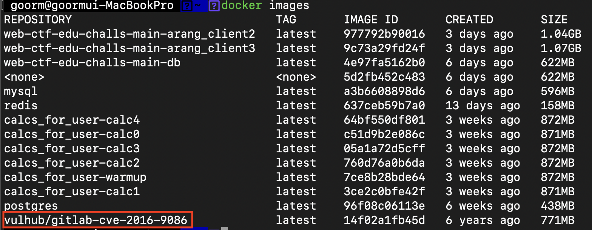  

```bash
docker images
```

제대로 이미지가 설치되었는지 확인한다.

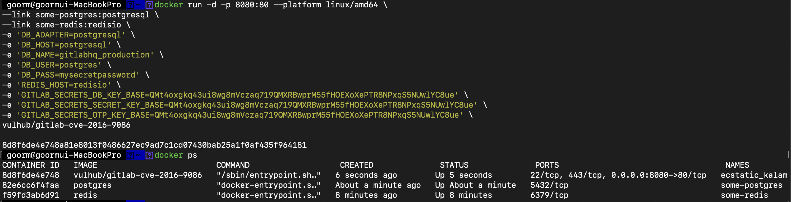  

```bash
docker run -d -p 8080:80 --platform linux/amd64 \
--link some-postgres:postgresql \
--link some-redis:redisio \
-e 'DB_ADAPTER=postgresql' \
-e 'DB_HOST=postgresql' \
-e 'DB_NAME=gitlabhq_production' \
-e 'DB_USER=postgres' \
-e 'DB_PASS=mysecretpassword' \
-e 'REDIS_HOST=redisio' \
-e 'GITLAB_SECRETS_DB_KEY_BASE=QMt4oxgkq43ui8wg8mVczaq719QMXRBwprM55fHOEXoXePTR8NPxqS5NUwlYC8ue' \
-e 'GITLAB_SECRETS_SECRET_KEY_BASE=QMt4oxgkq43ui8wg8mVczaq719QMXRBwprM55fHOEXoXePTR8NPxqS5NUwlYC8ue' \
-e 'GITLAB_SECRETS_OTP_KEY_BASE=QMt4oxgkq43ui8wg8mVczaq719QMXRBwprM55fHOEXoXePTR8NPxqS5NUwlYC8ue' \
vulhub/gitlab-cve-2016-9086


docker ps
```

도커를 실행하고, 제대로 올라왔는지 확인한다.

GitLab은 postgresql, redis도 같이 올려야 한다.


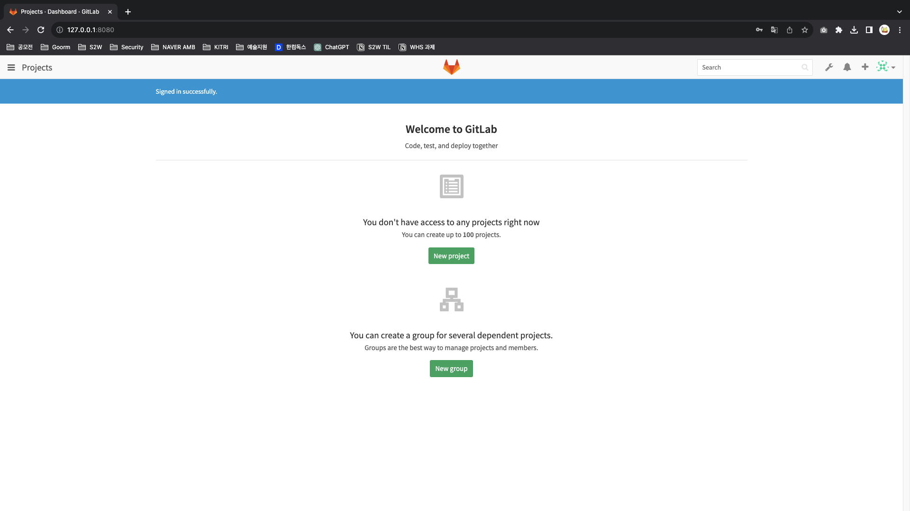  

정상적으로 올라왔으면, localhost:8080에 접속하여 GitLab에 로그인한다.

ID: root / PW: admin1234 로 회원가입 및 로그인 하였다.

그리고 New Project를 누르고 새로운 프로젝트를 생성한다.

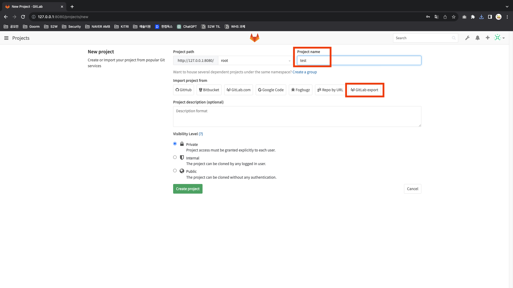  

프로젝트 이름을 임의로 설정하고, 아래에 GitLab export 버튼을 누른다.

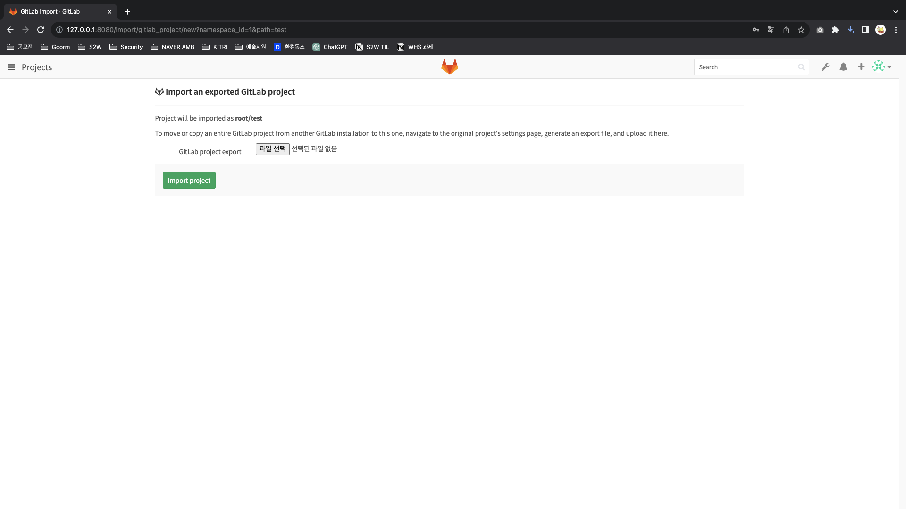  

해당 페이지는 export된 GitLab 프로젝트 파일을 불러오는 페이지이다.


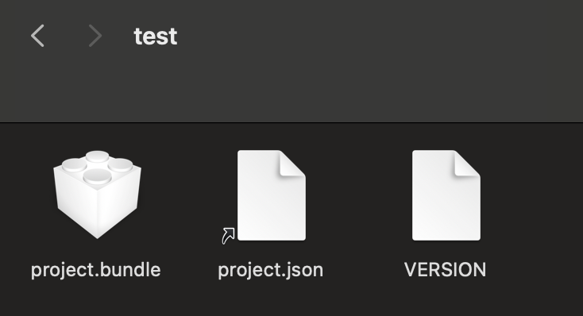  


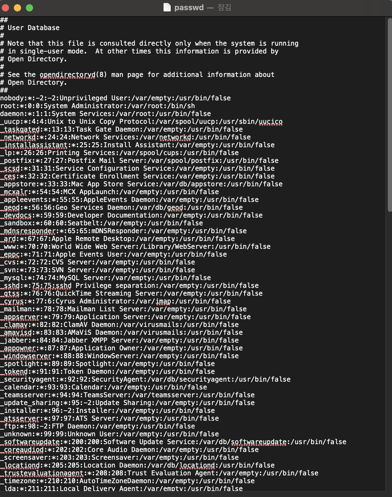  

해당 테스트 파일의 project.json에 비밀번호 정보도 저장되어 있다.


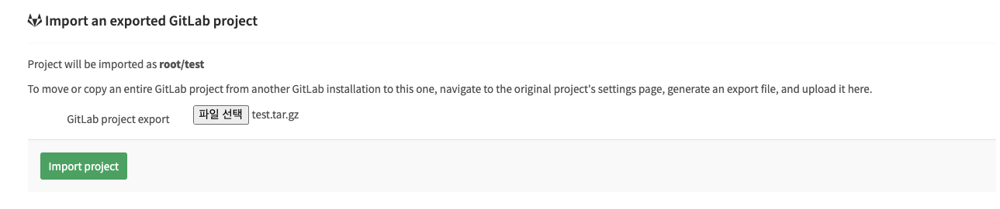  

[테스트 파일](./test.tar.gz)

파일 선택 버튼을 누르고 테스트용 tar 파일을 불러온다.


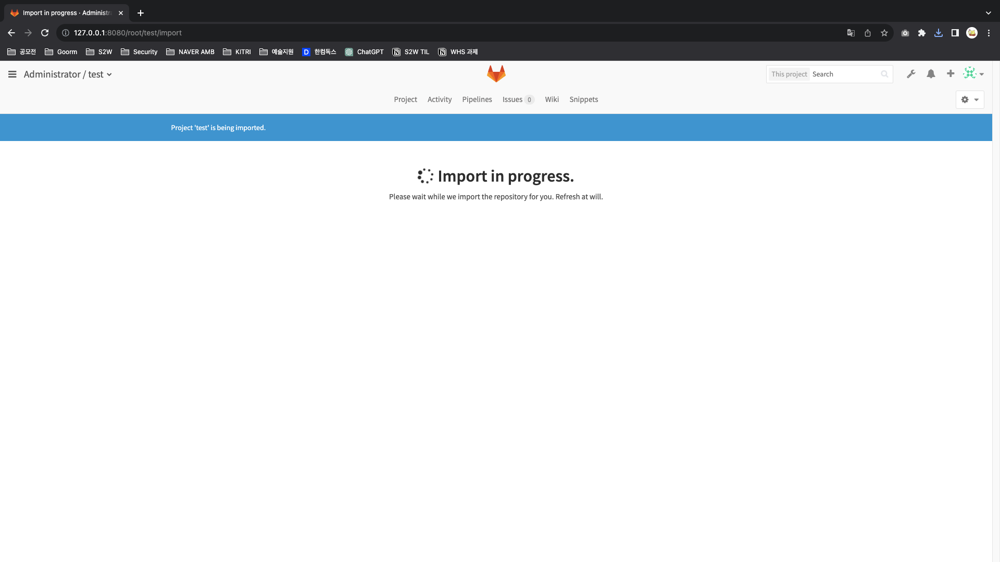  


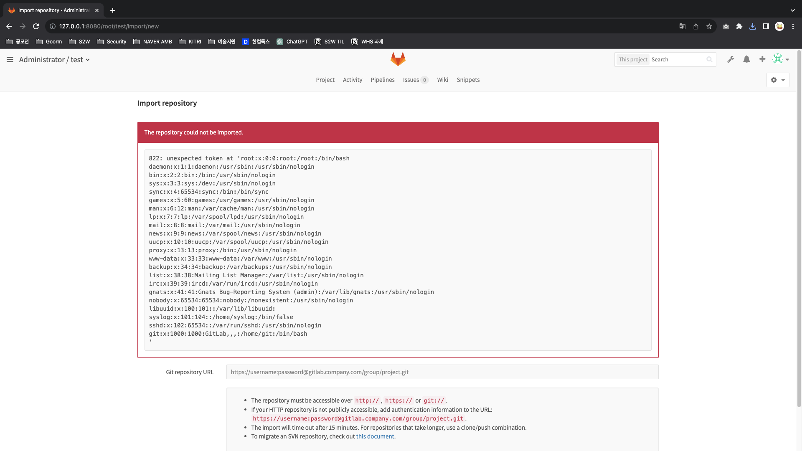  

오류 메시지와 함께 파일 내 패스워드 정보가 그대로 노출되는 것을 볼 수 있다.