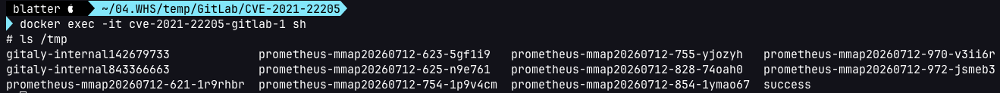

# GitLab 인증 우회 원격 명령 실행 (CVE-2021-22205)

[English version](README.md)

GitLab은 위키, 이슈 트래킹, CI/CD 파이프라인 기능을 제공하는 웹 기반 DevOps 라이프사이클 도구이자 Git 저장소 관리 플랫폼입니다.

이 취약점은 **GitLab CE/EE 11.9 이상 버전**에 영향을 줍니다. GitLab이 파일 파서로 넘어가는 이미지 파일을 제대로 검증하지 않아, **인증 없이 원격에서 명령을 실행**할 수 있습니다.

참고 자료:

- [GitLab 취약점 신고 리포트 (HackerOne, vakzz)](https://hackerone.com/reports/1154542)
- [ExifTool 코드 실행 취약점 원본 분석 (CVE-2021-22204)](https://devcraft.io/2021/05/04/exiftool-arbitrary-code-execution-cve-2021-22204.html)
- [실제 공격 사례 분석 (in-the-wild)](https://security.humanativaspa.it/gitlab-ce-cve-2021-22205-in-the-wild/)
- [Nuclei 취약점 탐지 템플릿](https://github.com/projectdiscovery/nuclei-templates/blob/master/cves/2021/CVE-2021-22205.yaml)

## 환경 구성

아래 명령을 실행해 GitLab Community Server 13.10.1을 실행합니다:

```
docker compose up -d
```

서버가 올라오면 `http://localhost:8080`으로 접속해 웹사이트를 확인합니다.


## 취약점 재현

API 엔드포인트 `/uploads/user`는 인증이 필요 없는 인터페이스입니다. [poc.py](poc.py)로 서버를 공격합니다:

```
python poc.py http://localhost:8080 "touch /tmp/success"
```


## 실행 결과 확인

아래 명령어를 이용하여 docker에 접속합니다:
```
docker exec -it cve-2021-22205-gitlab-1 sh
```
`touch /tmp/success`가 정상적으로 실행된 것을 확인할 수 있습니다:
```
ls /tmp
```



## 공격 흐름
- GitLab은 파일을 업로드하면 이미지 메타데이터를 자동으로 읽습니다. 이때 내부적으로 ExifTool을 실행합니다.

- ExifTool은 Perl로 만들어져 있는데, DjVu 파일의 주석 영역에 Perl 코드를 넣으면 그냥 실행해버리는 버그가 있습니다.

- **PoC 코드**는 이 파일을 test.jpg로 이름만 바꿔서 GitLab에 업로드합니다. GitLab은 이미지라고 믿고 ExifTool을 돌리고, ExifTool은 파일 안의 명령을 실행합니다.

- 더 문제인 건 업로드 경로(/uploads/user)가 **로그인 없이 접근 가능**했다는 것입니다. 업로드 페이지/요청에서 CSRF 토큰만 뽑아오면 누구나 파일을 올릴 수 있었습니다.

- 결과적으로 인터넷이 연결된 누구든, 로그인 없이, 악성 파일 하나로 GitLab 서버에서 원하는 명령을 실행할 수 있습니다.

## 대응 방안
GitLab 업데이트와 ExifTool 업데이트, 두 가지가 핵심 대응방안입니다.

GitLab은 **13.10.3 / 13.9.6 / 13.8.8 버전**에서 해당 취약점을 패치하였습니다. 업로드된 이미지 파일을 파서에 전달하기 전 검증 로직을 강화하고, 취약한 파일 파싱 경로를 제거하였으며, 영향받는 버전을 사용 중이라면 **즉시 업데이트가 필요**합니다.

ExifTool은 **12.24 버전**에서 DjVu 파서의 Perl 코드 인젝션 버그(CVE-2021-22204)가 패치되었습니다. GitLab 업데이트와 별개로 ExifTool 자체도 함께 업데이트해야 완전한 대응이 됩니다.

참고자료:

- [GitLab 공식 보안 공지 및 대응 안내 (CVE-2021-22205)](https://about.gitlab.com/blog/action-needed-in-response-to-cve2021-22205/)
- [Rapid7: 실제 악용 사례 분석 (CVE-2021-22205)](https://www.rapid7.com/blog/post/2021/11/01/gitlab-unauthenticated-remote-code-execution-cve-2021-22205-exploited-in-the-wild/)
- [NVD 취약점 상세 정보 (CVE-2021-22204)](https://nvd.nist.gov/vuln/detail/cve-2021-22204)
- [oss-sec: ExifTool DjVu 취약점 최초 공개 (CVE-2021-22204)](https://seclists.org/oss-sec/2021/q2/108)