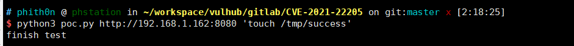
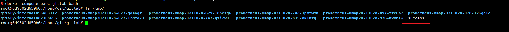

# GitLab 인증 우회 원격 명령 실행 (CVE-2021-22205)

[English version](README.md)

GitLab은 웹 기반 DevOps 라이프사이클 도구로, 위키·이슈 트래킹·CI/CD 파이프라인 기능을 제공하는 Git 저장소 관리 플랫폼이다.

GitLab CE/EE 11.9 버전 이상에서 취약점이 발견되었다. GitLab이 파일 파서로 전달되는 이미지 파일을 제대로 검증하지 않아, 인증 없이(unauthenticated) 원격 명령 실행이 가능하다.

참고 자료:

- https://hackerone.com/reports/1154542
- https://devcraft.io/2021/05/04/exiftool-arbitrary-code-execution-cve-2021-22204.html
- https://security.humanativaspa.it/gitlab-ce-cve-2021-22205-in-the-wild/
- https://github.com/projectdiscovery/nuclei-templates/blob/master/cves/2021/CVE-2021-22205.yaml

## 취약 환경

다음 명령을 실행해 GitLab Community Server 13.10.1을 기동한다:

```
docker compose up -d
```

서버가 시작되면 `http://your-ip:8080`으로 접속해 웹사이트를 확인한다.

## 익스플로잇

API 엔드포인트 `/uploads/user`는 인증이 필요 없는 인터페이스다. [poc.py](poc.py)를 통해 서버를 공격한다:

```
python poc.py http://your-ip:8080 "touch /tmp/success"
```



`touch /tmp/success`가 성공적으로 실행되었다:

