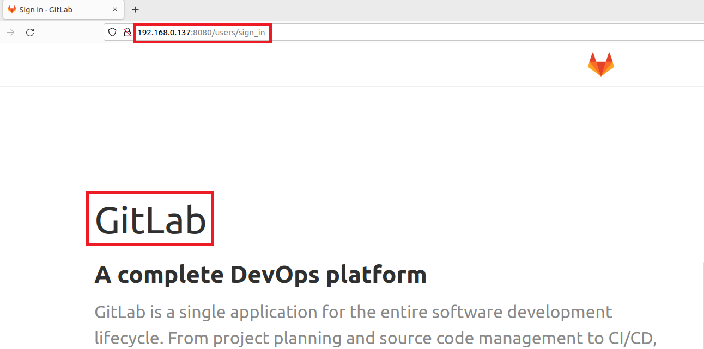

# GitLab Pre-Auth Remote Commands Execution (CVE-2021-22205)
---

### 요약
---

-   깃랩은 깃랩 사가 개발한 깃 저장소 및 CI/CD, 이슈 추적, 보안성 테스트 등의 기능을 갖춘 웹 기반의 데브옵스 플랫폼이다. 
-   이 취약점은 사용자가 제공한 이미지의 유효성을 적절히 검증하지 않아 임의 코드 실행으로 이어지는 문제이다. 11.9 부터 모든 버전에 영향을 미치며, 2021년 4월 14일 GitLab 버전 13.8.8,13.9.6,13.10.3에서 수정되었다.

### 참고자료 : 
---

-   https://ko.wikipedia.org/wiki/%EA%B9%83%EB%9E%A9https://ko.wikipedia.org/wiki/%EA%B9%83%EB%9E%A9
-   https://thehackernews.com/2021/11/alert-hackers-exploiting-gitlab.html
-   https://blog.alyac.co.kr/4241

### 취약한 환경 구성 및 실행 
--- 

-   `docker-compose up -d` 를 실행하여 테스트 환경을 실행함. 
-   `http://your-ip:8080/` 에 접속하여, gitlab 기본 페이지를 확인함. 

### 공격
---

API의 EndPoint는 인증이 수행되지 않은 /uploads/user 이며, poc.py로 공격을 실행함.  
-   `python poc.py http://your-ip:8080 "touch /tmp/success"`

### 결과
--- 

-   성공적으로 실행‰瑛습 확인함.

