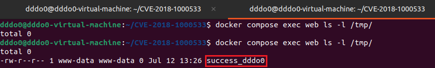

# GitList 0.6.0 원격 코드 실행 취약점 (CVE-2018-1000533)
GitList는 현대적인 Git 저장소 뷰어이다.

GitList 0.6.0 이하 버전에서는 시스템 함수에 부적절하게 검증된 입력값을 전달하는 취약점이 존재하여, PHP 사용자 권한으로 임의의 명령어를 실행할 수 있다.


## 환경 구성
GitList 서버 0.6.0을 시작하기 위해 다음 명령을 실행한다.

```bash
docker compose up -d
```

poc.py 실행 전 의존성을 설치한다.
```bash
pip install requests
```

환경 구성이 완료되면 `http://127.0.0.1:8080`에 접속하여 `example`이라는 테스트 저장소가 존재하는지 확인한다.


## 취약점 원리
GitList는 저장소 내 코드를 검색할 때 `git grep`을 사용한다.

```php
public function searchTree($query, $branch)
{
    if (empty($query)) {
        return null;
    }

    $query = escapeshellarg($query);

    try {
        $results = $this->getClient()->run($this, "grep -i --line-number {$query} $branch");
    } catch (\RuntimeException $e) {
        return false;
    }
```

여기서 `$query`는 검색 키워드, `$branch`는 검색 대상 브랜치를 의미한다. 

만약 공격자가 검색어로 `--open-files-in-pager=id;`를 전달하게 되면 시스템에서 id 명령어가 실행된다.


이 취약점이 발생하는 이유는 2가지이다 :
1. `escapeshellarg()` 함수의 한계
   
  이론적으로 `$query = escapeshellarg($query);` 코드를 거치면 입력값은 작은따옴표로 감싸진 문자열이 된다. 하지만 `escapeshellarg()`는 셸(shell) 입장에서의 인젝션은 막아주지만, `git` 자신의 옵션 파서가 `--`로 시작하는 문자열을 옵션으로 해석하는 것까지는 막지 못한다.

2. `--open-files-in-pager` 옵션의 특성 
   
git grep의 해당 옵션은 검색 결과를 보여줄 외부 페이저(Pager) 프로그램을 지정하는 역할을 하는데, 여기에 전달된 값을 시스템 명령어로 직접 실행해 버리는 특성이 있다.


## 취약 조건

* GitList 0.6.0 버전이 동작 중이어야 한다.
* POST 요청시 사용되는 url(`[repo_name]/tree/[keyword]/search`)에는 2개의 인수 `[repo_name]`와 `[keyword]`가 존재한다. 
* `[repo_name]`는 GitList에 존재하는 저장소여야 하고, `[keyword]`는 최소 하나 이상의 검색 결과를 생성하는 검색 키워드여야 한다.
(해당 재현에서는 저장소로 `example`, 키워드로 `a`를 사용하였다.)


## 재현 절차

다음의 명령어를 통해 `poc.py`를 실행한다. 

해당 스크립트를 통해 `touch /tmp/success_dddo0`이 실행되어 서버의 `/tmp` 디렉토리에 `success_dddo0`라는 빈 파일이 생성된다.

```bash
python3 poc.py http://127.0.0.1:8080
```

요청이 전송된 뒤, 다음의 명령어를 통해 `success_dddo0`이 성공적으로 생성되었는지 확인한다.

```bash
docker compose exec web ls -l /tmp/success_dddo0

```

## 실행 결과

PoC 실행 후, 서버 내부에 임의의 시스템 명령어(`touch /tmp/success_dddo0`)가 성공적으로 실행되어 파일이 생성된 것을 확인할 수 있다.




### 환경 종료

```
docker compose down
```

## 대응 방안

GitList 버전을 최신 버전으로 업데이트해야 한다.

**코드 수정 내용**: 
```php
public function searchTree($query, $branch)
{
    if (empty($query)) {
        return null;
    }
    $query = preg_replace('/(--?[A-Za-z0-9\-]+)/', '', $query);
    $query = escapeshellarg($query);
    try {
        $results = $this->getClient()->run($this, "grep -i --line-number -- {$query} $branch");
    } catch (\RuntimeException $e) {
        return false;
    }
```

GitList에서는 정규식을 사용하여 검색어(`$query`)에서 불법적인 `-` 접두사를 제거하고, `git grep` 명령어에 `--` (옵션의 끝을 알리는 식별자)를 추가하여 이후에 오는 모든 입력값이 명령 옵션이 아닌 일반 문자열(검색어)로만 취급되도록 강제하여 해당 취약점을 조치했다.


