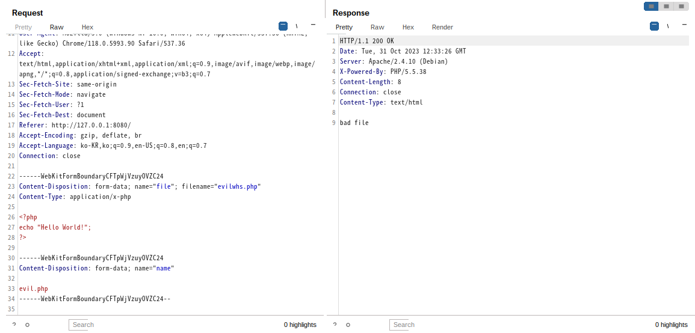
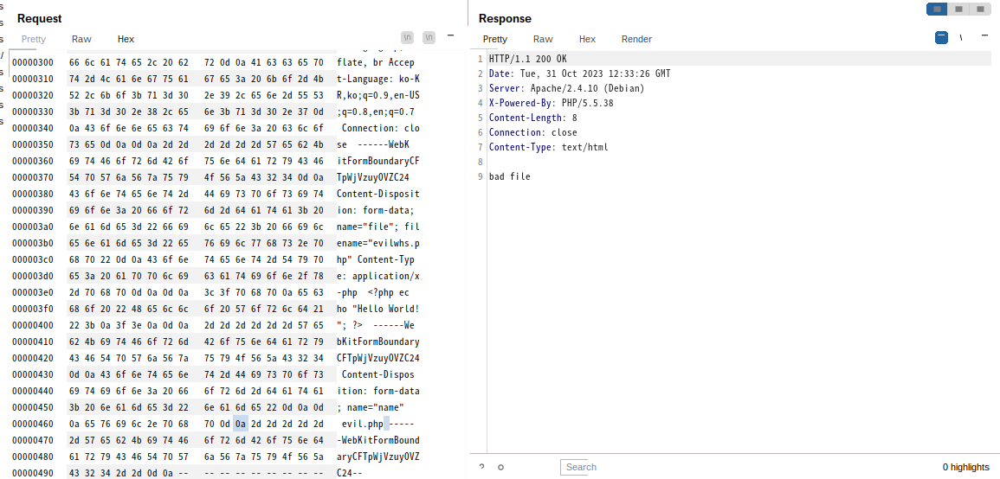
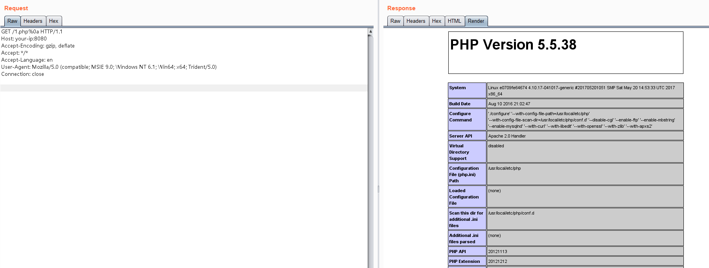

## Apache HTTPD 개행 문자 파싱 취약점 (CVE-2017-15715)

Apache HTTPD는 mod_php를 사용하여 PHP 웹 페이지를 실행할 수 있는 HTTP 서버입니다. 
버전 2.4.0에서 2.4.29까지의 범위에는 파싱 취약점이 존재합니다. 
PHP를 처리할 때 1.php\x0A라는 파일은 PHP 확장자로 해석되어 일부 서버 보안 정책을 우회할 수 있습니다.

## 취약점 환경

취약한 환경을 설정하려면 다음 단계를 따르세요:

다음 명령으로 환경을 빌드합니다.
```
docker-compose build
```
백그라운드에서 환경을 시작합니다.
```
docker-compose up -d
```

이후 Apache 서버는 http://your-ip:8080에서 실행됩니다.


## 취약점 재현

1.php라는 이름의 파일을 업로드하려고 하면 다음과 같이 차단됩니다:



그러나 1.php 뒤에 \x0A를 삽입하면 (주의: \x0D\x0A가 아니라 단순한 \x0A여야 함), 더 이상 차단되지 않습니다:



/1.php%0a에 접근하면 파일이 성공적으로 처리됩니다. 이 파일은 PHP 확장자가 없지만 처리 취약점이 존재함을 나타냅니다:

