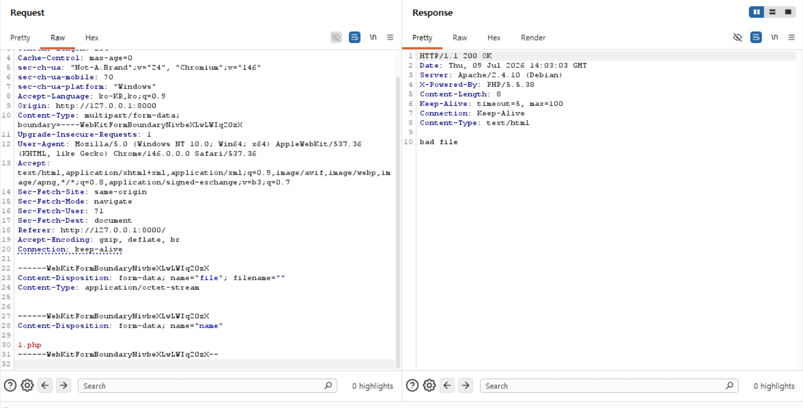
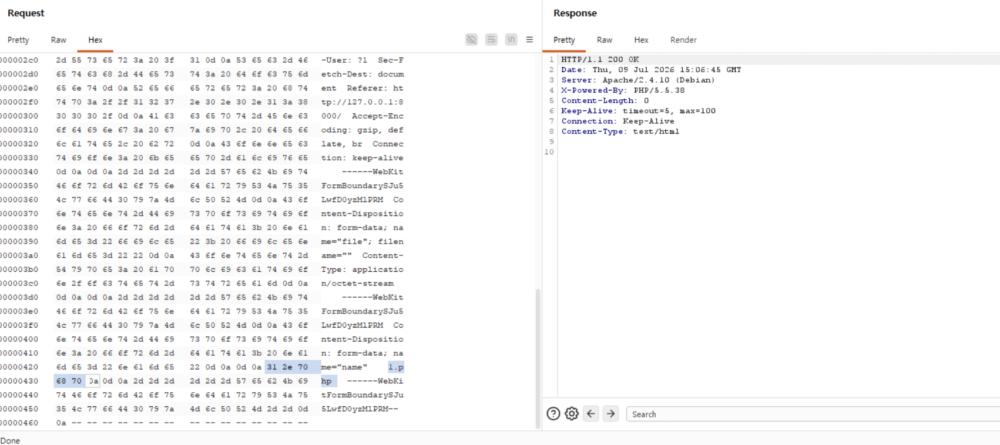
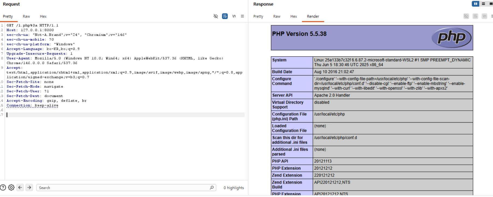

# CVE-2017-15715-httpd
whs 4기 컨테이너 과제

## 요약
Apache HTTPD는 mod_php를 통해 PHP 웹 페이지를 실행할 수 있는 널리 사용되는 HTTP 서버입니다.
2.4.0부터 2.4.29 버전까지는 구문 분석 취약점이 존재하는데, 이로 인해 파일 이름이 .php로 끝나는 경우 1.php\x0APHP 파일로 인식되어 공격자가 특정 서버 보안 정책을 우회할 수 있습니다.

## 참고자료
[https://httpd.apache.org/security/vulnerabilities_24.html](https://httpd.apache.org/security/vulnerabilities_24.html)
[https://security.elarlang.eu/cve-2017-15715-apache-http-server-filesmatch-bypass-with-a-trailing-newline-at-the-end-of-the-file-name.html](https://security.elarlang.eu/cve-2017-15715-apache-http-server-filesmatch-bypass-with-a-trailing-newline-at-the-end-of-the-file-name.html)

## 환경 설정
다음의 명령어를 실행하여 취약한 Apache HTTPD 서버를 구축한다
''' docker compose build
    docker compose up -d '''

서버가 시작되면 Apache는 나의 ip주소를 기반으로 생성된 http://my-ip:8080에서 실행된다.

## 취약점 재현
먼저 1.php라는 파일을 제출하면 보안 점검에 걸려 bad file이라는 문구와 함께 요청이 거부되는 것을 확인할 수 있습니다.

그러나 줄바꿈 문자를 추가하여 다시 1.php를 제출하면 성공적으로 업로드 된 것을 확인할 수 있습니다.
(Burp suite에서 Hex 값에서 이름 옆에 0a 추가하는 방식으로 진행했습니다.)

'/1.php%0a' 으로 접속했을 때, 적절한 PHP 확장자가 없음에도 불구하고 PHP 파일로 성공적으로 파싱됩니다. 이는 파싱 취약점이 존재함을 확인시켜 줍니다.

