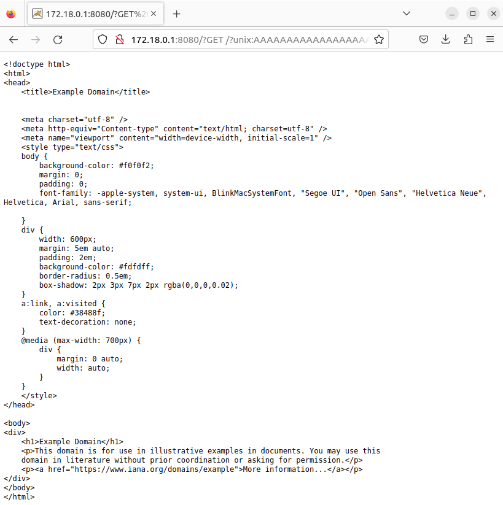

# CVE-2021-40438

**Contributors**

-   [오현수(@AenganZ)](https://github.com/AenganZ)

 

### 요약

-   이 취약점은 httpd의 mod_proxy 모듈 결함으로 인해 발생하며, mod_proxy는 httpd가 역방향 프록시 역할을 할 수 있도록 하는 모듈임. 즉, 클라이언트의 요청을 다른 서버로 전달할 수 있음. mod_proxy의 결함으로 인해 공격자는 해당 서버에 액세스할 권한이 없더라도 httpd가 임의의 서버로 요청을 전달하도록 하는 요청을 조작할 수 있음.

 

### 환경 구성 및 실행

-   `docker compose up -d`를 실행하여 테스트 환경을 실행함.
-   `http://your-ip:8080/`에 접속하여 Apache 기본 페이지를 확인함. 여기서 Apache HTTP Server는 클라이언트와 백엔드 Tomcat 서버 사이의 중간 역방향 프록시로 실행되며 AJP 프로토콜을 통해 통신함.
-   Apache HTTP 서버에 긴 문자열 GET 요청을 보냄.

 

### 결과

 

### 정리

-   이 취약점은 공격자가 원격에서 인증 없이도 HTTPD 서버를 통해 임의의 서버로 요청을 전달할 수 있음. 즉, HTTP 서버의 네트워크에 있는 내부 리소스에 액세스할 수 있음. 이 취약점을 방지하기 위해서는 Apache HTTP Server를 최신 버전으로 유지하거나 mod_proxy 모듈 구성을 신중하게 해야 함.

