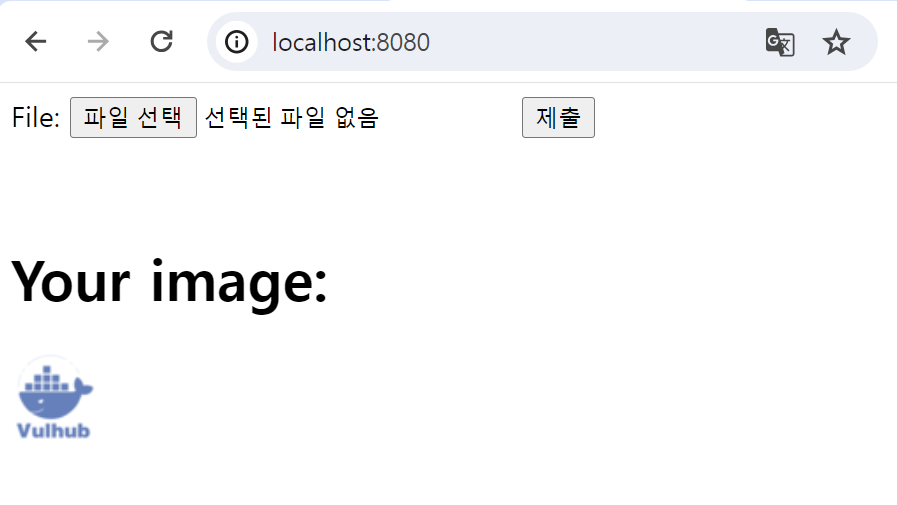
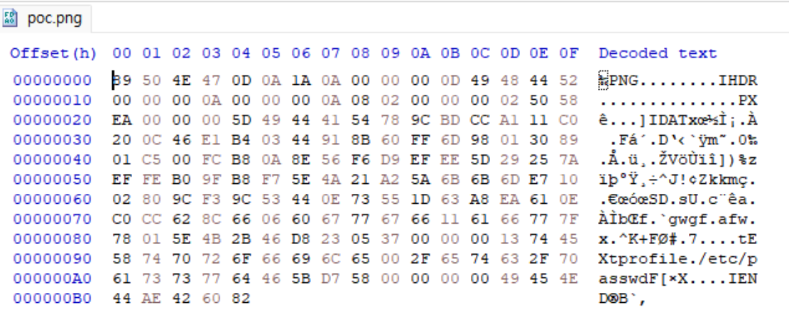
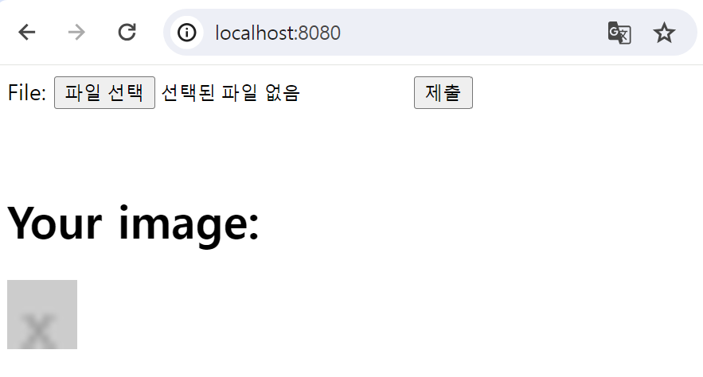
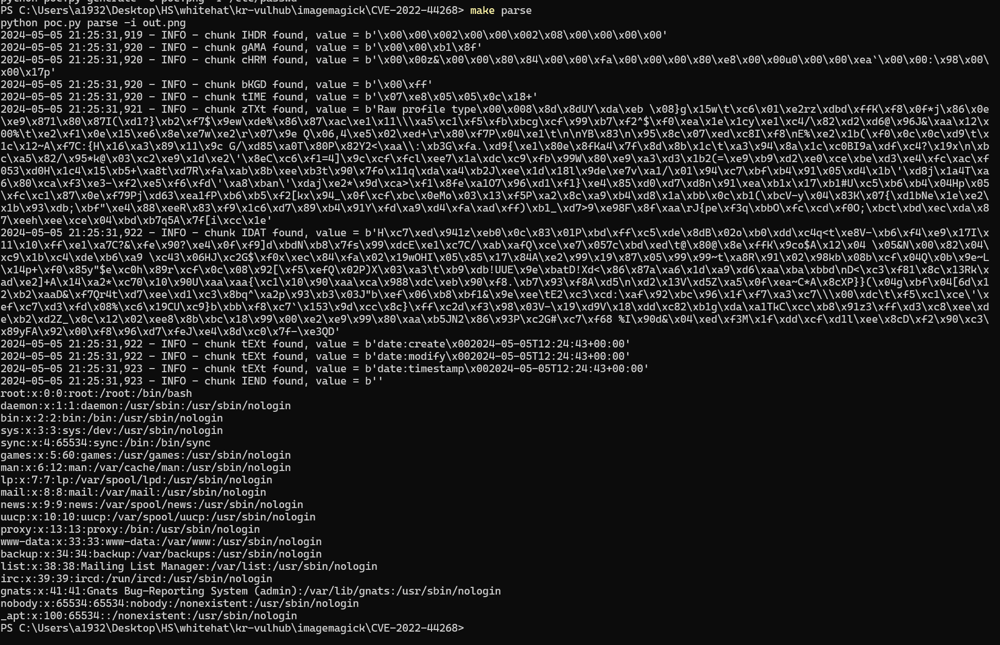

# ImageMagick Arbitrary File Disclosure (CVE-2022-44268)

## 개요
ImageMagick은 이미지를 표시, 생성, 변환, 수정 및 편집할 수 있는 자유 및 오픈 소스 크로스 플랫폼 소프트웨어 제품입니다.
ImageMagick의 7.1.0-51 이전 버전에서는 PNG 파일을 수정하여 서버의 임의 파일을 읽을 수 있는 취약점이 존재합니다.

References:
- <https://www.metabaseq.com/imagemagick-zero-days/>
- <https://github.com/ImageMagick/Website/blob/main/ChangeLog.md#710-52---2022-11-06>

## 취약점 환경

다음 명령을 차례대로 실행하여 ImageMagick을 사용하여 업로드한 이미지를 50x50 크기의 새로운 이미지로 변환하는 웹 서버를 시작합니다
```
make build
make run
```
서버가 시작되면 `http://localhost:8080`에 접속하면 파일 업로드 버튼을 확인할 수 있습니다.



서버에서 제공하는 서비스는 다음 코드로 업로드된 이미지를 50x50 픽셀로 크기를 조정한 후 
새로운 파일로 저장한다.

```php
$newname = uniqid() . '.png';
shell_exec("convert -resize 50x50 {$_FILES['file_upload']['tmp_name']} ./{$newname}");
```

## Exploit

Exploit하기 위해서는 chunk data와 정보를 얻고 싶은 파일 경로를 포함한 png 파일을 준비해야한다

다음 명령어를 사용하여 Exploit 하기 위한 png 파일을 얻을 수 있다.

```
make generate
```

> 위 명령어를 사용하기 위해서는 [PyPNG](https://pypng.readthedocs.io/en/latest/) 를 설치해야 한다
> (`pip install pypng`)

명령어를 실행하고 [HxD]를 사용하여 확인해보면, chunk 데이터를 포함하고 profile=/etc/passwd 의 경로를 가지고 있는 png 파일을 얻을 수 있다 



이 png 파일을 서버에 업로드 한 후에



50x50 픽셀로 변경되어 나타난 이미지 파일을 out.png 로 저장한 후 아래 명령어를 실행시킬 수 있다

```
make parse
```



/etc/passwd 의 파일 내용이 ImageMagick에 의해서 노출되는 것을 확인할 수 있다.
