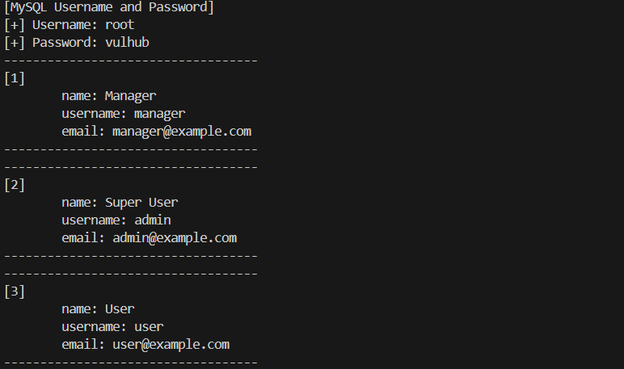
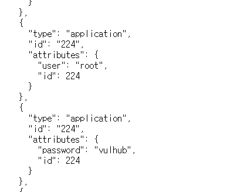
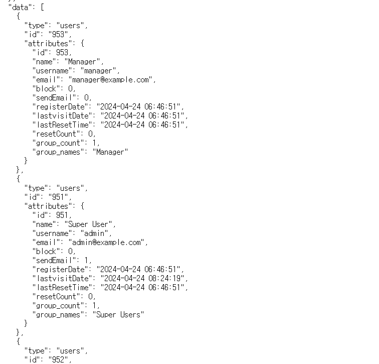
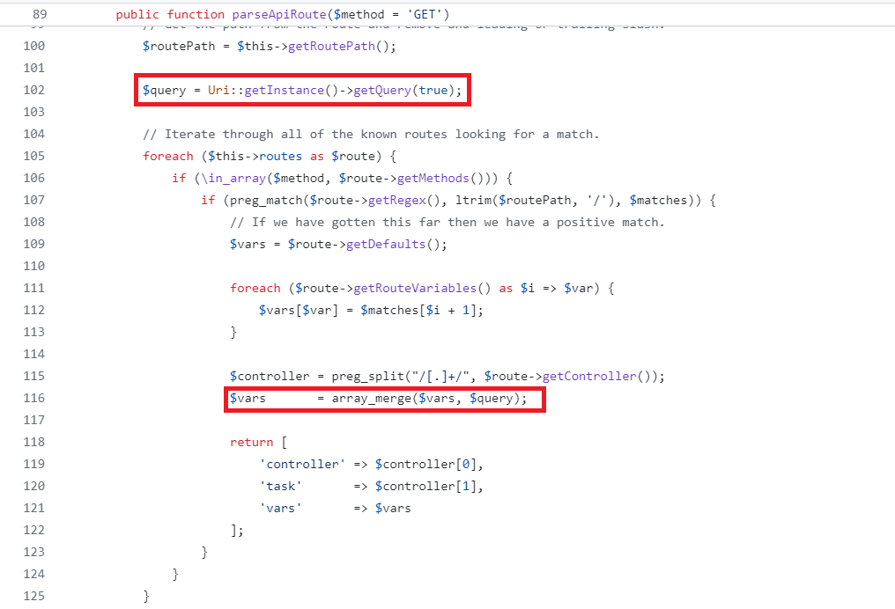

# Joomla의 웹서비스 엔드포인트에 대한 접근 검사 미흡 (CVE-2023-23752)

Joomla는 웹사이트 및 온라인 애플리케이션 구축을 위한 무료 오픈 소스 콘텐츠 관리 시스템(CMS)입니다. 2005년에 처음 출시된 이후 전 세계 수백만 개의 웹사이트를 운영하는 가장 인기 있는 CMS 플랫폼 중 하나가 되었습니다.

Joomla! 4.0.0 부터 4.2.7 버전에서 웹서비스 엔드포인트에 대한 접근 검사 미흡 문제가 발견되었습니다. 이로 인해, 인증되지 않은 접근이 가능합니다.

## 환경 구축
`docker compose up -d` 커맨드를 통해 취약한 Joomla 4.2.7 환경을 실행할 수 있습니다.

## 취약점 재현

사용자는 환경 구축이 완료된 뒤, `poc.py`의 실행을 통해 MySQL 유저네임과 비밀번호, 그리고 사용자들의 정보를 획득할 수 있습니다.

또는, `http://localhost:8080/api/index.php/v1/config/application?public=true`, 혹은 `localhost:8080/api/index.php/v1/users?public=true`으로 직접 접근하여 데이터를 확인해볼 수 있습니다.

## 취약점 발생 원인 분석
Joomla! 공식 레포지토리의 4.2.7 버전 소스 코드를 참조하였습니다. 분석 대상이 될 파일의 전체 소스코드는 https://github.com/joomla/joomla-cms/blob/4.2.7/libraries/src/Router/ApiRouter.php 에서 확인할 수 있습니다.

문제가 되는 부분은 `/api/index.php` 에서 URL을 파싱할 때 사용되는 `/libraries/src/Router/ApiRouter.php` 파일 내의 `parseApiRoute` 함수입니다.

이미지를 확인해보면, 102번째 라인에서 요청 URL을 가져오고, 116번째 라인에서 URL로 쿼리된 매개변수를 병합하고 있는 것을 확인할 수 있습니다. 따라서, 쿼리 변수로 `public=true`를 주게 되면 vars를 덮어쓰게 되어 민감한 정보에 추가 인증 없이 도달할 수 있게 됩니다. 

## 정리
공격자는 해당 취약점을 통해 사용자의 정보를 유출할 수 있으며, DB 서버가 외부로 노출되어 있을 경우 root 계정으로 로그인이 가능해집니다.

서버 관리자는 DB 서버가 외부로 노출되지 않도록 설정해야 하며, 취약한 버전의 Joomla!를 취약점을 해결한 버전으로 업그레이드 해야 합니다.