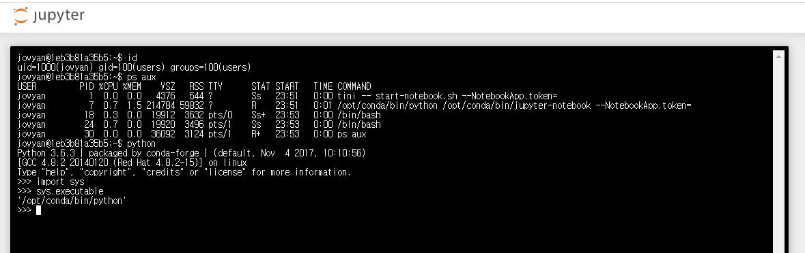

# Jupyter Notebook의 취약한 접근통제

Jupyter Notebook（이전 명칭: IPython notebook）은 40개 이상의 프로그래밍 언어를 지원하는 개발 환경이다.

Jupyter Notebook의 관리자가 비밀번호를 설정하지 않았다면, Jupyter Notebook은 CLI에 대한 접근통제를 전혀 하지 않는다.
따라서 임의의 사용자가 CLI를 통해 원하는 명령어를 실행할 수 있다.

## 실행 환견

테스트 환경 실행：

```
docker compose up -d
```

실행 후, 주소 `http://your-ip:8888`에 접근해서, Jupyter Notebook의 웹 관리 인터페이스에 비밀번호 없이 바로 접속할 수 있다.

## 취약점 재현(Vulnerability recurrence)

메뉴 중 "new" 의 Terminal을 선택하면 새로운 CLI 콘솔이 열린다.


임의의 명령을 실행한 결과：


